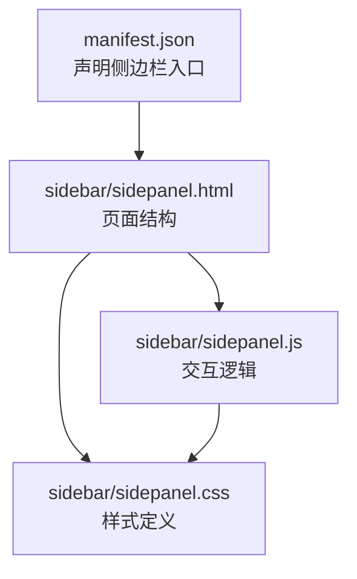
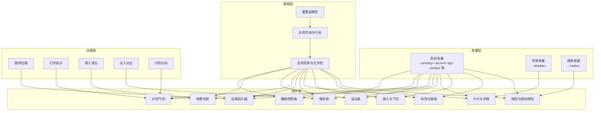
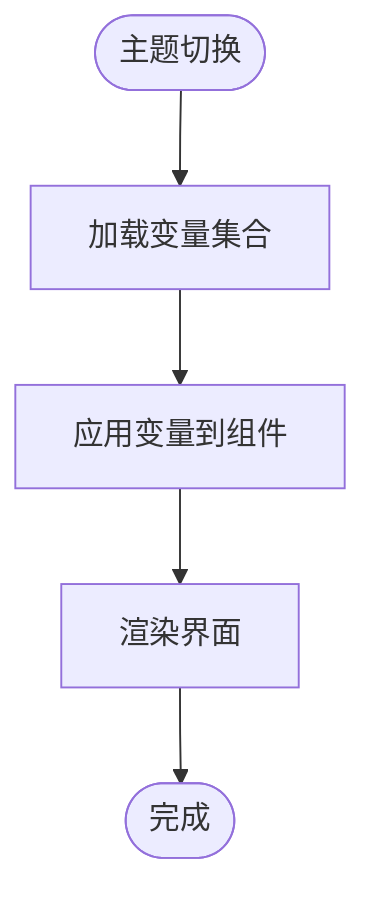
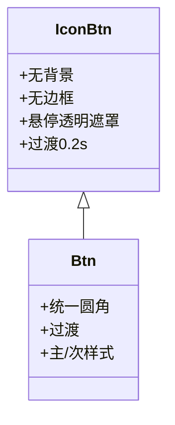
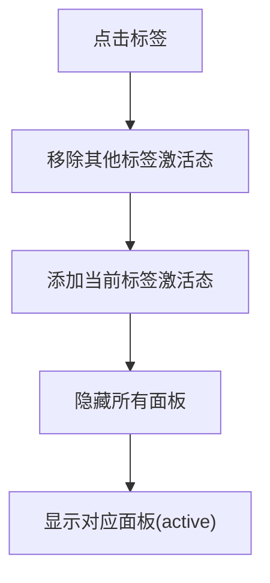
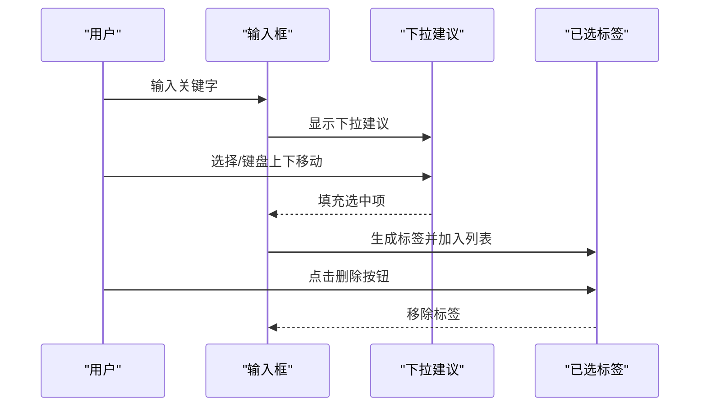
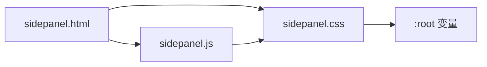

# 样式系统

<cite>
**本文引用的文件**
- [sidebar/sidepanel.css](file://sidebar/sidepanel.css)
- [sidebar/sidepanel.html](file://sidebar/sidepanel.html)
- [sidebar/sidepanel.js](file://sidebar/sidepanel.js)
- [manifest.json](file://manifest.json)
- [README.md](file://README.md)
</cite>

## 目录
1. [简介](#简介)
2. [项目结构](#项目结构)
3. [核心组件](#核心组件)
4. [架构总览](#架构总览)
5. [详细组件分析](#详细组件分析)
6. [依赖关系分析](#依赖关系分析)
7. [性能考量](#性能考量)
8. [故障排查指南](#故障排查指南)
9. [结论](#结论)
10. [附录](#附录)

## 简介
本样式系统服务于 Chrome 扩展“投资助手”的侧边栏界面，采用原生 CSS 与少量 JavaScript 的组合实现，强调模块化、可维护性和可扩展性。系统围绕变量定义、基础样式、组件样式、动画与过渡、响应式策略与交互反馈展开，覆盖从按钮、标签、卡片到模态框、加载指示器、对话气泡、滚动条、纲要导航与播报控制条等关键 UI 组件。

## 项目结构
- 样式文件：sidebar/sidepanel.css
- 页面结构：sidebar/sidepanel.html
- 逻辑脚本：sidebar/sidepanel.js
- 扩展清单：manifest.json
- 项目说明：README.md

图表来源
- [manifest.json:16-18](file://manifest.json#L16-L18)
- [sidebar/sidepanel.html:1-10](file://sidebar/sidepanel.html#L1-L10)
- [sidebar/sidepanel.css:1-50](file://sidebar/sidepanel.css#L1-L50)
- [sidebar/sidepanel.js:1-20](file://sidebar/sidepanel.js#L1-L20)

章节来源
- [manifest.json:16-18](file://manifest.json#L16-L18)
- [sidebar/sidepanel.html:1-10](file://sidebar/sidepanel.html#L1-L10)
- [sidebar/sidepanel.css:1-50](file://sidebar/sidepanel.css#L1-L50)
- [sidebar/sidepanel.js:1-20](file://sidebar/sidepanel.js#L1-L20)

## 核心组件
- 变量系统：通过 CSS 自定义属性集中管理色彩、阴影、圆角、间距等设计令牌，便于主题切换与品牌定制。
- 基础样式：重置盒模型、统一字体与行高、设定全局背景与文字色，确保一致的视觉基线。
- 组件库：按钮、标签、面板、输入、下拉、标签页、卡片、模态框、加载指示器、对话气泡、滚动条、纲要导航、播报控制条等。
- 动画与过渡：旋转加载、打字指示、滑入滑出、淡入淡出、闪烁光标等，提升交互体验。
- 响应式策略：通过媒体查询与弹性布局适配不同屏幕尺寸，保证移动端可用性。
- 主题与品牌：通过变量替换即可实现主题切换与品牌定制，无需修改组件样式。

章节来源
- [sidebar/sidepanel.css:1-25](file://sidebar/sidepanel.css#L1-L25)
- [sidebar/sidepanel.css:27-41](file://sidebar/sidepanel.css#L27-L41)
- [sidebar/sidepanel.css:806-833](file://sidebar/sidepanel.css#L806-L833)
- [sidebar/sidepanel.css:1002-1196](file://sidebar/sidepanel.css#L1002-L1196)
- [sidebar/sidepanel.css:1388-1404](file://sidebar/sidepanel.css#L1388-L1404)
- [sidebar/sidepanel.css:1406-1599](file://sidebar/sidepanel.css#L1406-L1599)
- [sidebar/sidepanel.css:1537-1633](file://sidebar/sidepanel.css#L1537-L1633)

## 架构总览
样式系统采用“变量 + 基础 + 组件 + 动画”的分层架构：
- 变量层：集中定义色彩、阴影、圆角、间距等设计令牌。
- 基础层：重置与全局样式，确保跨组件一致性。
- 组件层：以功能模块划分，如按钮、标签、面板、输入、下拉、卡片、模态框、加载、对话、滚动条、纲要导航、播报控制条等。
- 动画层：通过 keyframes 与 transition 实现流畅的交互反馈。
- 响应式层：通过媒体查询与弹性布局适配不同设备。

图表来源
- [sidebar/sidepanel.css:1-25](file://sidebar/sidepanel.css#L1-L25)
- [sidebar/sidepanel.css:27-41](file://sidebar/sidepanel.css#L27-L41)
- [sidebar/sidepanel.css:806-833](file://sidebar/sidepanel.css#L806-L833)
- [sidebar/sidepanel.css:1002-1196](file://sidebar/sidepanel.css#L1002-L1196)
- [sidebar/sidepanel.css:1388-1404](file://sidebar/sidepanel.css#L1388-L1404)
- [sidebar/sidepanel.css:1406-1599](file://sidebar/sidepanel.css#L1406-L1599)
- [sidebar/sidepanel.css:1537-1633](file://sidebar/sidepanel.css#L1537-L1633)

## 详细组件分析

### 变量系统与主题设计
- 色彩体系：定义主色、强调色、背景、表面、边框、文字、成功/警告/错误、聊天背景等变量，支持品牌色与状态色的统一管理。
- 阴影与圆角：统一阴影与圆角变量，确保组件视觉一致性。
- 主题切换：通过替换变量值即可实现主题切换，无需改动组件样式。

图表来源
- [sidebar/sidepanel.css:1-25](file://sidebar/sidepanel.css#L1-L25)

章节来源
- [sidebar/sidepanel.css:1-25](file://sidebar/sidepanel.css#L1-L25)

### 基础样式与全局布局
- 重置与盒模型：统一 margin/padding 与 box-sizing，避免布局差异。
- 字体与行高：采用系统字体栈，兼顾中文与英文显示。
- 全局背景与文字色：通过变量统一管理，确保明暗主题一致性。
- 页面容器：#app 采用 flex-column 布局，高度占满视口，便于子组件按需滚动。

章节来源
- [sidebar/sidepanel.css:27-41](file://sidebar/sidepanel.css#L27-L41)
- [sidebar/sidepanel.html:43-47](file://sidebar/sidepanel.html#L43-L47)

### 按钮与图标按钮
- 图标按钮：无背景、无边框，悬停有透明遮罩，过渡 0.2s。
- 普通按钮：统一圆角、过渡、权重与尺寸，主按钮与次按钮区分背景与边框。
- 交互反馈：hover 状态改变背景色，disabled 状态禁用点击并改变背景色。

图表来源
- [sidebar/sidepanel.css:82-124](file://sidebar/sidepanel.css#L82-L124)

章节来源
- [sidebar/sidepanel.css:82-124](file://sidebar/sidepanel.css#L82-L124)

### 标签与面板
- 标签栏：三标签样式，激活态带下划线，过渡色变化。
- 面板：默认隐藏，激活态显示为列向 flex，内部可滚动。

图表来源
- [sidebar/sidepanel.css:126-173](file://sidebar/sidepanel.css#L126-L173)
- [sidebar/sidepanel.js:990-1005](file://sidebar/sidepanel.js#L990-L1005)

章节来源
- [sidebar/sidepanel.css:126-173](file://sidebar/sidepanel.css#L126-L173)
- [sidebar/sidepanel.js:990-1005](file://sidebar/sidepanel.js#L990-L1005)

### 输入与下拉
- 输入框：统一边框、圆角、内边距、字体族，聚焦时高亮主色并带浅色阴影。
- 下拉建议：绝对定位、带阴影、滚动区域、悬停高亮、选中态。
- 已选标签：支持删除，动画入场。

图表来源
- [sidebar/sidepanel.css:313-330](file://sidebar/sidepanel.css#L313-L330)
- [sidebar/sidepanel.css:332-406](file://sidebar/sidepanel.css#L332-L406)
- [sidebar/sidepanel.css:408-448](file://sidebar/sidepanel.css#L408-L448)
- [sidebar/sidepanel.js:786-821](file://sidebar/sidepanel.js#L786-L821)

章节来源
- [sidebar/sidepanel.css:313-330](file://sidebar/sidepanel.css#L313-L330)
- [sidebar/sidepanel.css:332-406](file://sidebar/sidepanel.css#L332-L406)
- [sidebar/sidepanel.css:408-448](file://sidebar/sidepanel.css#L408-L448)
- [sidebar/sidepanel.js:786-821](file://sidebar/sidepanel.js#L786-L821)

### 卡片与详情
- 卡片：统一背景、边框、圆角、阴影，内部网格布局用于指标展示。
- 详情面板：折叠/展开，带动画，头部与主体结构清晰。

章节来源
- [sidebar/sidepanel.css:745-753](file://sidebar/sidepanel.css#L745-L753)
- [sidebar/sidepanel.css:247-296](file://sidebar/sidepanel.css#L247-L296)

### 模态框
- 背景遮罩：半透明黑色，居中弹出，带阴影。
- 内容区域：固定宽度上限，可滚动，头部/主体/底部结构清晰。

章节来源
- [sidebar/sidepanel.css:2313-2362](file://sidebar/sidepanel.css#L2313-L2362)

### 加载指示器
- 旋转加载：使用 keyframes 实现顺时针旋转，主色高亮。
- 文案与居中：垂直居中，文字提示。

章节来源
- [sidebar/sidepanel.css:806-833](file://sidebar/sidepanel.css#L806-L833)
- [sidebar/sidepanel.css:816-828](file://sidebar/sidepanel.css#L816-L828)

### 对话气泡与打字指示
- 消息气泡：用户与 AI 不同背景与圆角处理，支持 Markdown 渲染。
- 打字指示：三点动画，延迟错开，营造自然节奏。

章节来源
- [sidebar/sidepanel.css:1002-1196](file://sidebar/sidepanel.css#L1002-L1196)
- [sidebar/sidepanel.css:1122-1143](file://sidebar/sidepanel.css#L1122-L1143)

### 滚动条
- 自定义滚动条：细宽度、浅色轨道、灰色滑块，悬停变深色。

章节来源
- [sidebar/sidepanel.css:1388-1404](file://sidebar/sidepanel.css#L1388-L1404)

### 纲要导航与播报控制条
- 纲要面板：滑入动画，层级高，支持跳转与高亮。
- 播报控制条：滑入出现，进度条、播放/暂停/上一段/下一段/停止、语速调节。

章节来源
- [sidebar/sidepanel.css:1406-1599](file://sidebar/sidepanel.css#L1406-L1599)
- [sidebar/sidepanel.css:1537-1633](file://sidebar/sidepanel.css#L1537-L1633)

### 估值计算器与结果展示
- 搜索与卡片：输入框聚焦高亮、卡片展示指标网格。
- 方法切换：chip 条切换估值方法，参数表单按方法动态渲染。
- 结果展示：核心数值、安全边际、对比行、可视化柱状图、假设明细。

章节来源
- [sidebar/sidepanel.css:1635-1796](file://sidebar/sidepanel.css#L1635-L1796)
- [sidebar/sidepanel.css:1798-2055](file://sidebar/sidepanel.css#L1798-L2055)
- [sidebar/sidepanel.css:2067-2088](file://sidebar/sidepanel.css#L2067-L2088)

### 热点信息模块
- 子标签切换：行业热点/公司资讯，切换面板。
- 过滤标签：领域过滤 chip 条，支持横向滚动。
- 列表项：来源徽章、时间、热度标记、标签与股票关联。
- 弹窗：配置与搜索弹窗，支持 RSS 源管理与关键词过滤。

章节来源
- [sidebar/sidepanel.css:2090-2736](file://sidebar/sidepanel.css#L2090-L2736)

## 依赖关系分析
- 样式依赖：HTML 结构依赖 CSS 类名，JS 通过类名与 ID 控制显示/隐藏与激活态。
- 变量依赖：所有组件样式依赖 :root 变量，统一主题与品牌。
- 动画依赖：关键帧与过渡属性依赖组件结构与状态切换。

图表来源
- [sidebar/sidepanel.html:1-10](file://sidebar/sidepanel.html#L1-L10)
- [sidebar/sidepanel.css:1-25](file://sidebar/sidepanel.css#L1-L25)
- [sidebar/sidepanel.js:1-20](file://sidebar/sidepanel.js#L1-L20)

章节来源
- [sidebar/sidepanel.html:1-10](file://sidebar/sidepanel.html#L1-L10)
- [sidebar/sidepanel.css:1-25](file://sidebar/sidepanel.css#L1-L25)
- [sidebar/sidepanel.js:1-20](file://sidebar/sidepanel.js#L1-L20)

## 性能考量
- 样式体积：CSS 文件较大但结构清晰，建议按模块拆分或使用构建工具按需打包。
- 动画性能：使用 transform/opacity 等 GPU 友好属性，避免频繁重排。
- 交互反馈：过渡时长适中，避免过长导致感知迟滞。
- 滚动性能：列表使用 -webkit-scrollbar 自定义滚动条，减少布局抖动。
- 响应式：通过媒体查询与弹性布局适配，避免复杂嵌套选择器。

## 故障排查指南
- 样式未生效
  - 检查 HTML 是否正确引入 sidepanel.css。
  - 检查类名拼写与大小写是否与 CSS 定义一致。
- 主题切换无效
  - 确认 :root 变量是否被正确替换。
  - 检查变量使用是否覆盖到相关组件。
- 动画异常
  - 检查 keyframes 名称与调用是否一致。
  - 确认 transition 属性是否作用在可动画元素上。
- 滚动条样式不生效
  - 确认浏览器支持 ::-webkit-scrollbar。
  - 检查滚动容器是否可见且可滚动。
- 交互状态异常
  - 检查 JS 是否正确切换 active 类与 display 样式。
  - 确认事件绑定是否正确，避免重复绑定。

章节来源
- [sidebar/sidepanel.html:7](file://sidebar/sidepanel.html#L7)
- [sidebar/sidepanel.css:1388-1404](file://sidebar/sidepanel.css#L1388-L1404)
- [sidebar/sidepanel.js:990-1005](file://sidebar/sidepanel.js#L990-L1005)

## 结论
该样式系统以变量为核心、以组件为骨架、以动画为细节，构建了清晰、可维护、可扩展的 UI 设计体系。通过统一的设计令牌与模块化组件，能够高效实现主题切换与品牌定制，同时保证良好的交互体验与跨设备适配。建议后续在工程层面引入构建工具与模块化拆分，进一步优化性能与可维护性。

## 附录
- 主题切换与品牌定制
  - 替换 :root 变量即可实现主题切换。
  - 品牌色可通过 --primary 等主色变量统一调整。
- 动画与过渡
  - 使用 transform/opacity 实现高性能动画。
  - 合理设置 transition-duration 与 timing-function。
- 响应式策略
  - 使用媒体查询与弹性布局适配移动端。
  - 控制滚动条宽度与可见性，提升移动端体验。