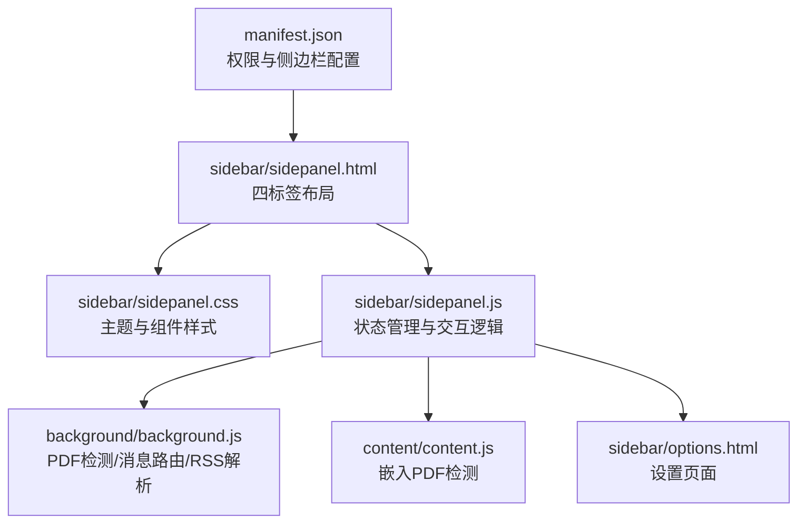
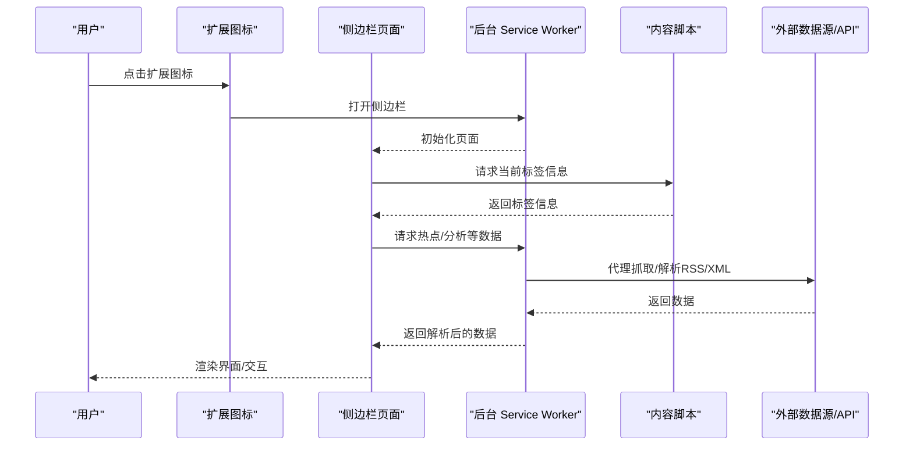
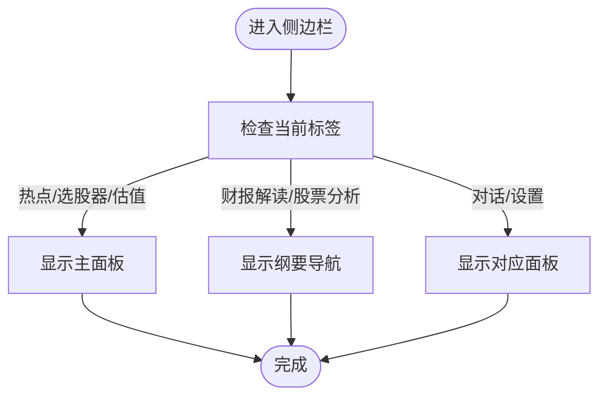
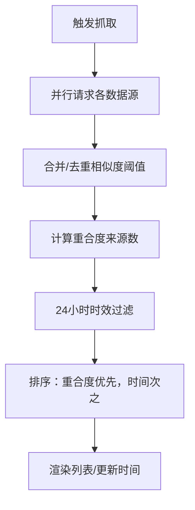
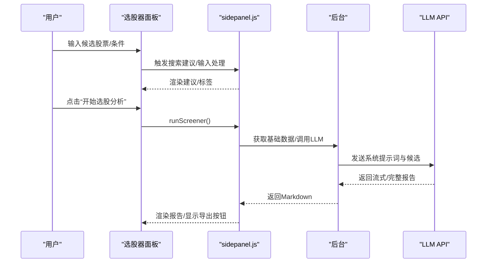
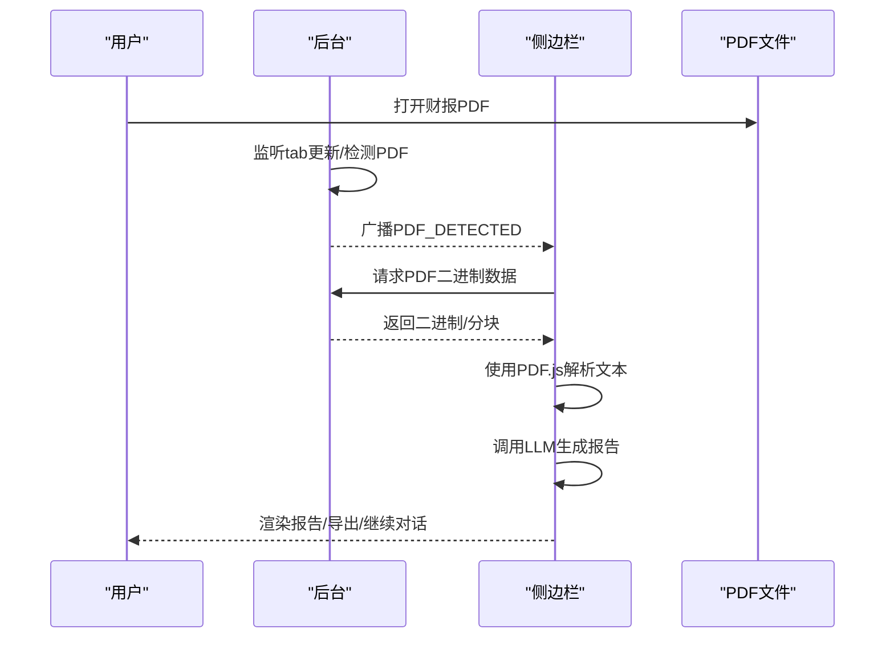
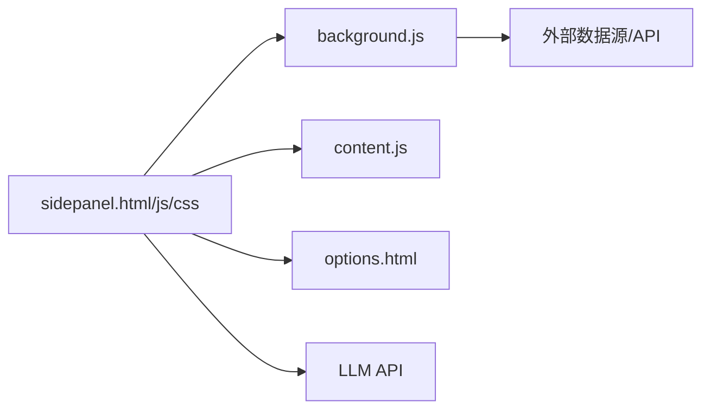

# 用户界面设计

<cite>
**本文引用的文件**
- [manifest.json](file://manifest.json)
- [sidepanel.html](file://sidebar/sidepanel.html)
- [sidepanel.css](file://sidebar/sidepanel.css)
- [sidepanel.js](file://sidebar/sidepanel.js)
- [options.html](file://sidebar/options.html)
- [background.js](file://background/background.js)
- [content.js](file://content/content.js)
- [README.md](file://README.md)
</cite>

## 目录
1. [简介](#简介)
2. [项目结构](#项目结构)
3. [核心组件](#核心组件)
4. [架构总览](#架构总览)
5. [详细组件分析](#详细组件分析)
6. [依赖关系分析](#依赖关系分析)
7. [性能考量](#性能考量)
8. [故障排查指南](#故障排查指南)
9. [结论](#结论)
10. [附录](#附录)

## 简介
本文件面向“投资助手”Chrome扩展的用户界面设计，系统梳理侧边栏布局、标签系统、交互模式与样式体系，阐述响应式与无障碍设计原则，并提供定制与优化建议。该扩展采用Manifest V3 + Side Panel API，围绕“热点信息、选股器、估值计算器、财报解读、股票分析、AI对话、设置”七大功能模块构建，界面以卡片化、模块化与渐进增强为核心理念，兼顾可访问性与跨浏览器兼容。

## 项目结构
- 扩展入口与权限声明位于 manifest.json，启用 side_panel、action 图标、web_accessible_resources 等。
- 侧边栏页面 sidepanel.html 定义四标签布局与各功能面板；样式 sidepanel.css 提供主题变量与组件样式；逻辑 sidepanel.js 实现标签切换、搜索建议、TTS、Markdown渲染、事件绑定等。
- 设置页面 options.html 用于LLM服务商与API配置。
- background/background.js 负责PDF检测、消息路由、RSS/XML解析与数据抓取。
- content/content.js 用于检测嵌入式PDF并上报。

图表来源
- [manifest.json:1-48](file://manifest.json#L1-L48)
- [sidepanel.html:1-646](file://sidebar/sidepanel.html#L1-L646)
- [sidepanel.css:1-2736](file://sidebar/sidepanel.css#L1-L2736)
- [sidepanel.js:1-5523](file://sidebar/sidepanel.js#L1-L5523)
- [background.js:1-307](file://background/background.js#L1-L307)
- [content.js:1-36](file://content/content.js#L1-L36)
- [options.html:1-124](file://sidebar/options.html#L1-L124)

章节来源
- [manifest.json:1-48](file://manifest.json#L1-L48)
- [sidepanel.html:1-646](file://sidebar/sidepanel.html#L1-L646)
- [sidepanel.css:1-2736](file://sidebar/sidepanel.css#L1-L2736)
- [sidepanel.js:1-5523](file://sidebar/sidepanel.js#L1-L5523)
- [background.js:1-307](file://background/background.js#L1-L307)
- [content.js:1-36](file://content/content.js#L1-L36)
- [options.html:1-124](file://sidebar/options.html#L1-L124)

## 核心组件
- 顶部导航与标签栏：统一的头部区域包含应用标识与设置/目录按钮；标签栏提供五个主标签（热点、选股器、估值、财报解读、股票分析、对话）。
- 热点信息模块：支持领域过滤、关键词过滤、自动刷新、RSS/JSON数据源聚合与去重。
- 选股器模块：策略选择（格雷厄姆/巴菲特/林奇/费雪/芒格/综合），输入候选股票，生成Markdown报告，支持导出与继续对话。
- 估值计算器模块：支持五种估值方法，参数自动填充与可视化对比。
- 财报解读模块：支持PDF自动检测与解析、手动粘贴、Markdown报告生成与导出。
- 股票分析模块：基于投资公司分析框架，生成六大维度报告。
- AI对话模块：基于历史上下文与报告内容进行问答。
- 设置模块：LLM服务商、API地址、API Key、模型名称与关注公司管理。
- TTS播报与纲要导航：滚动高亮、章节播报、进度条与控制条。

章节来源
- [sidepanel.html:10-646](file://sidebar/sidepanel.html#L10-L646)
- [sidepanel.js:14-297](file://sidebar/sidepanel.js#L14-L297)
- [sidepanel.js:516-584](file://sidebar/sidepanel.js#L516-L584)
- [sidepanel.js:990-1005](file://sidebar/sidepanel.js#L990-L1005)

## 架构总览
扩展采用“侧边栏页面 + Service Worker后台”的双层架构：
- 侧边栏页面负责UI与用户交互，状态集中管理，事件驱动更新DOM。
- Service Worker负责PDF下载、消息路由、RSS/XML解析与跨域数据抓取，避免CORS限制。
- Content Script用于检测嵌入式PDF并上报。

图表来源
- [background.js:11-19](file://background/background.js#L11-L19)
- [background.js:36-117](file://background/background.js#L36-L117)
- [content.js:11-35](file://content/content.js#L11-L35)
- [sidepanel.js:591-607](file://sidebar/sidepanel.js#L591-L607)

## 详细组件分析

### 标签系统与布局
- 标签栏：五个主标签，当前激活标签带有底部强调条；点击切换面板。
- 纲要导航：仅在“财报解读/股票分析”标签下显示，支持滚动高亮与章节播报。
- 响应式布局：基于Flexbox与自适应容器，面板内容垂直滚动，确保在不同窗口尺寸下可读性。

图表来源
- [sidepanel.html:33-40](file://sidebar/sidepanel.html#L33-L40)
- [sidepanel.html:24-30](file://sidebar/sidepanel.html#L24-L30)
- [sidepanel.js:990-1005](file://sidebar/sidepanel.js#L990-L1005)

章节来源
- [sidepanel.html:33-40](file://sidebar/sidepanel.html#L33-L40)
- [sidepanel.html:24-30](file://sidebar/sidepanel.html#L24-L30)
- [sidepanel.js:990-1005](file://sidebar/sidepanel.js#L990-L1005)

### 热点信息模块（行业热点/公司资讯）
- 数据源：内置API（财联社电报、东方财富7×24）、默认RSS列表、自定义RSS/JSON API。
- 聚合与去重：并行抓取，基于标题关键词相似度合并重复新闻，计算“重合度”（来源数量）。
- 过滤与搜索：领域过滤（半导体/新能源/AI/机器人/核电/伊朗战况/关键词），关键词搜索。
- 自动刷新：基于配置的分钟级定时器，24小时内时效过滤。

图表来源
- [sidepanel.js:1291-1363](file://sidebar/sidepanel.js#L1291-L1363)
- [sidepanel.js:1371-1492](file://sidebar/sidepanel.js#L1371-L1492)
- [sidepanel.js:1497-1585](file://sidebar/sidepanel.js#L1497-L1585)

章节来源
- [sidepanel.js:1026-1086](file://sidebar/sidepanel.js#L1026-L1086)
- [sidepanel.js:1291-1363](file://sidebar/sidepanel.js#L1291-L1363)
- [sidepanel.js:1371-1492](file://sidebar/sidepanel.js#L1371-L1492)
- [sidepanel.js:1497-1585](file://sidebar/sidepanel.js#L1497-L1585)

### 选股器模块（策略+输入+报告）
- 策略选择：五种大师策略与综合策略，支持展开策略详情。
- 输入与建议：实时搜索建议，键盘上下选择，标签化已选股票，支持批量清空。
- 分析与导出：生成Markdown报告，支持复制与导出，支持继续对话。

图表来源
- [sidepanel.js:758-844](file://sidebar/sidepanel.js#L758-L844)
- [sidepanel.js:800-844](file://sidebar/sidepanel.js#L800-L844)
- [sidepanel.js:14-297](file://sidebar/sidepanel.js#L14-L297)

章节来源
- [sidepanel.js:758-844](file://sidebar/sidepanel.js#L758-L844)
- [sidepanel.js:800-844](file://sidebar/sidepanel.js#L800-L844)
- [sidepanel.js:14-297](file://sidebar/sidepanel.js#L14-L297)

### 估值计算器模块（DCF/格雷厄姆/DDM/相对PE/EVA）
- 方法切换：五种估值方法，动态渲染参数表。
- 参数自动填充：基于股票搜索结果自动填充PE/PB/ROE/FCF等关键指标。
- 结果展示：内在价值对比、安全边际、可视化对比与计算假设明细。

章节来源
- [sidepanel.html:291-371](file://sidebar/sidepanel.html#L291-L371)
- [sidepanel.js:846-901](file://sidebar/sidepanel.js#L846-L901)

### 财报解读模块（PDF/手动粘贴/报告）
- PDF检测：后台监听tab更新，识别PDF URL或chrome://pdf-viewer；内容脚本检测嵌入式PDF。
- 文本提取与解析：后台下载PDF二进制，必要时分块传输；解析为文本后交给前端LLM分析。
- 报告生成：Markdown结构化报告，支持导出与继续对话。

图表来源
- [background.js:21-34](file://background/background.js#L21-L34)
- [background.js:125-177](file://background/background.js#L125-L177)
- [content.js:11-35](file://content/content.js#L11-L35)
- [sidepanel.js:591-597](file://sidebar/sidepanel.js#L591-L597)

章节来源
- [background.js:21-34](file://background/background.js#L21-L34)
- [background.js:125-177](file://background/background.js#L125-L177)
- [content.js:11-35](file://content/content.js#L11-L35)
- [sidepanel.js:591-597](file://sidebar/sidepanel.js#L591-L597)

### 股票分析模块（投资公司分析框架）
- 框架维度：行业与商业模式、财务稳健性、管理层质量、估值分析、核心风险、预期与触发点。
- 输入：股票搜索，渲染股票卡片与核心指标，支持开始分析。
- 输出：Markdown报告，支持导出与继续对话。

章节来源
- [sidepanel.html:442-543](file://sidebar/sidepanel.html#L442-L543)
- [sidepanel.js:902-956](file://sidebar/sidepanel.js#L902-L956)

### AI对话模块
- 上下文：基于历史聊天记录与报告内容。
- 快捷问题：预设常见问题，一键提问。
- 交互：支持回车发送、流式输出、复制与导出。

章节来源
- [sidepanel.html:545-562](file://sidebar/sidepanel.html#L545-L562)
- [sidepanel.js:958-986](file://sidebar/sidepanel.js#L958-L986)

### 设置模块
- LLM配置：服务商、API地址、API Key、模型名称。
- 关注公司管理：添加/删除关注公司，支持搜索建议。
- 本地持久化：设置保存在localStorage。

章节来源
- [sidepanel.html:564-617](file://sidebar/sidepanel.html#L564-L617)
- [sidepanel.js:609-637](file://sidebar/sidepanel.js#L609-L637)
- [options.html:72-121](file://sidebar/options.html#L72-L121)

### TTS播报与纲要导航
- 纲要导航：滚动高亮、章节跳转、自动追踪。
- TTS控制：底部控制条，支持播放/暂停/上一段/下一段/停止/语速调节，章节播报高亮。

章节来源
- [sidepanel.html:23-30](file://sidebar/sidepanel.html#L23-L30)
- [sidepanel.css:1406-1599](file://sidebar/sidepanel.css#L1406-L1599)
- [sidepanel.js:974-986](file://sidebar/sidepanel.js#L974-L986)

## 依赖关系分析
- 侧边栏页面依赖CSS主题变量与组件样式，逻辑依赖后台消息与内容脚本提供的PDF检测信号。
- 后台负责跨域数据抓取与RSS/XML解析，避免CORS限制；同时承担PDF二进制下载与分块传输。
- 设置页面与侧边栏设置面板共享相同的配置项与持久化策略。

图表来源
- [sidepanel.html:1-646](file://sidebar/sidepanel.html#L1-L646)
- [sidepanel.css:1-2736](file://sidebar/sidepanel.css#L1-L2736)
- [sidepanel.js:1-5523](file://sidebar/sidepanel.js#L1-L5523)
- [background.js:1-307](file://background/background.js#L1-L307)
- [content.js:1-36](file://content/content.js#L1-L36)
- [options.html:1-124](file://sidebar/options.html#L1-L124)

章节来源
- [sidepanel.html:1-646](file://sidebar/sidepanel.html#L1-L646)
- [sidepanel.css:1-2736](file://sidebar/sidepanel.css#L1-L2736)
- [sidepanel.js:1-5523](file://sidebar/sidepanel.js#L1-L5523)
- [background.js:1-307](file://background/background.js#L1-L307)
- [content.js:1-36](file://content/content.js#L1-L36)
- [options.html:1-124](file://sidebar/options.html#L1-L124)

## 性能考量
- 搜索建议防抖：输入事件统一使用setTimeout去抖，降低频繁请求与渲染开销。
- 列表截断与排序：热点列表最多100条，按重合度与时间排序，减少DOM节点数量。
- 并行抓取：热点模块对多个数据源并行请求，缩短首屏时间。
- PDF分块传输：后台对大体积PDF进行分块传输，避免一次性消息过大导致性能问题。
- 滚动高亮与TTS：仅在相关面板启用，避免无关面板的监听与计算。

章节来源
- [sidepanel.js:788-821](file://sidebar/sidepanel.js#L788-L821)
- [sidepanel.js:1291-1363](file://sidebar/sidepanel.js#L1291-L1363)
- [background.js:159-177](file://background/background.js#L159-L177)
- [sidepanel.js:981-986](file://sidebar/sidepanel.js#L981-L986)

## 故障排查指南
- PDF无法自动检测
  - 检查是否为chrome://pdf-viewer/链接，后台会解析src参数；若无src则无法获取原始PDF地址。
  - 确认后台已监听tab更新并广播PDF_DETECTED消息。
- 抓取热点失败
  - 检查HOTSPOT_FETCH消息是否正确转发至后台fetch函数；确认外部数据源可用与CORS策略。
  - 若RSS/XML解析失败，后台会返回原始文本，前端可降级处理。
- 设置保存无效
  - 确认options页面与侧边栏设置面板均写入localStorage；检查API Key是否为空。
- 滚动高亮不生效
  - 确认报告内容容器存在滚动事件绑定；仅在“财报解读/股票分析”标签启用。

章节来源
- [background.js:21-34](file://background/background.js#L21-L34)
- [background.js:64-117](file://background/background.js#L64-L117)
- [background.js:192-251](file://background/background.js#L192-L251)
- [options.html:102-121](file://sidebar/options.html#L102-L121)
- [sidepanel.js:974-986](file://sidebar/sidepanel.js#L974-L986)

## 结论
该扩展的UI设计以“模块化卡片 + 渐进增强”为核心，通过清晰的标签系统与纲要导航提升信息密度与可读性；通过TTS播报与滚动高亮强化阅读体验；通过策略化与框架化分析输出结构化报告，满足专业用户的信息检索与决策需求。在性能方面，采用并行抓取、去重与列表截断等策略，保证在大数据量场景下的流畅体验。建议后续可在无障碍与跨浏览器兼容方面进一步完善。

## 附录

### 响应式与交互设计原则
- 布局：Flexbox纵向布局，面板内容垂直滚动，确保在窄窗口下可完整阅读。
- 交互：统一的按钮与输入框样式，hover与focus状态一致；键盘导航支持（上下箭头、回车、Esc）。
- 可访问性：提供title属性与语义化标签；颜色对比符合WCAG基本要求；键盘可达。

章节来源
- [sidepanel.css:43-47](file://sidebar/sidepanel.css#L43-L47)
- [sidepanel.css:82-125](file://sidebar/sidepanel.css#L82-L125)
- [sidepanel.js:800-821](file://sidebar/sidepanel.js#L800-L821)

### 主题与样式系统
- 主题变量：通过CSS自定义属性集中管理主色、辅色、背景、表面、边框、文本与阴影等。
- 组件样式：按钮、标签、面板、列表、输入框、滚动条、Markdown渲染等均有独立样式模块。
- 动画与过渡：下拉、上滑、加载旋转、打字指示器等使用简单动画提升反馈。

章节来源
- [sidepanel.css:2-25](file://sidebar/sidepanel.css#L2-L25)
- [sidepanel.css:806-834](file://sidebar/sidepanel.css#L806-L834)
- [sidepanel.css:1122-1144](file://sidebar/sidepanel.css#L1122-L1144)

### 用户交互模式与体验优化
- 搜索建议：输入即建议，支持键盘导航与回车确认，减少用户操作路径。
- 策略与方法切换：即时切换并动态渲染参数，避免页面刷新。
- 报告导出：一键导出Markdown，支持复制与继续对话，形成闭环。
- TTS播报：章节级播报与进度条，支持语速调节与章节跳转。

章节来源
- [sidepanel.js:788-821](file://sidebar/sidepanel.js#L788-L821)
- [sidepanel.js:886-893](file://sidebar/sidepanel.js#L886-L893)
- [sidepanel.css:1538-1599](file://sidebar/sidepanel.css#L1538-L1599)

### 界面定制指导与最佳实践
- 主题定制：通过修改CSS变量即可实现主题切换；建议提供浅/深色主题开关。
- 组件复用：将通用组件（按钮、输入框、标签、模态框）抽象为可复用模块，便于维护。
- 可访问性：为所有交互元素提供title与aria-label；确保键盘可达；为图片与图标提供替代文本。
- 跨浏览器兼容：避免使用实验性API；对Web Speech API与PDF.js进行降级处理；在options页面提供兼容性提示。

章节来源
- [sidepanel.css:2-25](file://sidebar/sidepanel.css#L2-L25)
- [sidepanel.html:1-646](file://sidebar/sidepanel.html#L1-L646)
- [README.md:138-142](file://README.md#L138-L142)