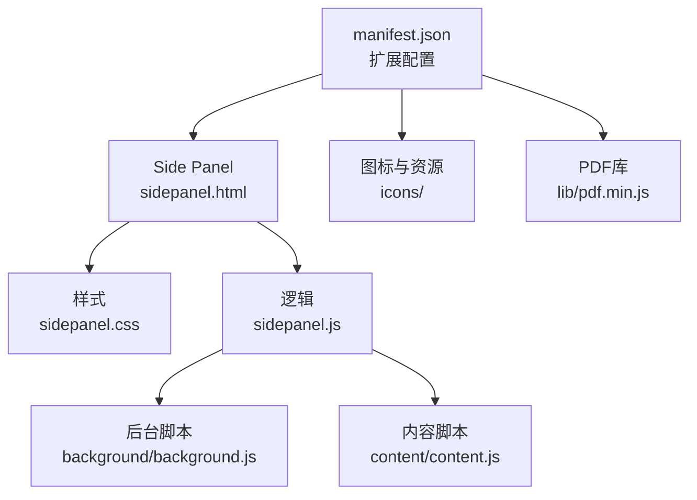
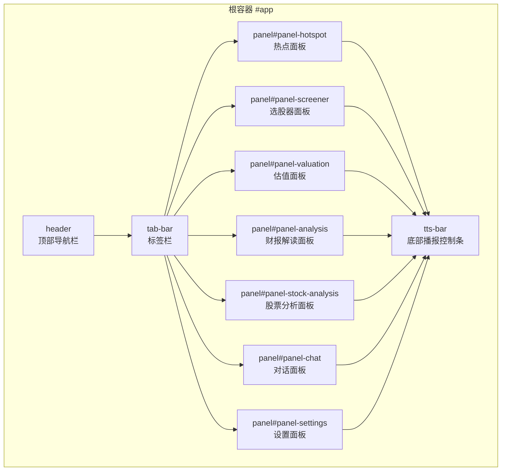
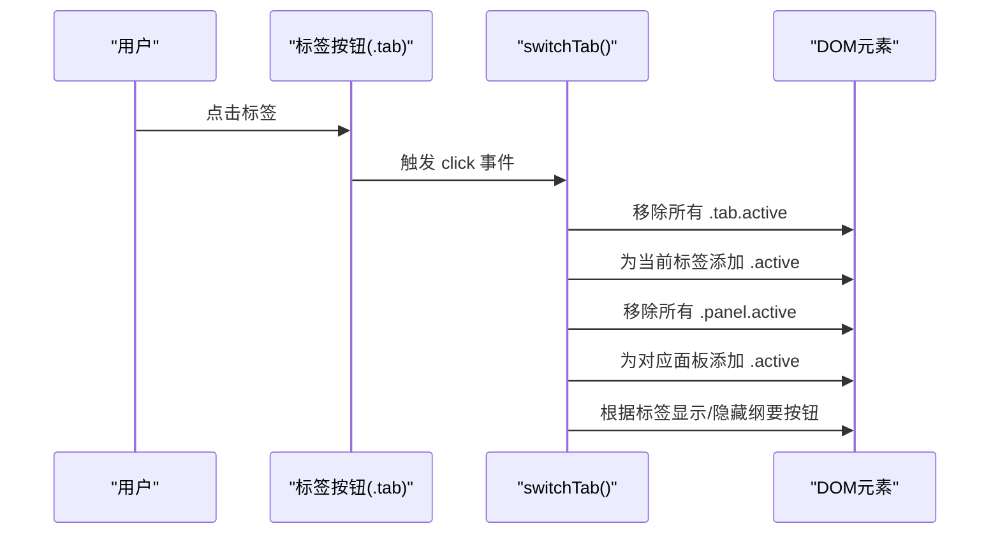
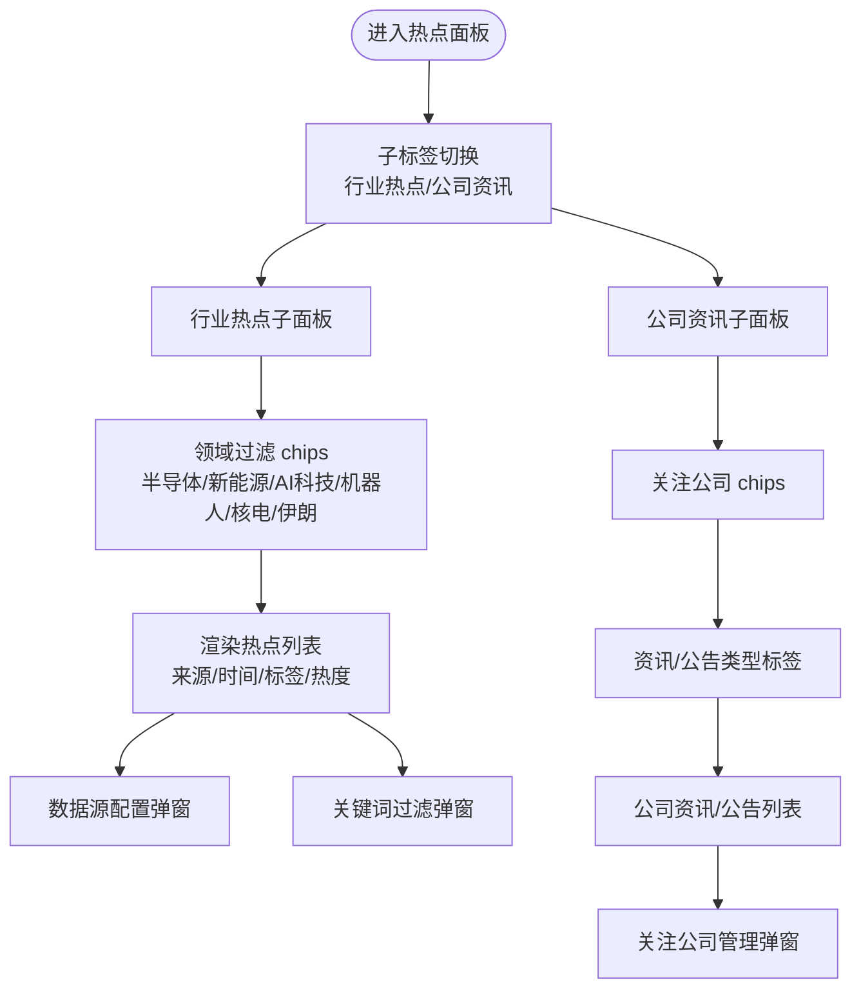
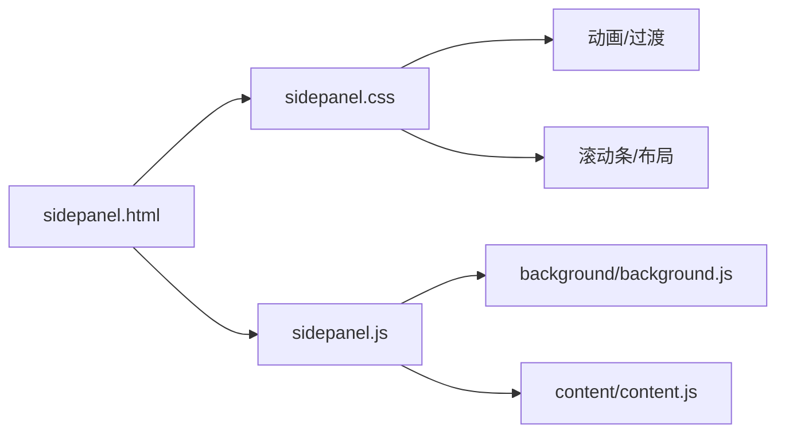

# 界面布局设计

<cite>
**本文档引用的文件**
- [sidepanel.html](file://sidebar/sidepanel.html)
- [sidepanel.css](file://sidebar/sidepanel.css)
- [sidepanel.js](file://sidebar/sidepanel.js)
- [manifest.json](file://manifest.json)
- [README.md](file://README.md)
</cite>

## 目录
1. [简介](#简介)
2. [项目结构](#项目结构)
3. [核心组件](#核心组件)
4. [架构总览](#架构总览)
5. [详细组件分析](#详细组件分析)
6. [依赖关系分析](#依赖关系分析)
7. [性能考量](#性能考量)
8. [故障排除指南](#故障排除指南)
9. [结论](#结论)
10. [附录](#附录)

## 简介
本文件系统性阐述投资助手扩展的界面布局设计，涵盖整体布局架构（顶部导航栏、标签栏、主内容区域、底部播报控制条）、五大主标签页的布局策略与响应式实现、子标签系统（热点信息面板中的行业热点与公司资讯）、面板切换机制与动画效果、用户体验优化、屏幕适配与移动端优化，以及布局定制的最佳实践与扩展指导。文档旨在帮助开发者与产品人员快速理解并高效迭代该侧边栏应用的界面设计。

## 项目结构
- 采用 Manifest V3 的 Chrome 扩展结构，侧边栏通过 Side Panel API 展示。
- 核心文件：
  - sidepanel.html：页面结构与标签组织
  - sidepanel.css：样式与响应式规则
  - sidepanel.js：状态管理、事件绑定、面板切换、交互逻辑
  - manifest.json：扩展配置与权限声明
  - README.md：功能说明与使用指南

图表来源
- [manifest.json:16-18](file://manifest.json#L16-L18)
- [sidepanel.html:1-646](file://sidebar/sidepanel.html#L1-L646)
- [sidepanel.css:1-2736](file://sidebar/sidepanel.css#L1-L2736)
- [sidepanel.js:1-5523](file://sidebar/sidepanel.js#L1-L5523)

章节来源
- [manifest.json:1-48](file://manifest.json#L1-L48)
- [README.md:108-126](file://README.md#L108-L126)

## 核心组件
- 顶部导航栏：品牌标识、标题与工具按钮（纲要导航、设置）
- 标签栏：五个主标签（热点、选股器、估值、财报解读、股票分析、对话）
- 主内容区域：各标签对应的面板，采用统一的“panel active”激活机制
- 子标签系统：热点面板内行业热点与公司资讯的子标签切换
- 底部播报控制条：TTS 播报控制与进度反馈
- 设置面板：LLM 服务商配置与关注公司管理

章节来源
- [sidepanel.html:11-40](file://sidebar/sidepanel.html#L11-L40)
- [sidepanel.html:42-562](file://sidebar/sidepanel.html#L42-L562)
- [sidepanel.html:619-640](file://sidebar/sidepanel.html#L619-L640)

## 架构总览
整体采用“容器-面板-子面板”的层级结构：
- #app 作为根容器，垂直布局（column），高度占满视口
- header 固定高度，tab-bar 固定高度，panel 区域自适应填充剩余空间
- panel.active 控制当前可见面板，其余隐藏
- 热点面板包含 hs-sub-tabs 与两个 hs-sub-panel（行业热点/公司资讯）

图表来源
- [sidepanel.html:10-646](file://sidebar/sidepanel.html#L10-L646)
- [sidepanel.css:43-173](file://sidebar/sidepanel.css#L43-L173)

## 详细组件分析

### 顶部导航栏与标签栏
- 顶部导航栏：左侧 logo+标题，右侧工具按钮（纲要导航、设置）
- 标签栏：六个主标签，均等分配宽度，当前标签带底部强调条
- 切换机制：点击标签更新 state.activeTab 并切换 panel.active

图表来源
- [sidepanel.js:990-1005](file://sidebar/sidepanel.js#L990-L1005)
- [sidepanel.html:33-40](file://sidebar/sidepanel.html#L33-L40)
- [sidepanel.css:126-162](file://sidebar/sidepanel.css#L126-L162)

章节来源
- [sidepanel.html:11-21](file://sidebar/sidepanel.html#L11-L21)
- [sidepanel.html:33-40](file://sidebar/sidepanel.html#L33-L40)
- [sidepanel.css:126-162](file://sidebar/sidepanel.css#L126-L162)
- [sidepanel.js:990-1005](file://sidebar/sidepanel.js#L990-L1005)

### 热点信息面板（含子标签系统）
- 子标签：行业热点 / 公司资讯
- 子标签切换：hs-sub-tabs 下的 hs-sub-tab，切换对应 hs-sub-panel
- 行业热点子面板：
  - 顶部控制区：刷新、数据源配置、关键词过滤
  - 领域过滤 chips：半导体、新能源、AI科技、机器人、核电、伊朗战况
  - 热点列表：支持领域过滤、关键词搜索、来源标签、热度标记
  - 弹窗：数据源配置、关键词过滤、RSS 源管理
- 公司资讯子面板：
  - 关注公司 chips：动态填充
  - 类型标签：资讯/公告
  - 列表：支持刷新、加载状态
  - 弹窗：关注公司管理（添加/删除）

图表来源
- [sidepanel.html:42-222](file://sidebar/sidepanel.html#L42-L222)
- [sidepanel.html:2558-2595](file://sidebar/sidepanel.html#L2558-L2595)
- [sidepanel.css:2558-2595](file://sidebar/sidepanel.css#L2558-L2595)
- [sidepanel.js:1026-1595](file://sidebar/sidepanel.js#L1026-L1595)

章节来源
- [sidepanel.html:42-222](file://sidebar/sidepanel.html#L42-L222)
- [sidepanel.html:2558-2595](file://sidebar/sidepanel.html#L2558-L2595)
- [sidepanel.css:2558-2595](file://sidebar/sidepanel.css#L2558-L2595)
- [sidepanel.js:1026-1595](file://sidebar/sidepanel.js#L1026-L1595)

### 选股器面板
- 策略 chips：格雷厄姆、巴菲特、林奇、费雪、芒格、综合
- 展开/收起策略详情
- 输入候选股票：支持逗号/换行分隔，搜索提示，已选股票标签
- 结果展示：Markdown 报告，支持复制、导出、继续对话
- 加载状态：统一 loading-state

章节来源
- [sidepanel.html:224-289](file://sidebar/sidepanel.html#L224-L289)
- [sidepanel.css:175-488](file://sidebar/sidepanel.css#L175-L488)
- [sidepanel.js:758-986](file://sidebar/sidepanel.js#L758-L986)

### 估值计算器面板
- 搜索股票：输入代码/名称，搜索提示
- 股票信息卡：名称、代码、行业、价格、涨跌、多项财务指标
- 估值方法切换：DCFr、格雷厄姆、DDM、相对PE、EVA
- 参数表单与计算按钮、结果展示

章节来源
- [sidepanel.html:291-371](file://sidebar/sidepanel.html#L291-L371)
- [sidepanel.css:1598-1735](file://sidebar/sidepanel.css#L1598-L1735)
- [sidepanel.js:846-901](file://sidebar/sidepanel.js#L846-L901)

### 财报解读面板
- 搜索股票：输入代码/名称，搜索提示
- 财报列表：按时间倒序展示，支持选择
- PDF/手动粘贴两种入口
- 结果展示：Markdown 报告，支持复制、导出、继续对话
- 纲要导航：仅在该标签下显示

章节来源
- [sidepanel.html:373-440](file://sidebar/sidepanel.html#L373-L440)
- [sidepanel.css:489-651](file://sidebar/sidepanel.css#L489-L651)
- [sidepanel.js:687-986](file://sidebar/sidepanel.js#L687-L986)

### 股票分析面板
- 搜索股票：输入代码/名称，搜索提示
- 分析框架说明（details 折叠）
- 股票信息卡：核心指标概览
- 分析结果：Markdown 报告，支持复制、导出、继续对话

章节来源
- [sidepanel.html:442-543](file://sidebar/sidepanel.html#L442-L543)
- [sidepanel.css:652-753](file://sidebar/sidepanel.css#L652-L753)
- [sidepanel.js:902-956](file://sidebar/sidepanel.js#L902-L956)

### 对话面板
- 欢迎语与常用问题建议
- 输入框与发送按钮
- 消息气泡：用户/AI 区分，支持 Markdown 渲染
- 打字动画：typing-indicator

章节来源
- [sidepanel.html:545-562](file://sidebar/sidepanel.html#L545-L562)
- [sidepanel.css:1002-1197](file://sidebar/sidepanel.css#L1002-L1197)
- [sidepanel.js:958-972](file://sidebar/sidepanel.js#L958-L972)

### 设置面板
- LLM 服务商选择与 API 配置
- 关注公司管理：添加/删除、搜索提示
- 保存设置与状态提示

章节来源
- [sidepanel.html:564-617](file://sidebar/sidepanel.html#L564-L617)
- [sidepanel.css:1198-1354](file://sidebar/sidepanel.css#L1198-L1354)
- [sidepanel.js:609-637](file://sidebar/sidepanel.js#L609-L637)

### 底部播报控制条
- 播报进度条、状态文本、控制按钮（上一段/播放暂停/下一段/停止）
- 语速选择
- 与报告内容联动：章节高亮、滚动同步、章节播报按钮

章节来源
- [sidepanel.html:619-640](file://sidebar/sidepanel.html#L619-L640)
- [sidepanel.css:1537-1599](file://sidebar/sidepanel.css#L1537-L1599)
- [sidepanel.js:3521-3705](file://sidebar/sidepanel.js#L3521-L3705)

## 依赖关系分析
- HTML 结构依赖 CSS 样式与 JS 逻辑
- JS 通过 DOM API 控制面板切换、事件绑定、状态管理
- 后台脚本负责跨域数据抓取与 PDF 解析（通过 runtime 消息）
- CSS 通过 Flexbox、动画与滚动条样式实现布局与交互

图表来源
- [sidepanel.html:1-646](file://sidebar/sidepanel.html#L1-L646)
- [sidepanel.css:1-2736](file://sidebar/sidepanel.css#L1-L2736)
- [sidepanel.js:1-5523](file://sidebar/sidepanel.js#L1-L5523)

章节来源
- [sidepanel.js:974-986](file://sidebar/sidepanel.js#L974-L986)

## 性能考量
- 面板切换：通过移除/添加 active 类实现，避免复杂 DOM 重建
- 列表渲染：热点列表最多显示 100 条，减少重绘
- 搜索建议：防抖/节流（setTimeout clearTimeout），降低频繁请求
- 滚动优化：使用 -webkit-overflow-scrolling: touch，提升移动端滚动体验
- 动画：关键路径使用 transform/opacity，避免强制同步布局

章节来源
- [sidepanel.js:786-821](file://sidebar/sidepanel.js#L786-L821)
- [sidepanel.css:2164-2175](file://sidebar/sidepanel.css#L2164-L2175)

## 故障排除指南
- 标签切换无效：检查 state.activeTab 与 DOM 操作是否一致
- 热点列表为空：确认数据源配置、关键词过滤、时间窗口（24小时内）
- 播报控制条不显示：确认当前标签为“财报解读/股票分析”，且已生成报告内容
- 设置保存失败：检查 API Key 是否为空，localStorage 是否可用

章节来源
- [sidepanel.js:609-637](file://sidebar/sidepanel.js#L609-L637)
- [sidepanel.js:1291-1363](file://sidebar/sidepanel.js#L1291-L1363)
- [sidepanel.js:3684-3705](file://sidebar/sidepanel.js#L3684-L3705)

## 结论
该界面布局以“容器-面板-子面板”为核心，通过统一的 panel.active 机制实现清晰的面板切换与动画效果；热点面板的子标签系统提升了信息密度与可探索性；底部播报控制条贯穿核心内容，增强阅读体验。整体采用 Flex 布局与 CSS 动画，兼顾桌面端与移动端滚动体验。建议后续可在样式层面引入媒体查询以进一步优化移动端显示，并在交互层面增加手势支持与无障碍访问。

## 附录

### 响应式设计与移动端优化
- 当前样式未显式使用媒体查询，但通过以下方式实现移动端友好：
  - Flex 布局与自适应高度，适合不同窗口尺寸
  - 横向 chips 区域支持滚动，避免换行
  - 滚动条样式与触摸滚动优化
  - 底部控制条固定在视口底部，便于单手操作
- 建议新增媒体查询：
  - 小屏设备（<768px）：减小字体、按钮尺寸、间距；标签栏改为纵向排列或折叠菜单
  - 中屏设备（768px-1024px）：调整面板内边距与列表行高
  - 大屏设备（>1024px）：增大面板宽度与列表列宽，提升信息密度

章节来源
- [sidepanel.css:193-202](file://sidebar/sidepanel.css#L193-L202)
- [sidepanel.css:1388-1404](file://sidebar/sidepanel.css#L1388-L1404)
- [sidepanel.css:1537-1599](file://sidebar/sidepanel.css#L1537-L1599)

### 布局定制最佳实践
- 面板切换
  - 保持 state.activeTab 与 DOM 状态一致
  - 使用统一的 switchTab() 逻辑，避免直接操作 DOM
- 子标签系统
  - 子面板采用 hs-sub-panel.active 控制显示
  - 子标签 hover/active 状态与面板内容保持同步
- 动画与过渡
  - 使用 CSS 动画（slideDown/slideUp/fadeInOut）提升交互质感
  - 关键动画属性使用 transform/opacity，避免重排
- 可访问性
  - 为按钮添加 title 属性与键盘导航支持（上下箭头选择搜索项）
  - 为列表项添加 aria-label 或 role 属性，提升屏幕阅读器体验

章节来源
- [sidepanel.js:990-1005](file://sidebar/sidepanel.js#L990-L1005)
- [sidepanel.css:1415-1419](file://sidebar/sidepanel.css#L1415-L1419)
- [sidepanel.js:800-821](file://sidebar/sidepanel.js#L800-L821)