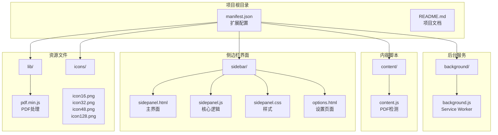
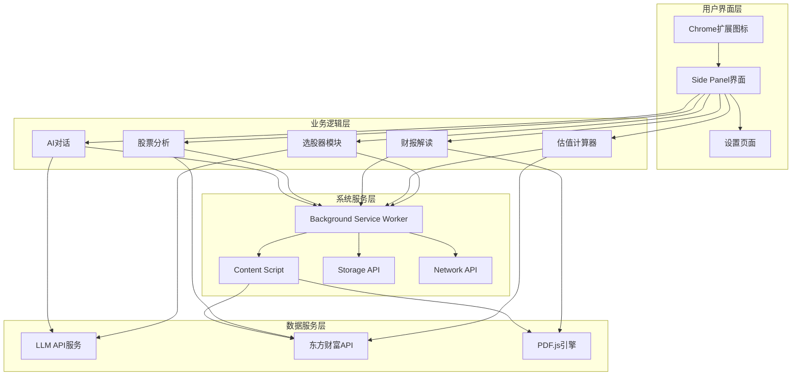
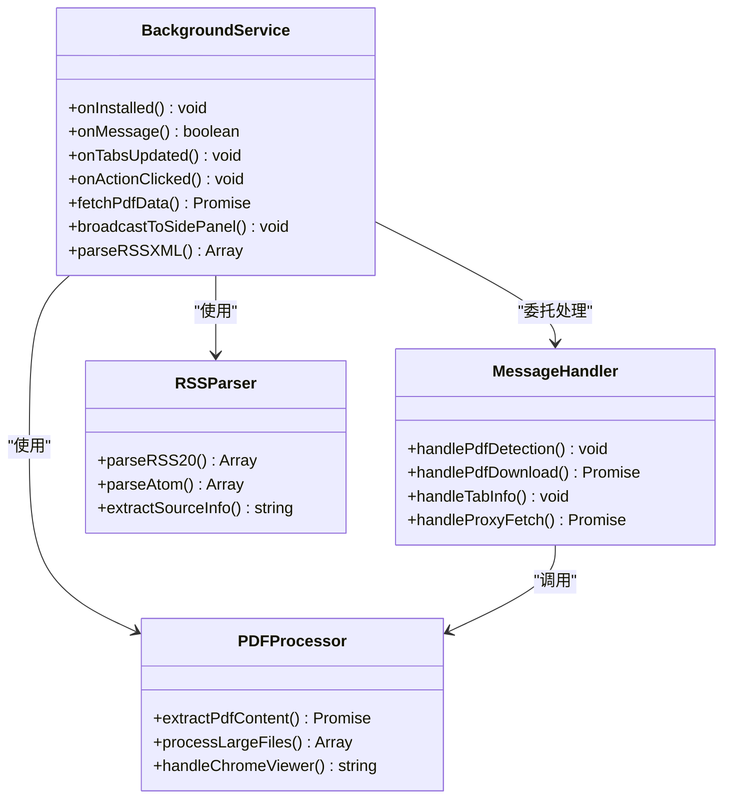
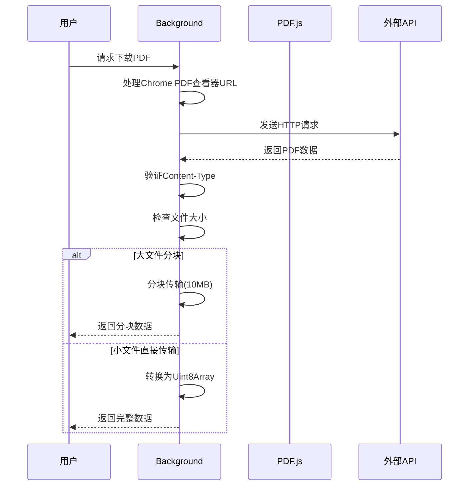
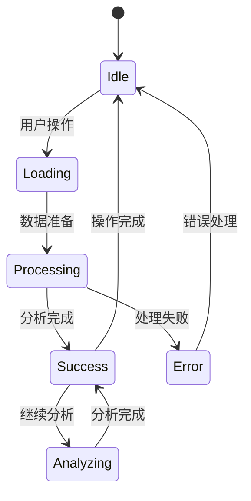
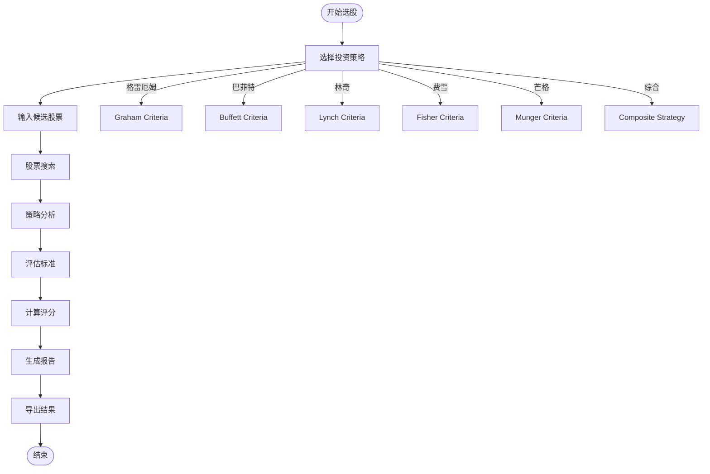
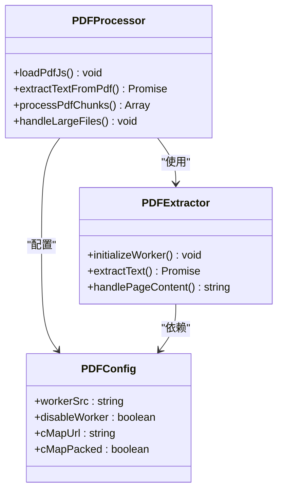
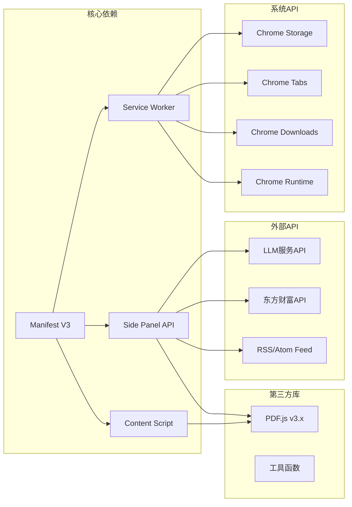

# 开发者模式

<cite>
**本文档引用的文件**
- [manifest.json](file://manifest.json)
- [README.md](file://README.md)
- [background.js](file://background/background.js)
- [content.js](file://content/content.js)
- [sidepanel.js](file://sidebar/sidepanel.js)
- [sidepanel.html](file://sidebar/sidepanel.html)
- [sidepanel.css](file://sidebar/sidepanel.css)
- [options.html](file://sidebar/options.html)
- [pdf.min.js](file://lib/pdf.min.js)
- [pdf.worker.min.js](file://lib/pdf.worker.min.js)
</cite>

## 目录
1. [简介](#简介)
2. [项目结构](#项目结构)
3. [核心组件](#核心组件)
4. [架构概览](#架构概览)
5. [详细组件分析](#详细组件分析)
6. [依赖关系分析](#依赖关系分析)
7. [性能考虑](#性能考虑)
8. [故障排除指南](#故障排除指南)
9. [结论](#结论)
10. [附录](#附录)

## 简介

这是一个基于Chrome扩展框架的"投资助手"项目，集成了价值投资大师策略、财报解读、内在价值计算器等功能。该项目采用Manifest V3标准，使用Side Panel API提供现代化的用户体验，并集成了PDF.js进行PDF文档处理。

该项目的核心特色包括：
- 多种价值投资大师策略（格雷厄姆、巴菲特、林奇、费雪、芒格）
- AI驱动的财报解读和股票分析
- 内在价值计算器
- PDF文档自动检测和处理
- 多LLM服务商支持

## 项目结构

项目采用清晰的功能模块化组织，主要包含以下核心目录：

**图表来源**
- [manifest.json:1-48](file://manifest.json#L1-L48)
- [README.md:108-126](file://README.md#L108-L126)

**章节来源**
- [manifest.json:1-48](file://manifest.json#L1-L48)
- [README.md:108-126](file://README.md#L108-L126)

## 核心组件

### 扩展配置（Manifest V3）

项目使用最新的Manifest V3标准，提供了完整的功能配置：

**权限配置**：
- `sidePanel`: 启用侧边栏功能
- `activeTab`: 访问当前活动标签页
- `scripting`: 注入脚本
- `storage`: 本地存储
- `downloads`: 文件下载

**核心功能**：
- Service Worker后台处理
- Side Panel侧边栏界面
- Web Accessible Resources资源暴露
- Action图标和菜单

**章节来源**
- [manifest.json:6-47](file://manifest.json#L6-L47)

### 后台服务（Background Service Worker）

后台服务是整个扩展的核心协调者，负责：

- **侧边栏管理**：响应用户点击，打开/关闭侧边栏
- **PDF检测**：监听标签页更新，自动检测PDF文件
- **数据下载**：绕过CORS限制，下载PDF和其他资源
- **消息路由**：在各个组件间传递消息

**章节来源**
- [background.js:11-186](file://background/background.js#L11-L186)

### 内容脚本（Content Script）

轻量级内容脚本专注于PDF检测：

- **嵌入式PDF检测**：检测网页中的embed/object/iframe PDF元素
- **事件通信**：向后台发送PDF发现通知
- **兼容性**：Chrome内置PDF查看器的特殊处理

**章节来源**
- [content.js:11-35](file://content/content.js#L11-L35)

### 侧边栏界面

侧边栏采用模块化设计，包含六个主要功能模块：

1. **热点信息**：实时新闻和市场动态
2. **选股器**：多策略价值投资分析
3. **估值计算器**：多种估值方法
4. **财报解读**：PDF文档分析
5. **股票分析**：深度投资分析框架
6. **AI对话**：自然语言交互

**章节来源**
- [sidepanel.html:33-562](file://sidebar/sidepanel.html#L33-L562)
- [sidepanel.js:12-297](file://sidebar/sidepanel.js#L12-L297)

## 架构概览

项目采用典型的Chrome扩展三层架构：

**图表来源**
- [background.js:11-117](file://background/background.js#L11-L117)
- [sidepanel.js:589-607](file://sidebar/sidepanel.js#L589-L607)

## 详细组件分析

### 后台服务组件分析

后台服务采用事件驱动架构，通过消息传递实现组件间通信：

**图表来源**
- [background.js:16-186](file://background/background.js#L16-L186)
- [background.js:125-177](file://background/background.js#L125-L177)
- [background.js:192-306](file://background/background.js#L192-L306)

#### PDF下载流程

**图表来源**
- [background.js:125-177](file://background/background.js#L125-L177)

**章节来源**
- [background.js:11-186](file://background/background.js#L11-L186)

### 侧边栏核心逻辑分析

侧边栏采用状态管理模式，集中管理所有功能模块的状态：

**图表来源**
- [sidepanel.js:516-584](file://sidebar/sidepanel.js#L516-L584)

#### 价值投资策略模板

项目内置六种价值投资大师策略，每种策略都有详细的评估标准：

**图表来源**
- [sidepanel.js:14-297](file://sidebar/sidepanel.js#L14-L297)

**章节来源**
- [sidepanel.js:14-297](file://sidebar/sidepanel.js#L14-L297)

### PDF处理组件分析

项目集成了PDF.js库，提供完整的PDF处理能力：

**图表来源**
- [sidepanel.js:594-594](file://sidebar/sidepanel.js#L594-L594)
- [pdf.min.js](file://lib/pdf.min.js)
- [pdf.worker.min.js](file://lib/pdf.worker.min.js)

**章节来源**
- [sidepanel.js:594-594](file://sidebar/sidepanel.js#L594-L594)

## 依赖关系分析

项目依赖关系清晰，主要依赖包括：

**图表来源**
- [manifest.json:6-30](file://manifest.json#L6-L30)
- [background.js:17-186](file://background/background.js#L17-L186)

**章节来源**
- [manifest.json:6-30](file://manifest.json#L6-L30)

## 性能考虑

### 内存管理

项目在处理大型PDF文件时采用了分块传输机制：

- **分块大小**：10MB每块
- **内存限制**：避免一次性加载超大文件
- **渐进式处理**：提高用户体验

### 网络优化

- **CORS绕过**：后台服务拥有host_permissions权限
- **缓存策略**：合理使用localStorage存储设置
- **并发控制**：限制同时进行的网络请求数量

### 代码分割

- **模块化设计**：功能按模块分离
- **懒加载**：非关键资源延迟加载
- **事件委托**：减少DOM事件监听器数量

## 故障排除指南

### 开发者模式启用问题

**问题**：无法在Chrome中启用开发者模式

**解决方案**：
1. 打开Chrome浏览器，访问 `chrome://extensions/`
2. 确保右上角"开发者模式"开关处于开启状态
3. 如果看不到开关，检查Chrome版本是否支持

**章节来源**
- [README.md:85-86](file://README.md#L85-L86)

### 扩展加载失败

**常见错误及解决方法**：

1. **清单文件错误**
   - 检查manifest.json语法正确性
   - 确认所有路径都存在且正确

2. **权限问题**
   - 验证manifest.json中的权限声明
   - 检查host_permissions配置

3. **文件缺失**
   - 确认icons目录下所有图标文件存在
   - 验证lib目录下的PDF.js文件

**章节来源**
- [manifest.json:1-48](file://manifest.json#L1-L48)

### PDF处理问题

**问题**：PDF文件无法正确解析

**诊断步骤**：
1. 检查PDF文件是否为有效格式
2. 验证Content-Type头部
3. 确认文件大小是否超出限制

**解决方案**：
- 对于超大文件，使用分块传输
- 检查PDF.js版本兼容性
- 验证worker文件路径

**章节来源**
- [background.js:125-177](file://background/background.js#L125-L177)

### 调试技巧

#### 控制台日志查看

1. **打开开发者工具**
   - 右键扩展图标 → 选择"检查视图"
   - 或在chrome://extensions/页面点击"检查视图"

2. **查看不同面板的日志**
   - Background页面：后台服务日志
   - Content页面：内容脚本日志
   - Side Panel：侧边栏界面日志

#### 网络请求监控

1. **Network标签页**
   - 监控LLM API请求
   - 检查PDF下载进度
   - 验证CORS请求状态

2. **请求拦截**
   - 使用Fetch拦截器
   - 记录所有API调用

#### 扩展权限检查

1. **权限管理**
   - 检查已授予的权限
   - 验证host_permissions配置
   - 确认activeTab权限

2. **安全警告**
   - 关注CSP相关的安全警告
   - 检查跨域请求限制

**章节来源**
- [background.js:173-176](file://background/background.js#L173-L176)

## 结论

该项目展示了现代Chrome扩展开发的最佳实践，包括：

- **架构设计**：清晰的模块分离和职责划分
- **用户体验**：直观的侧边栏界面和流畅的交互
- **技术实现**：合理的性能优化和错误处理
- **开发体验**：完善的调试工具和故障排除指南

通过遵循本文档的开发指南，开发者可以高效地进行本地安装、调试和功能扩展。

## 附录

### 版本管理和热重载

**版本管理建议**：
- 使用语义化版本控制
- 维护变更日志
- 标准化的发布流程

**热重载机制**：
- 开发模式下自动重载
- 缓存清理策略
- 状态保持机制

### 开发环境配置建议

**推荐工具**：
- VS Code + Chrome扩展开发插件
- ESLint + Prettier代码格式化
- Browser-sync用于热重载

**开发工作流**：
1. 启用开发者模式
2. 加载已解压的扩展
3. 使用Live Reload工具
4. 定期清理缓存
5. 测试多浏览器兼容性

**章节来源**
- [README.md:83-89](file://README.md#L83-L89)