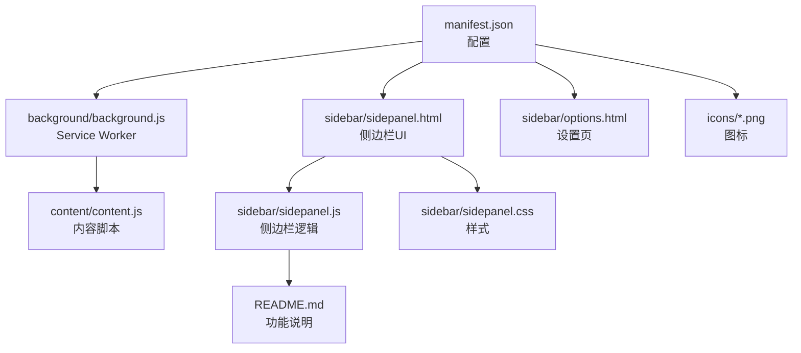
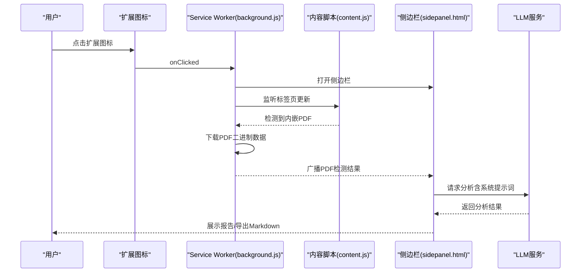
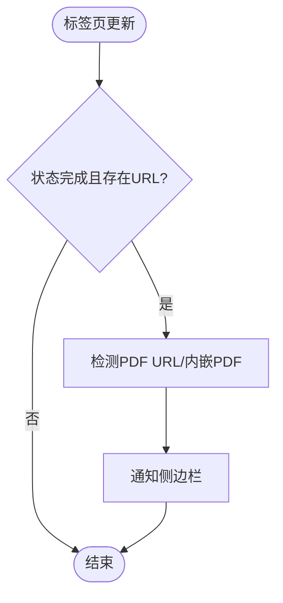
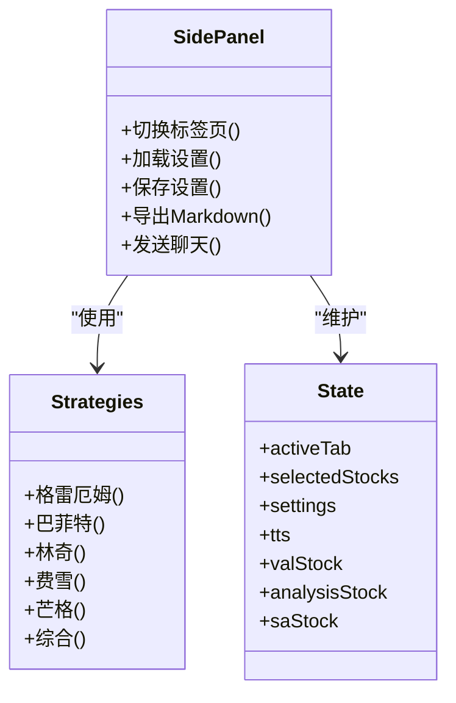
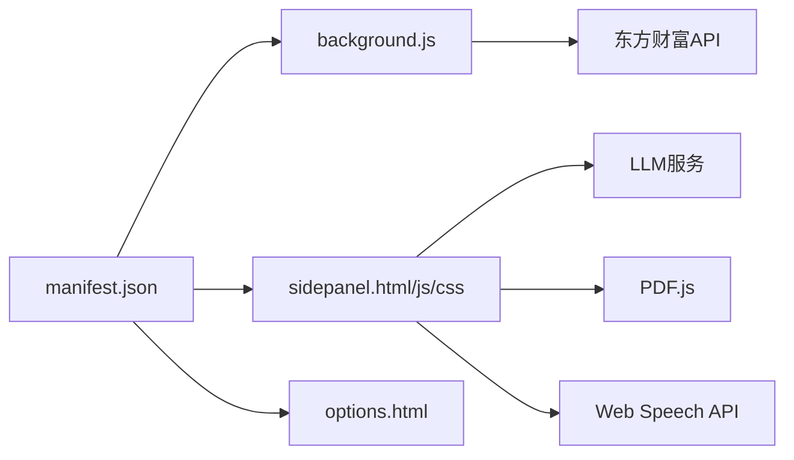

# Chrome Web Store提交

<cite>
**本文引用的文件**
- [manifest.json](file://manifest.json)
- [README.md](file://README.md)
- [background.js](file://background/background.js)
- [content.js](file://content/content.js)
- [options.html](file://sidebar/options.html)
- [sidepanel.html](file://sidebar/sidepanel.html)
- [sidepanel.js](file://sidebar/sidepanel.js)
- [sidepanel.css](file://sidebar/sidepanel.css)
- [icon16.png](file://icons/icon16.png)
- [icon32.png](file://icons/icon32.png)
- [icon48.png](file://icons/icon48.png)
- [icon128.png](file://icons/icon128.png)
</cite>

## 目录
1. [简介](#简介)
2. [项目结构](#项目结构)
3. [核心组件](#核心组件)
4. [架构总览](#架构总览)
5. [详细组件分析](#详细组件分析)
6. [依赖分析](#依赖分析)
7. [性能考虑](#性能考虑)
8. [故障排查指南](#故障排查指南)
9. [结论](#结论)
10. [附录](#附录)

## 简介
本指南面向希望将本Chrome扩展发布到Chrome Web Store的开发者，围绕“开发者注册与账户验证”“Google Developer Console使用与费用支付”“应用创建与信息填写”“截图与预览视频”“隐私政策链接”“manifest.json最终确认”“提交前检查清单”“提交后状态跟踪与常见问题处理”等环节，提供可操作的步骤说明与技术要点核对，帮助您顺利完成发布流程。

## 项目结构
该项目采用Manifest V3架构，核心文件与目录如下：
- manifest.json：扩展配置（名称、版本、权限、侧边栏、图标、选项页等）
- background/background.js：Service Worker，负责侧边栏打开、PDF检测、消息路由、下载PDF等
- content/content.js：内容脚本，检测网页内嵌PDF并通知后台
- sidebar/：侧边栏页面与逻辑
  - sidepanel.html：侧边栏UI结构（五标签页：热点、选股器、估值、财报解读、股票分析、对话）
  - sidepanel.js：侧边栏主逻辑（策略模板、系统提示词、状态管理、事件绑定、导出Markdown等）
  - sidepanel.css：侧边栏样式
  - options.html：设置页面（LLM服务商、API Key、模型等）
- icons/：扩展图标（16x16、32x32、48x48、128x128）

图表来源
- [manifest.json](file://manifest.json)
- [background.js](file://background/background.js)
- [content.js](file://content/content.js)
- [sidepanel.html](file://sidebar/sidepanel.html)
- [sidepanel.js](file://sidebar/sidepanel.js)
- [sidepanel.css](file://sidebar/sidepanel.css)
- [options.html](file://sidebar/options.html)
- [README.md](file://README.md)

章节来源
- [manifest.json](file://manifest.json)
- [README.md](file://README.md)

## 核心组件
- 扩展配置（manifest.json）
  - 名称、版本、描述、权限、主机权限、侧边栏默认路径、背景脚本、web_accessible_resources、action图标、选项页等
- Service Worker（background/background.js）
  - 点击扩展图标打开侧边栏、监听标签页更新检测PDF、消息路由、下载PDF、代理请求、RSS/Atom解析
- 内容脚本（content/content.js）
  - 检测网页内嵌PDF并通知后台
- 侧边栏页面（sidebar/sidepanel.html）
  - 五标签页布局：热点、选股器、估值、财报解读、股票分析、对话；包含纲要导航、TTS播报、导出Markdown等
- 侧边栏逻辑（sidebar/sidepanel.js）
  - 价值投资策略模板、系统提示词、状态管理、事件绑定、导出Markdown、聊天对话等
- 设置页面（sidebar/options.html）
  - LLM服务商选择、API地址、API Key、模型名称等
- 图标（icons/*.png）
  - 提供16x16、32x32、48x48、128x128尺寸图标

章节来源
- [manifest.json](file://manifest.json)
- [background.js](file://background/background.js)
- [content.js](file://content/content.js)
- [sidepanel.html](file://sidebar/sidepanel.html)
- [sidepanel.js](file://sidebar/sidepanel.js)
- [options.html](file://sidebar/options.html)
- [icon16.png](file://icons/icon16.png)
- [icon32.png](file://icons/icon32.png)
- [icon48.png](file://icons/icon48.png)
- [icon128.png](file://icons/icon128.png)

## 架构总览
扩展运行时交互链路：
- 用户点击扩展图标触发Service Worker打开侧边栏
- 侧边栏通过消息与后台通信，后台检测PDF并下载二进制数据
- 侧边栏调用LLM接口生成分析结果，支持导出Markdown
- 设置页保存LLM配置，侧边栏读取并使用

图表来源
- [background.js](file://background/background.js)
- [content.js](file://content/content.js)
- [sidepanel.html](file://sidebar/sidepanel.html)
- [sidepanel.js](file://sidebar/sidepanel.js)

## 详细组件分析

### 组件A：manifest.json配置与最终确认
- 关键字段核对
  - manifest_version：3
  - name：建议使用简短、易懂、符合目标市场的名称
  - version：建议遵循语义化版本（如 x.y.z）
  - description：建议突出核心功能与价值主张
  - permissions：确保仅声明必要权限
  - host_permissions：谨慎使用全局权限
  - side_panel.default_path：指向侧边栏页面
  - background.service_worker：指向Service Worker
  - web_accessible_resources：仅暴露必要资源
  - action.default_icon：提供多尺寸图标
  - icons：提供多尺寸图标
  - options_page：指向设置页面
- 权限合理性
  - sidePanel：用于侧边栏
  - activeTab：用于检测PDF与交互
  - scripting：用于注入或脚本执行
  - storage：用于本地存储设置
  - downloads：用于导出Markdown
  - host_permissions: <all_urls>：若确需跨域访问，请评估必要性与替代方案
- 优化建议
  - name与description应与商店页面一致，避免误导
  - 仅保留必要权限，减少审核风险
  - icons与action.default_title保持品牌一致性

章节来源
- [manifest.json](file://manifest.json)

### 组件B：Service Worker（background.js）
- 职责
  - 点击图标打开侧边栏
  - 监听标签页更新检测PDF
  - 下载PDF二进制数据（绕过CORS限制）
  - 消息路由与代理请求
  - RSS/Atom解析
- 关键点
  - 使用host_permissions: <all_urls>下载PDF
  - 对大文件进行分块传输
  - 对RSS/Atom进行统一解析
- 性能与可靠性
  - 对HTTP错误与解析异常进行兜底
  - 对chrome://pdf-viewer/类型的URL进行参数提取

图表来源
- [background.js](file://background/background.js)

章节来源
- [background.js](file://background/background.js)

### 组件C：内容脚本（content.js）
- 职责
  - 检测网页内嵌PDF（embed/object/iframe）
  - 通知后台进行后续处理
- 注意
  - Chrome内置PDF查看器无法注入内容脚本，因此PDF下载与解析由后台与侧边栏协作完成

章节来源
- [content.js](file://content/content.js)

### 组件D：侧边栏页面与逻辑（sidepanel.html, sidepanel.js）
- 页面结构
  - 五标签页：热点、选股器、估值、财报解读、股票分析、对话
  - 纲要导航、TTS播报、导出Markdown
- 逻辑要点
  - 价值投资策略模板与系统提示词
  - 状态管理与事件绑定
  - 导出Markdown至下载目录（含降级处理）
  - 聊天对话与API Key校验
- 用户体验
  - 多标签布局清晰，交互反馈及时
  - 支持快捷键与键盘导航

图表来源
- [sidepanel.js](file://sidebar/sidepanel.js)
- [sidepanel.html](file://sidebar/sidepanel.html)

章节来源
- [sidepanel.html](file://sidebar/sidepanel.html)
- [sidepanel.js](file://sidebar/sidepanel.js)

### 组件E：设置页面（options.html）
- 功能
  - 选择LLM服务商（OpenAI、DeepSeek、智谱、通义千问、自定义）
  - 填写API地址、API Key、模型名称
  - 本地存储设置
- 安全与隐私
  - API Key存储在localStorage，不上传到服务器
  - 数据隐私声明与免责声明

章节来源
- [options.html](file://sidebar/options.html)
- [README.md](file://README.md)

## 依赖分析
- 内部依赖
  - manifest.json声明的模块依赖（background、sidepanel、icons、options_page）
  - sidepanel.js依赖策略模板、系统提示词、状态管理
- 外部依赖
  - LLM服务（OpenAI、DeepSeek、智谱、通义千问、自定义）
  - PDF.js（本地打包）
  - Web Speech API（TTS播报）
  - 东方财富API（股票搜索与行情）

图表来源
- [manifest.json](file://manifest.json)
- [background.js](file://background/background.js)
- [sidepanel.html](file://sidebar/sidepanel.html)
- [sidepanel.js](file://sidebar/sidepanel.js)
- [options.html](file://sidebar/options.html)

章节来源
- [manifest.json](file://manifest.json)
- [background.js](file://background/background.js)
- [sidepanel.js](file://sidebar/sidepanel.js)
- [options.html](file://sidebar/options.html)

## 性能考虑
- PDF下载与解析
  - 使用后台下载绕过CORS限制
  - 大文件分块传输，降低内存占用
- 消息通信
  - 使用chrome.runtime.onMessage与chrome.runtime.sendMessage，避免阻塞UI
- UI渲染
  - 侧边栏采用标签页切换，减少DOM复杂度
  - CSS变量与动画优化提升交互流畅度
- 导出Markdown
  - 优先使用chrome.downloads API，失败时降级为传统下载

章节来源
- [background.js](file://background/background.js)
- [sidepanel.js](file://sidebar/sidepanel.js)
- [sidepanel.css](file://sidebar/sidepanel.css)

## 故障排查指南
- PDF无法检测或下载失败
  - 检查后台是否正确监听标签页更新
  - 确认host_permissions: <all_urls>是否满足需求
  - 对chrome://pdf-viewer/类型的URL提取src参数
- LLM API Key无效或未配置
  - 确认设置页面已保存
  - 检查API Key是否正确、模型名称是否匹配
- 导出Markdown失败
  - 检查chrome.downloads API权限
  - 若失败，使用降级下载方式
- 侧边栏无法打开
  - 确认Service Worker已注册
  - 检查manifest.json中action与side_panel配置

章节来源
- [background.js](file://background/background.js)
- [sidepanel.js](file://sidebar/sidepanel.js)
- [options.html](file://sidebar/options.html)

## 结论
本项目具备完整的Manifest V3扩展架构与丰富的侧边栏功能，适合发布到Chrome Web Store。建议在提交前完成manifest.json的最终确认、权限最小化、截图与预览视频准备、隐私政策链接与商店页面文案一致化，并在发布后关注审核状态与常见问题处理。

## 附录

### Chrome Web Store提交流程（开发者视角）
- 开发者注册与账户验证
  - 访问Google Developer Console，注册开发者账户
  - 完成邮箱验证与身份信息填写
  - 缴纳一次性注册费用（USD 5）
- 创建应用
  - 进入“创建应用”，选择“Chrome扩展”
  - 填写基本信息：应用名称、描述、主页链接、隐私政策链接
  - 上传图标（128x128）、截图（最多8张）、预览视频（可选）
- 配置manifest.json
  - 确保name、version、description与商店页面一致
  - 仅声明必要权限，避免使用全局host_permissions
  - 确认action、side_panel、icons、options_page等字段正确
- 上传版本包
  - 将扩展打包为zip，包含manifest.json与所有资源
  - 上传到Developer Console
- 审核与发布
  - 等待Google审核（通常几个工作日）
  - 审核通过后发布到Chrome Web Store

### 提交前最后检查清单
- 清单
  - manifest.json字段核对：name、version、description、permissions、host_permissions、side_panel、background、icons、options_page
  - 权限合理性：仅声明必要权限，避免过度授权
  - 功能完整性：侧边栏、PDF检测、LLM分析、导出Markdown、TTS播报、设置页
  - 用户体验：界面友好、响应迅速、错误提示清晰
  - 隐私与合规：隐私政策链接有效、API Key本地存储、数据最小化
  - 截图与预览：清晰展示核心功能，预览视频不超过2分钟
  - 商店页面文案：与manifest.json一致，避免误导性描述

### 提交后状态跟踪与常见问题
- 状态跟踪
  - 在Developer Console查看审核进度与状态
  - 关注邮件通知与Console消息
- 常见问题
  - 权限过多导致审核拒绝：精简权限，提供必要性说明
  - 描述与截图不符：保持商店页面与扩展功能一致
  - PDF下载失败：确认host_permissions与CORS策略
  - LLM API Key问题：确保设置页面可用、API Key有效