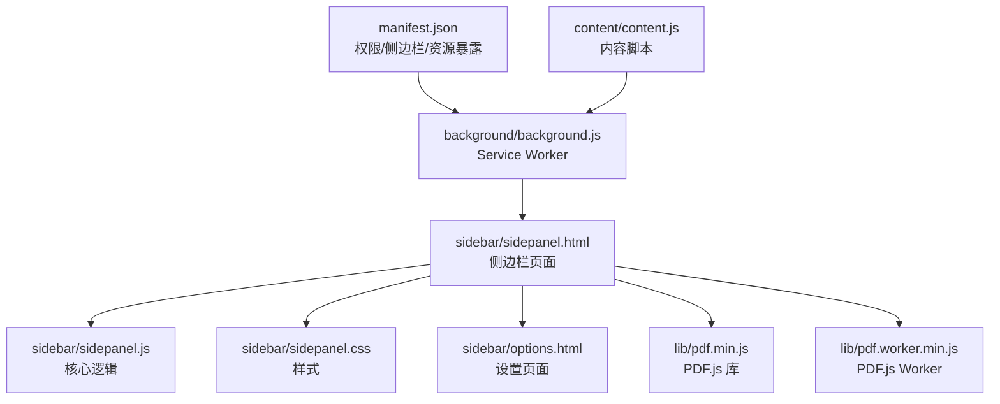
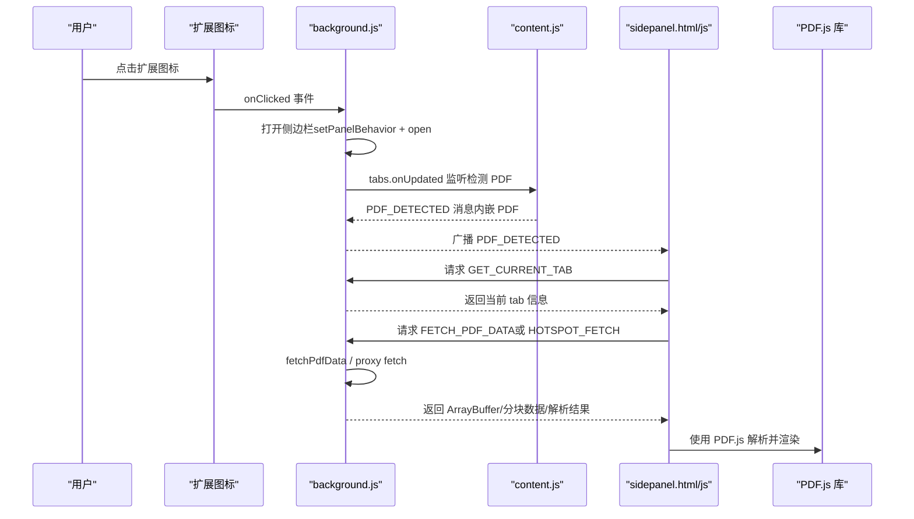
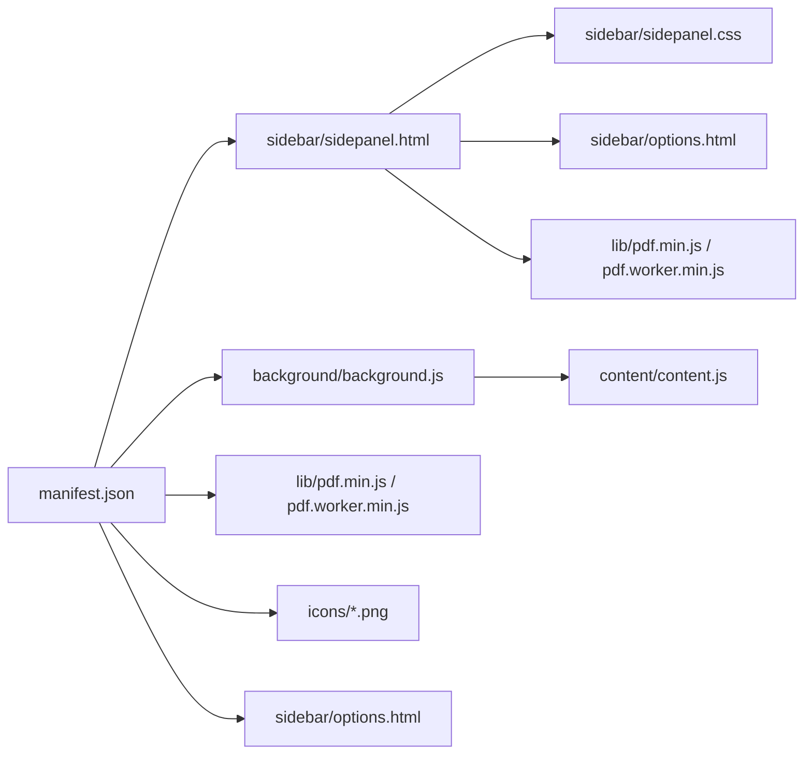

# 发布前准备

<cite>
**本文引用的文件**
- [manifest.json](file://manifest.json)
- [README.md](file://README.md)
- [background.js](file://background/background.js)
- [content.js](file://content/content.js)
- [sidepanel.html](file://sidebar/sidepanel.html)
- [sidepanel.js](file://sidebar/sidepanel.js)
- [sidepanel.css](file://sidebar/sidepanel.css)
- [options.html](file://sidebar/options.html)
- [pdf.min.js](file://lib/pdf.min.js)
- [pdf.worker.min.js](file://lib/pdf.worker.min.js)
</cite>

## 目录
1. [简介](#简介)
2. [项目结构](#项目结构)
3. [核心组件](#核心组件)
4. [架构总览](#架构总览)
5. [详细组件分析](#详细组件分析)
6. [依赖关系分析](#依赖关系分析)
7. [性能考量](#性能考量)
8. [故障排查指南](#故障排查指南)
9. [结论](#结论)
10. [附录](#附录)

## 简介
本指南面向即将发布 Chrome 扩展“投资助手”的开发者，提供一套完整的发布前准备清单与最佳实践，涵盖 manifest.json 的最终检查、图标与资源文件准备、Chrome Web Store 文件结构与尺寸要求、代码压缩与优化建议，以及本地测试验证步骤。文档同时结合仓库现有实现，帮助你在发布前确保功能完整、资源齐全、性能达标。

## 项目结构
该项目采用 Manifest V3 架构，核心目录与文件如下：
- manifest.json：扩展配置（权限、侧边栏、后台脚本、资源暴露等）
- background/background.js：Service Worker，负责侧边栏打开、PDF 下载、消息路由
- content/content.js：内容脚本，检测网页内嵌 PDF 并上报
- sidebar/sidepanel.html/js/css：侧边栏界面与逻辑（多标签布局、热点、选股、估值、财报解读、对话、设置）
- sidebar/options.html：设置页面
- lib/pdf.min.js、lib/pdf.worker.min.js：PDF.js 本地打包库
- README.md：项目说明与安装使用说明

图表来源
- [manifest.json](file://manifest.json)
- [background.js](file://background/background.js)
- [content.js](file://content/content.js)
- [sidepanel.html](file://sidebar/sidepanel.html)
- [sidepanel.js](file://sidebar/sidepanel.js)
- [sidepanel.css](file://sidebar/sidepanel.css)
- [options.html](file://sidebar/options.html)
- [pdf.min.js](file://lib/pdf.min.js)
- [pdf.worker.min.js](file://lib/pdf.worker.min.js)

章节来源
- [manifest.json](file://manifest.json)
- [README.md](file://README.md)

## 核心组件
- Manifest V3 配置：声明权限、侧边栏默认路径、后台脚本、web_accessible_resources、action 图标与扩展图标、选项页
- Service Worker：监听点击事件打开侧边栏；监听标签页更新检测 PDF；转发消息给侧边栏；代理网络请求；下载 PDF 二进制数据
- 内容脚本：检测网页内嵌 PDF（embed/object/iframe），通知 background
- 侧边栏界面：多标签布局（热点、选股器、估值、财报解读、股票分析、对话、设置），集成 PDF.js 解析与 LLM 对话
- 设置页面：LLM 服务商、API 地址、API Key、模型名称等配置持久化

章节来源
- [manifest.json](file://manifest.json)
- [background.js](file://background/background.js)
- [content.js](file://content/content.js)
- [sidepanel.html](file://sidebar/sidepanel.html)
- [sidepanel.js](file://sidebar/sidepanel.js)
- [options.html](file://sidebar/options.html)

## 架构总览
下面的序列图展示了从用户点击扩展图标到侧边栏打开、PDF 检测与数据下载的关键交互流程。

图表来源
- [background.js](file://background/background.js)
- [content.js](file://content/content.js)
- [sidepanel.html](file://sidebar/sidepanel.html)
- [sidepanel.js](file://sidebar/sidepanel.js)

## 详细组件分析

### Manifest V3 最终检查清单
- 版本号更新
  - 检查 manifest.json 中的 version 字段是否已更新至发布版本
  - 章节来源
    - [manifest.json](file://manifest.json)
- 权限声明验证
  - permissions：sidePanel、activeTab、scripting、storage、downloads
  - host_permissions：<all_urls>
  - 章节来源
    - [manifest.json](file://manifest.json)
- 侧边栏与后台脚本
  - side_panel.default_path 指向 sidebar/sidepanel.html
  - background.service_worker 指向 background/background.js
  - 章节来源
    - [manifest.json](file://manifest.json)
- 资源暴露
  - web_accessible_resources 包含 lib/pdf.min.js、lib/pdf.worker.min.js，匹配 <all_urls>
  - 章节来源
    - [manifest.json](file://manifest.json)
- 图标与扩展图标
  - action.default_icon：16、32、48、128 指向 icons/icon16.png 等
  - icons：16、32、48、128 指向 icons/icon16.png 等
  - 章节来源
    - [manifest.json](file://manifest.json)
- 选项页
  - options_page 指向 sidebar/options.html
  - 章节来源
    - [manifest.json](file://manifest.json)

章节来源
- [manifest.json](file://manifest.json)

### 图标与资源文件准备
- 图标尺寸与格式要求
  - 16x16、32x32、48x48、128x128 四种尺寸
  - PNG 格式，支持透明度
  - manifest.json 中 action.default_icon 与 icons 字段已正确指向对应文件
  - 章节来源
    - [manifest.json](file://manifest.json)
- PDF.js 库文件
  - lib/pdf.min.js、lib/pdf.worker.min.js 已存在于项目中
  - manifest.json 的 web_accessible_resources 已声明允许访问
  - 章节来源
    - [manifest.json](file://manifest.json)
    - [pdf.min.js](file://lib/pdf.min.js)
    - [pdf.worker.min.js](file://lib/pdf.worker.min.js)
- 侧边栏界面文件
  - sidebar/sidepanel.html、sidebar/sidepanel.js、sidebar/sidepanel.css、sidebar/options.html
  - 章节来源
    - [sidepanel.html](file://sidebar/sidepanel.html)
    - [sidepanel.js](file://sidebar/sidepanel.js)
    - [sidepanel.css](file://sidebar/sidepanel.css)
    - [options.html](file://sidebar/options.html)

章节来源
- [manifest.json](file://manifest.json)
- [pdf.min.js](file://lib/pdf.min.js)
- [pdf.worker.min.js](file://lib/pdf.worker.min.js)
- [sidepanel.html](file://sidebar/sidepanel.html)
- [sidepanel.js](file://sidebar/sidepanel.js)
- [sidepanel.css](file://sidebar/sidepanel.css)
- [options.html](file://sidebar/options.html)

### 代码压缩与优化最佳实践
- 资源体积控制
  - PDF.js 体积较大，建议在发布前进行压缩与最小化，确保与 manifest.json 的 web_accessible_resources 声明一致
  - 章节来源
    - [manifest.json](file://manifest.json)
    - [pdf.min.js](file://lib/pdf.min.js)
- CSS 与 JS 压缩
  - 将 sidepanel.css 与 sidepanel.js 进行压缩与去空白，减少传输体积
  - 章节来源
    - [sidepanel.css](file://sidebar/sidepanel.css)
    - [sidepanel.js](file://sidebar/sidepanel.js)
- 图标优化
  - 使用 PNG 压缩工具（如 pngquant、optipng）减小图标体积，保持透明度
  - 章节来源
    - [manifest.json](file://manifest.json)
- 缓存与懒加载
  - 仅在需要时加载 PDF.js，避免首屏阻塞
  - 章节来源
    - [sidepanel.js](file://sidebar/sidepanel.js)

章节来源
- [manifest.json](file://manifest.json)
- [pdf.min.js](file://lib/pdf.min.js)
- [sidepanel.css](file://sidebar/sidepanel.css)
- [sidepanel.js](file://sidebar/sidepanel.js)

### 本地测试验证步骤
- 安装与启用开发者模式
  - 打开 chrome://extensions/，开启“开发者模式”，加载已解压的扩展
  - 章节来源
    - [README.md](file://README.md)
- 功能验证
  - 点击扩展图标，确认侧边栏打开且默认标签页为“热点”
  - 在“热点”标签页中，检查自动刷新与数据源配置
  - 在“选股器”标签页中，输入候选股票，执行筛选并查看报告
  - 在“估值”标签页中，查询股票并执行估值计算
  - 在“财报解读”标签页中，打开 PDF 或手动粘贴文本，查看报告生成
  - 在“股票分析”标签页中，输入股票并查看分析报告
  - 在“对话”标签页中，与 LLM 进行对话
  - 在“设置”标签页中，配置 LLM 服务商、API Key、模型名称并保存
  - 章节来源
    - [sidepanel.html](file://sidebar/sidepanel.html)
    - [sidepanel.js](file://sidebar/sidepanel.js)
    - [options.html](file://sidebar/options.html)
- PDF 检测与下载
  - 在普通网页中打开 PDF（内嵌 embed/object/iframe），确认 content.js 能检测并通知 background
  - 在侧边栏中触发 PDF 下载与解析，确认 PDF.js 能正常工作
  - 章节来源
    - [content.js](file://content/content.js)
    - [background.js](file://background/background.js)
    - [sidepanel.js](file://sidebar/sidepanel.js)

章节来源
- [README.md](file://README.md)
- [sidepanel.html](file://sidebar/sidepanel.html)
- [sidepanel.js](file://sidebar/sidepanel.js)
- [options.html](file://sidebar/options.html)
- [content.js](file://content/content.js)
- [background.js](file://background/background.js)

## 依赖关系分析
- manifest.json 依赖
  - 侧边栏页面：sidebar/sidepanel.html
  - 后台脚本：background/background.js
  - 资源暴露：lib/pdf.min.js、lib/pdf.worker.min.js
  - 图标：icons/icon16.png、icons/icon32.png、icons/icon48.png、icons/icon128.png
  - 选项页：sidebar/options.html
- 侧边栏依赖
  - PDF.js：lib/pdf.min.js、lib/pdf.worker.min.js
  - 样式：sidebar/sidepanel.css
  - 设置页面：sidebar/options.html
- Service Worker 依赖
  - content/content.js：用于检测内嵌 PDF
  - 与侧边栏通过消息通信

图表来源
- [manifest.json](file://manifest.json)
- [sidepanel.html](file://sidebar/sidepanel.html)
- [sidepanel.css](file://sidebar/sidepanel.css)
- [options.html](file://sidebar/options.html)
- [pdf.min.js](file://lib/pdf.min.js)
- [pdf.worker.min.js](file://lib/pdf.worker.min.js)
- [background.js](file://background/background.js)
- [content.js](file://content/content.js)

章节来源
- [manifest.json](file://manifest.json)

## 性能考量
- 资源体积
  - PDF.js 与侧边栏界面文件体积较大，建议发布前进行压缩与最小化
  - 章节来源
    - [pdf.min.js](file://lib/pdf.min.js)
    - [sidepanel.css](file://sidebar/sidepanel.css)
    - [sidepanel.js](file://sidebar/sidepanel.js)
- 懒加载策略
  - 仅在需要时加载 PDF.js，避免首屏阻塞
  - 章节来源
    - [sidepanel.js](file://sidebar/sidepanel.js)
- 网络请求
  - background.js 中对第三方 API 的代理与错误处理，确保稳定性
  - 章节来源
    - [background.js](file://background/background.js)

## 故障排查指南
- 侧边栏无法打开
  - 检查 manifest.json 中 side_panel.default_path 与 background.service_worker 是否正确
  - 章节来源
    - [manifest.json](file://manifest.json)
- PDF 无法检测或解析
  - 确认 content.js 能检测到内嵌 PDF（embed/object/iframe）
  - 确认 background.js 能正确下载并返回 ArrayBuffer
  - 确认 sidepanel.js 能正确加载 PDF.js 并解析
  - 章节来源
    - [content.js](file://content/content.js)
    - [background.js](file://background/background.js)
    - [sidepanel.js](file://sidebar/sidepanel.js)
- 图标显示异常
  - 确认 icons/icon16.png、icons/icon32.png、icons/icon48.png、icons/icon128.png 存在且为 PNG 格式
  - 章节来源
    - [manifest.json](file://manifest.json)
- 设置页面无效
  - 确认 sidebar/options.html 中的设置项能正确写入 localStorage
  - 章节来源
    - [options.html](file://sidebar/options.html)

章节来源
- [manifest.json](file://manifest.json)
- [content.js](file://content/content.js)
- [background.js](file://background/background.js)
- [sidepanel.js](file://sidebar/sidepanel.js)
- [options.html](file://sidebar/options.html)

## 结论
本指南提供了针对“投资助手”扩展的发布前准备清单与最佳实践，涵盖 manifest.json 的最终检查、图标与资源文件准备、Chrome Web Store 文件结构与尺寸要求、代码压缩与优化建议，以及本地测试验证步骤。请在发布前对照清单逐项核验，确保扩展在发布后具备良好的用户体验与稳定的性能表现。

## 附录
- Chrome Web Store 文件结构与尺寸要求
  - 图标尺寸：16x16、32x32、48x48、128x128
  - 图标格式：PNG，支持透明度
  - 选项页：sidebar/options.html
  - 章节来源
    - [manifest.json](file://manifest.json)
    - [options.html](file://sidebar/options.html)