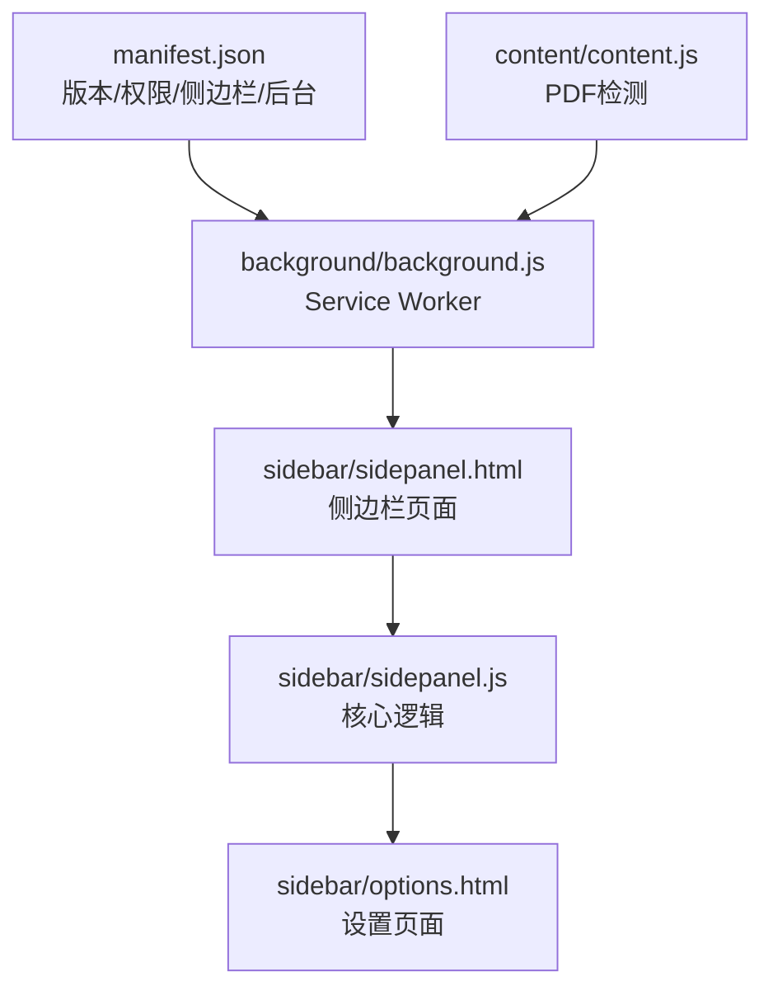
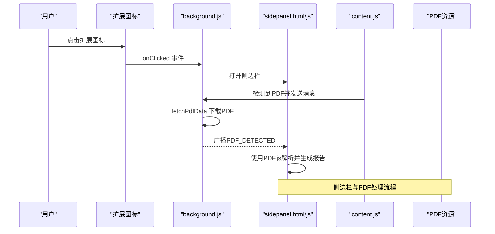
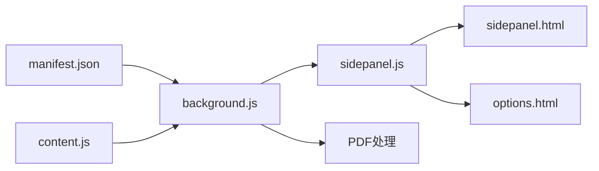

# 版本管理与更新

<cite>
**本文档引用的文件**
- [manifest.json](file://manifest.json)
- [background.js](file://background/background.js)
- [content.js](file://content/content.js)
- [sidepanel.js](file://sidebar/sidepanel.js)
- [sidepanel.html](file://sidebar/sidepanel.html)
- [options.html](file://sidebar/options.html)
- [README.md](file://README.md)
</cite>

## 目录
1. [简介](#简介)
2. [项目结构](#项目结构)
3. [核心组件](#核心组件)
4. [架构总览](#架构总览)
5. [详细组件分析](#详细组件分析)
6. [依赖关系分析](#依赖关系分析)
7. [性能考量](#性能考量)
8. [故障排查指南](#故障排查指南)
9. [结论](#结论)
10. [附录](#附录)

## 简介
本指南面向“投资助手”Chrome扩展的版本管理与更新发布策略，围绕语义化版本控制（SemVer）的应用、版本号更新规则、发布计划制定、兼容性管理与用户反馈闭环等方面，提供可落地的实践方法。项目当前版本为 2.11.1，涉及 Manifest V3、Service Worker、Side Panel、PDF处理、热点资讯与AI对话等核心功能。

## 项目结构
项目采用模块化组织，核心目录与文件如下：
- manifest.json：扩展清单，定义版本、权限、侧边栏、后台脚本等
- background/background.js：Service Worker，负责侧边栏交互、PDF下载、消息路由
- content/content.js：内容脚本，检测嵌入式PDF并通知后台
- sidebar/sidepanel.html：侧边栏页面（四标签布局）
- sidebar/sidepanel.js：侧边栏主逻辑（选股器、估值、财报解读、对话、热点等）
- sidebar/options.html：设置页面（LLM提供商、API Key等）
- README.md：功能说明与使用指南

图表来源
- [manifest.json:1-48](file://manifest.json#L1-L48)
- [background.js:1-307](file://background/background.js#L1-L307)
- [content.js:1-36](file://content/content.js#L1-L36)
- [sidepanel.html:1-646](file://sidebar/sidepanel.html#L1-L646)
- [sidepanel.js:1-800](file://sidebar/sidepanel.js#L1-L800)
- [options.html:1-124](file://sidebar/options.html#L1-L124)

章节来源
- [manifest.json:1-48](file://manifest.json#L1-L48)
- [README.md:108-126](file://README.md#L108-L126)

## 核心组件
- 版本与清单
  - manifest.json 中的 version 字段用于标识扩展版本，Chrome 扩展商店与本地安装均以此为准
- Service Worker（后台）
  - 负责侧边栏打开、PDF检测与下载、消息路由、热点数据抓取与解析
- 内容脚本
  - 检测页面中的嵌入式PDF并通知后台
- 侧边栏页面与逻辑
  - 四标签布局（热点、选股器、估值、财报解读、股票分析、对话）
  - 设置页面（LLM提供商、API Key、关注公司管理）
- PDF处理
  - 后台下载PDF并分块传输，前端使用PDF.js解析

章节来源
- [manifest.json:4](file://manifest.json#L4)
- [background.js:11-117](file://background/background.js#L11-L117)
- [content.js:11-35](file://content/content.js#L11-L35)
- [sidepanel.html:32-646](file://sidebar/sidepanel.html#L32-L646)
- [sidepanel.js:14-297](file://sidebar/sidepanel.js#L14-L297)

## 架构总览
整体架构围绕 Manifest V3 的 Side Panel 与 Service Worker，形成“前台页面 ↔ 侧边栏 ↔ 后台”的消息链路，同时通过内容脚本检测PDF并触发后台下载。

图表来源
- [background.js:12-186](file://background/background.js#L12-L186)
- [content.js:11-35](file://content/content.js#L11-L35)
- [sidepanel.js:974-986](file://sidebar/sidepanel.js#L974-L986)

## 详细组件分析

### 版本号与语义化控制
- 当前版本：2.11.1
- 语义化版本控制（SemVer）应用建议
  - 主版本（2）：破坏性变更（如API接口变更、权限调整、侧边栏结构重构）
  - 次版本（11）：向后兼容的新功能或重大改进（如新增策略、界面重构、LLM提供商扩展）
  - 补丁版本（1）：向后兼容的问题修复或小改进（如Bug修复、性能优化、文案修正）

章节来源
- [manifest.json:4](file://manifest.json#L4)

### 版本更新规则与时机
- 主版本更新（破坏性变更）
  - 示例：Manifest V3 权限调整、Side Panel 行为变更、消息协议升级
  - 触发条件：底层API变更、安全策略收紧、用户界面重大改版
- 次版本更新（新功能/重大改进）
  - 示例：新增“股票分析”面板、支持更多LLM提供商、热点模块增强
  - 触发条件：功能迭代完成、用户需求明确、兼容性验证通过
- 补丁更新（问题修复）
  - 示例：PDF下载失败修复、RSS解析异常修复、UI交互问题修复
  - 触发条件：用户反馈、自动化监控、回归测试发现

章节来源
- [background.js:125-177](file://background/background.js#L125-L177)
- [sidepanel.js:1073-1211](file://sidebar/sidepanel.js#L1073-L1211)

### 发布计划制定
- 版本节奏
  - 次版本：月度或双月度发布，承载明显功能改进
  - 补丁：按需发布，修复紧急问题
- 发布窗口
  - 周一至周五工作日发布，避免周末用户活跃高峰造成干扰
- 用户通知策略
  - 扩展商店更新说明：突出功能亮点与修复项
  - 内部公告：邮件/聊天群组通知，引导用户查看更新说明
- 回滚机制
  - 保留上一个版本的发布包，必要时可回退
  - Chrome 扩展商店支持版本回滚，用户可选择降级

章节来源
- [README.md:83-107](file://README.md#L83-L107)

### 兼容性管理
- 向后兼容性
  - 保持 Manifest V3 兼容，避免移除已声明权限
  - 侧边栏消息协议保持稳定，避免破坏性变更
- 迁移指南
  - 新增LLM提供商时，提供配置向导与默认值
  - 侧边栏标签变更时，提供过渡提示与快捷入口
- 数据持久化
  - 设置与关注列表使用 localStorage，升级后自动迁移
  - 热点配置使用 chrome.storage.local，升级后保留

章节来源
- [options.html:82-120](file://sidebar/options.html#L82-L120)
- [sidepanel.js:591-637](file://sidebar/sidepanel.js#L591-L637)

### 用户反馈与改进循环
- 反馈渠道
  - 扩展商店评论、GitHub Issues、邮件支持
- 收集与分类
  - Bug：优先级高，尽快修复
  - 功能请求：纳入规划，评估影响与成本
  - 性能问题：结合日志与监控定位
- 改进闭环
  - 计划 → 开发 → 测试 → 发布 → 反馈 → 评估 → 循环

章节来源
- [README.md:138-147](file://README.md#L138-L147)

## 依赖关系分析
- 清单与后台
  - manifest.json 声明 side_panel、background.service_worker、permissions/host_permissions
  - background.js 依赖 Manifest V3 API（chrome.sidePanel、chrome.runtime、chrome.tabs）
- 后台与侧边栏
  - background.js 通过消息路由与 sidepanel.js 通信
  - sidepanel.js 通过 chrome.runtime.sendMessage 与后台交互
- 内容脚本与后台
  - content.js 通过 chrome.runtime.sendMessage 通知后台检测到PDF
- PDF处理
  - background.js 使用 fetch 下载PDF，分块传输避免消息过大
  - sidepanel.js 使用 PDF.js 解析PDF内容

图表来源
- [manifest.json:16-30](file://manifest.json#L16-L30)
- [background.js:12-117](file://background/background.js#L12-L117)
- [content.js:23-27](file://content/content.js#L23-L27)
- [sidepanel.js:974-986](file://sidebar/sidepanel.js#L974-L986)

章节来源
- [manifest.json:16-30](file://manifest.json#L16-L30)
- [background.js:12-117](file://background/background.js#L12-L117)
- [content.js:23-27](file://content/content.js#L23-L27)
- [sidepanel.js:974-986](file://sidebar/sidepanel.js#L974-L986)

## 性能考量
- PDF下载与传输
  - 后台下载PDF并分块传输，避免一次性大对象导致消息超限
  - 建议：对超大PDF进行分块处理，前端按需拼接
- 热点数据抓取
  - 并行抓取多个RSS/JSON源，使用Promise.allSettled避免部分失败影响整体
  - 建议：限制并发数量，增加重试与超时控制
- UI渲染
  - 列表渲染采用虚拟滚动或分页，减少DOM节点数量
  - 建议：对热点列表与公司资讯列表增加懒加载

章节来源
- [background.js:125-177](file://background/background.js#L125-L177)
- [sidepanel.js:1303-1334](file://sidebar/sidepanel.js#L1303-L1334)
- [sidepanel.js:1497-1585](file://sidebar/sidepanel.js#L1497-L1585)

## 故障排查指南
- PDF下载失败
  - 现象：后台返回错误信息，侧边栏无法解析PDF
  - 排查：检查网络连接、CORS限制、PDF URL有效性
  - 处理：增加重试与错误提示，必要时提示用户更换PDF链接
- 热点数据抓取异常
  - 现象：热点列表为空或加载缓慢
  - 排查：检查RSS/JSON源可用性、解析逻辑、超时设置
  - 处理：增加降级方案与缓存，优化相似度合并算法
- 设置保存失败
  - 现象：localStorage写入失败或API Key校验失败
  - 排查：检查浏览器隐私设置、localStorage容量限制
  - 处理：增加错误提示与重试机制

章节来源
- [background.js:125-177](file://background/background.js#L125-L177)
- [sidepanel.js:1073-1211](file://sidebar/sidepanel.js#L1073-L1211)
- [options.html:102-120](file://sidebar/options.html#L102-L120)

## 结论
通过实施语义化版本控制、制定清晰的发布计划与兼容性策略、建立用户反馈与改进闭环，可以有效保障“投资助手”扩展的持续演进与用户体验。建议在每次发布前进行充分的回归测试与兼容性验证，并在发布后持续收集用户反馈，形成稳定的迭代节奏。

## 附录
- 版本号更新建议
  - 主版本：破坏性变更
  - 次版本：新功能/重大改进
  - 补丁：问题修复/小改进
- 发布检查清单
  - 功能测试、兼容性验证、性能基准、用户通知、回滚准备
- 用户反馈渠道
  - 扩展商店评论、GitHub Issues、邮件支持