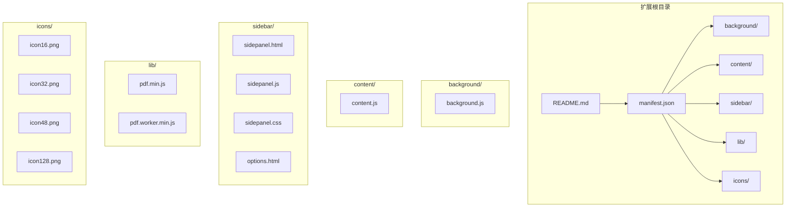
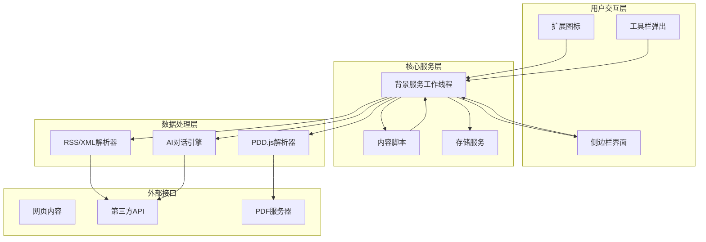
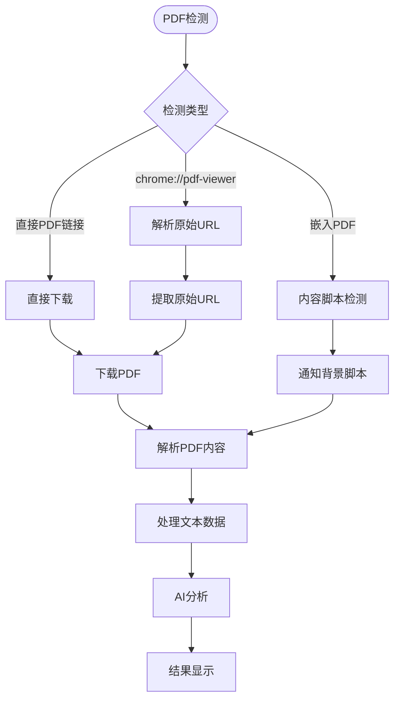
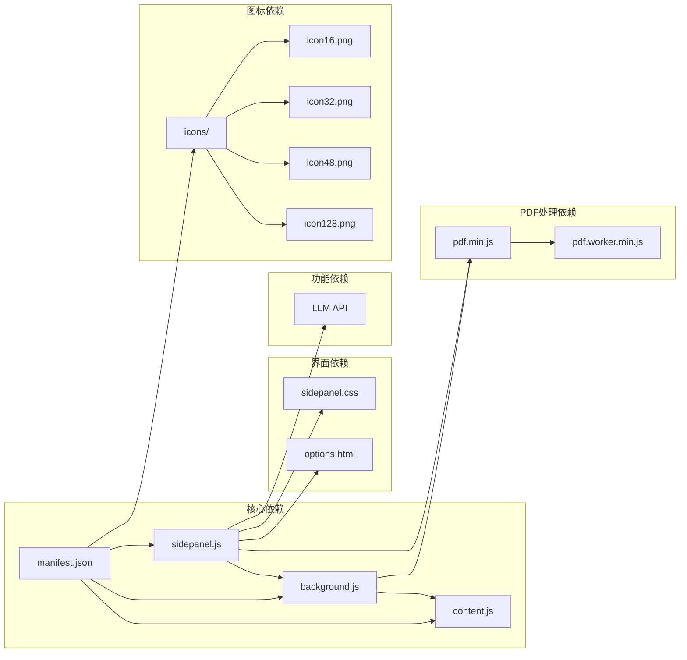

# 生产部署

<cite>
**本文档引用的文件**
- [manifest.json](file://manifest.json)
- [background.js](file://background/background.js)
- [content.js](file://content/content.js)
- [sidepanel.js](file://sidebar/sidepanel.js)
- [sidepanel.html](file://sidebar/sidepanel.html)
- [options.html](file://sidebar/options.html)
- [sidepanel.css](file://sidebar/sidepanel.css)
- [pdf.min.js](file://lib/pdf.min.js)
- [pdf.worker.min.js](file://lib/pdf.worker.min.js)
- [README.md](file://README.md)
</cite>

## 目录
1. [简介](#简介)
2. [项目结构](#项目结构)
3. [核心组件](#核心组件)
4. [架构概览](#架构概览)
5. [详细组件分析](#详细组件分析)
6. [依赖关系分析](#依赖关系分析)
7. [性能考虑](#性能考虑)
8. [故障排除指南](#故障排除指南)
9. [结论](#结论)
10. [附录](#附录)

## 简介

本指南面向生产环境的Chrome扩展发布，基于"投资助手"扩展的实际代码库，提供完整的发布流程、配置检查、优化策略和后续运营方案。该扩展采用Manifest V3架构，集成了侧边栏界面、PDF解析、AI对话等功能模块。

## 项目结构

该项目采用清晰的功能模块化组织：

**图表来源**
- [manifest.json:1-48](file://manifest.json#L1-L48)
- [README.md:108-126](file://README.md#L108-L126)

**章节来源**
- [manifest.json:1-48](file://manifest.json#L1-L48)
- [README.md:108-126](file://README.md#L108-L126)

## 核心组件

### Manifest V3配置详解

扩展的核心配置位于manifest.json中，采用最新的Manifest V3标准：

**权限声明分析：**
- `sidePanel`: 启用侧边栏功能
- `activeTab`: 访问当前标签页信息
- `scripting`: 注入脚本和执行命令
- `storage`: 本地存储访问
- `downloads`: 文件下载功能

**主机权限：**
- `<all_urls>`: 允许访问所有网站，用于PDF解析和API调用

**关键配置项：**
- 服务工作线程: background/background.js
- 侧边栏默认路径: sidebar/sidepanel.html
- Web可访问资源: PDF.js库文件
- 图标配置: 16x16到128x128像素

**章节来源**
- [manifest.json:1-48](file://manifest.json#L1-L48)

### 背景服务工作线程

background.js负责扩展的核心后台逻辑：

**主要功能：**
- 侧边栏打开控制
- PDF检测和下载
- 消息路由和通信
- RSS/XML数据解析

**PDF处理流程：**
- 监听标签页更新事件
- 检测PDF URL和chrome://pdf-viewer
- 下载PDF文件并处理大文件分块传输
- 通过消息通道与侧边栏通信

**章节来源**
- [background.js:1-307](file://background/background.js#L1-L307)

### 内容脚本

content.js实现轻量级的PDF检测功能：

**功能特点：**
- 检测嵌入在网页中的PDF对象
- 通知背景脚本PDF发现事件
- 支持embed、object、iframe三种PDF嵌入方式

**章节来源**
- [content.js:1-36](file://content/content.js#L1-L36)

## 架构概览

扩展采用典型的Chrome扩展架构，包含多个相互协作的组件：

**图表来源**
- [background.js:11-117](file://background/background.js#L11-L117)
- [content.js:11-28](file://content/content.js#L11-L28)
- [sidepanel.js:1-50](file://sidebar/sidepanel.js#L1-L50)

## 详细组件分析

### 侧边栏主界面

sidepanel.js实现了完整的用户交互界面：

**功能模块划分：**
- 价值投资策略筛选器
- 财报解读分析器
- 股票分析工具
- AI对话系统
- 设置管理界面

**策略模板系统：**
扩展支持5种价值投资大师策略：
- 格雷厄姆深度价值策略
- 巴菲特护城河策略
- 彼得·林奇PEG策略
- 费雪长期成长策略
- 芒格理性投资策略

**章节来源**
- [sidepanel.js:14-296](file://sidebar/sidepanel.js#L14-L296)

### PDF解析和处理

扩展集成了完整的PDF处理能力：

**PDF.js集成：**
- 本地打包的PDF.js库
- Worker线程分离处理
- 大文件分块传输支持
- 多种PDF格式兼容

**处理流程：**

**图表来源**
- [background.js:125-177](file://background/background.js#L125-L177)
- [content.js:11-28](file://content/content.js#L11-L28)

**章节来源**
- [pdf.min.js:1-22](file://lib/pdf.min.js#L1-L22)
- [pdf.worker.min.js:1-22](file://lib/pdf.worker.min.js#L1-L22)

### 设置和配置管理

扩展提供了灵活的配置选项：

**设置界面：**
- LLM服务商选择（OpenAI、DeepSeek、智谱、通义千问等）
- API地址和密钥配置
- 模型参数设置
- 关注公司管理

**本地存储：**
- 设置信息保存在localStorage
- 用户偏好和配置持久化
- 安全的API密钥存储

**章节来源**
- [options.html:1-124](file://sidebar/options.html#L1-L124)
- [sidepanel.js:590-637](file://sidebar/sidepanel.js#L590-L637)

## 依赖关系分析

扩展的模块间依赖关系如下：

**图表来源**
- [manifest.json:40-46](file://manifest.json#L40-L46)
- [sidepanel.css:1-50](file://sidebar/sidepanel.css#L1-L50)

**章节来源**
- [manifest.json:1-48](file://manifest.json#L1-L48)
- [sidepanel.css:1-800](file://sidebar/sidepanel.css#L1-L800)

## 性能考虑

### 内存和CPU优化

**PDF处理优化：**
- 大文件分块传输（10MB分块）
- Worker线程分离，避免阻塞主线程
- PDF.js库本地缓存
- 及时释放内存资源

**网络请求优化：**
- 批量请求合并
- 缓存机制实现
- 超时和重试策略
- CORS代理绕过

**UI渲染优化：**
- 虚拟滚动实现
- 懒加载策略
- CSS动画性能优化
- 事件委托减少监听器

### 存储和缓存策略

**本地存储优化：**
- localStorage容量限制考虑
- 数据压缩和序列化
- 渐进式数据加载
- 失效时间管理

**缓存策略：**
- PDF内容缓存
- API响应缓存
- 图标和静态资源缓存
- 版本化缓存管理

## 故障排除指南

### 常见问题诊断

**PDF解析失败：**
- 检查CORS限制和代理设置
- 验证PDF URL有效性
- 确认PDF.js库完整性
- 检查文件大小限制

**侧边栏无法打开：**
- 验证manifest.json配置
- 检查服务工作线程状态
- 确认权限声明完整
- 验证文件路径正确性

**LLM API连接问题：**
- 检查API密钥有效性
- 验证网络连接状态
- 确认API端点可达性
- 检查请求频率限制

**性能问题：**
- 监控内存使用情况
- 检查CPU占用率
- 优化图片和资源加载
- 实施节流和防抖机制

### 调试工具和方法

**开发工具：**
- Chrome扩展开发模式
- 背景页面调试
- 网络请求监控
- 存储查看器

**日志记录：**
- 错误捕获和上报
- 性能指标监控
- 用户行为追踪
- 诊断信息收集

**章节来源**
- [background.js:125-177](file://background/background.js#L125-L177)
- [sidepanel.js:609-637](file://sidebar/sidepanel.js#L609-L637)

## 结论

本指南提供了基于实际代码库的完整Chrome扩展发布方案。通过合理的架构设计、严格的配置检查和完善的优化策略，可以确保扩展在生产环境中稳定运行。关键要点包括：

1. **配置完整性**：确保manifest.json中所有必需字段正确配置
2. **权限最小化**：仅申请必要的权限，避免过度授权
3. **性能优化**：实施多种优化策略提升用户体验
4. **错误处理**：建立完善的错误处理和监控机制
5. **持续改进**：基于用户反馈持续优化功能和性能

## 附录

### 发布检查清单

**开发阶段：**
- [ ] 所有功能模块测试通过
- [ ] 性能基准测试完成
- [ ] 安全审计完成
- [ ] 用户体验测试完成

**发布准备：**
- [ ] 版本号更新和变更日志
- [ ] 图标和截图准备
- [ ] 描述和关键词优化
- [ ] 法律合规审查

**发布后监控：**
- [ ] 用户反馈收集
- [ ] 性能指标监控
- [ ] 错误日志分析
- [ ] 用户行为分析

### 版本更新策略

**热修复：**
- 紧急bug修复
- 快速发布流程
- 回滚机制
- 用户通知

**功能更新：**
- 渐进式发布
- A/B测试
- 用户反馈收集
- 性能影响评估

**章节来源**
- [README.md:1-147](file://README.md#L1-L147)