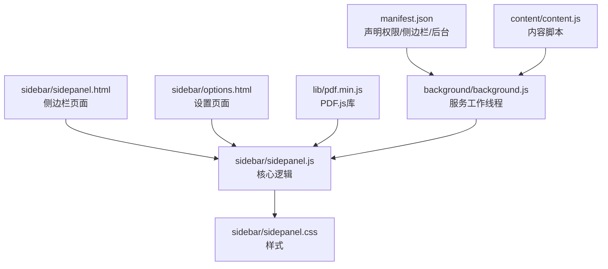
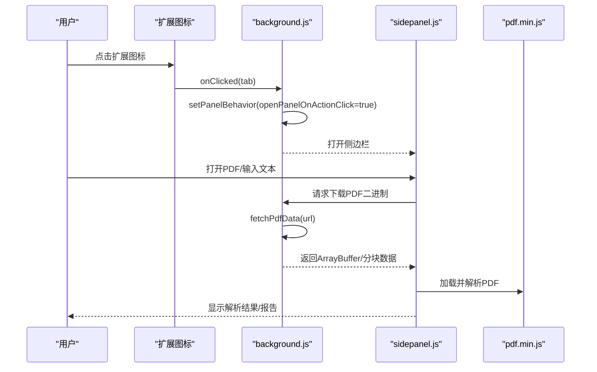
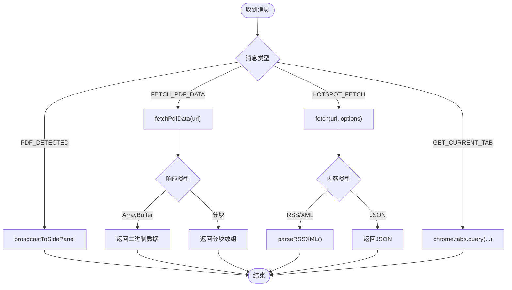
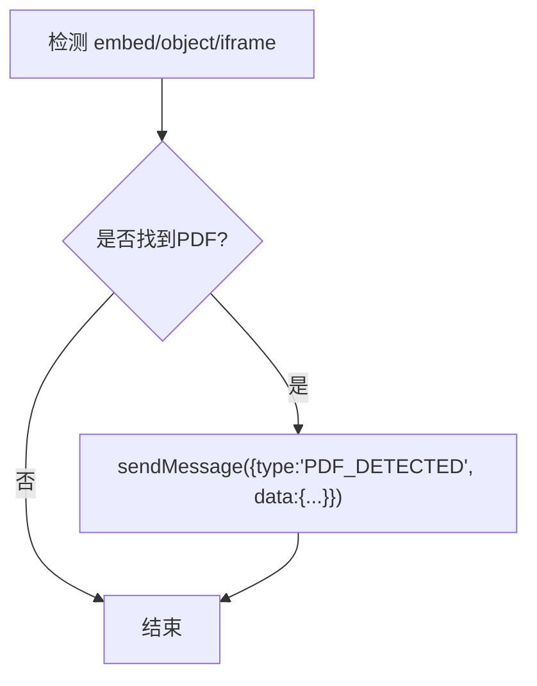
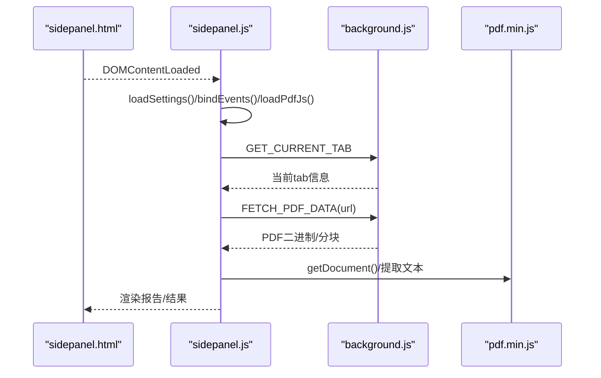
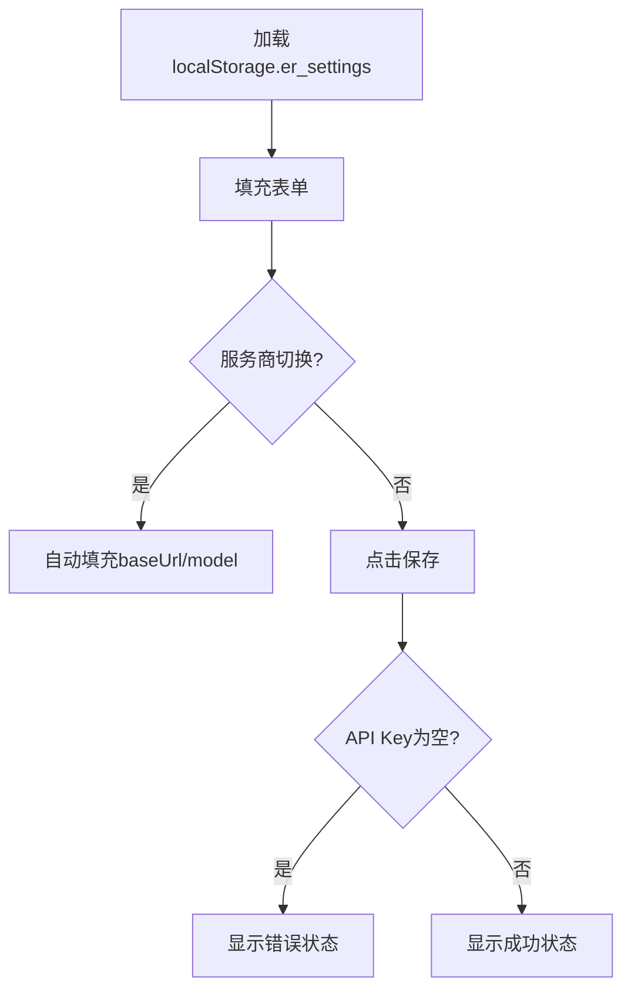
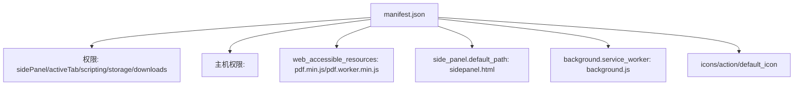

# 维护与支持

<cite>
**本文引用的文件**
- [manifest.json](file://manifest.json)
- [background.js](file://background/background.js)
- [content.js](file://content/content.js)
- [sidepanel.html](file://sidebar/sidepanel.html)
- [sidepanel.js](file://sidebar/sidepanel.js)
- [sidepanel.css](file://sidebar/sidepanel.css)
- [options.html](file://sidebar/options.html)
- [pdf.min.js](file://lib/pdf.min.js)
- [README.md](file://README.md)
</cite>

## 目录
1. [简介](#简介)
2. [项目结构](#项目结构)
3. [核心组件](#核心组件)
4. [架构总览](#架构总览)
5. [详细组件分析](#详细组件分析)
6. [依赖分析](#依赖分析)
7. [性能考虑](#性能考虑)
8. [故障排查指南](#故障排查指南)
9. [结论](#结论)
10. [附录](#附录)

## 简介
本指南面向“投资助手”Chrome扩展的维护与支持团队，提供从问题定位、日志分析、修复验证，到功能更新的版本管理策略、性能监控与优化、用户反馈处理、安全与隐私变更、扩展生命周期管理与废弃策略，以及常见问题FAQ与自助排查路径。文档以仓库现有代码为基础，结合Manifest V3架构与模块职责，形成可执行的维护流程。

## 项目结构
该项目采用Manifest V3标准，核心目录与职责如下：
- manifest.json：声明扩展元数据、权限、侧边栏、后台脚本与可访问资源
- background/background.js：服务工作线程，负责侧边栏控制、PDF检测与下载、消息路由、RSS/XML解析
- content/content.js：内容脚本，检测页面内嵌PDF并上报
- sidebar/sidepanel.html/js/css：侧边栏UI与交互逻辑，包含热点信息、选股器、估值计算器、财报解读、股票分析、AI对话等模块
- sidebar/options.html：设置页面，保存LLM提供商与API密钥
- lib/pdf.min.js：本地打包的PDF.js库，用于侧边栏PDF解析
- README.md：功能说明与安装使用指引

图表来源
- [manifest.json:1-48](file://manifest.json#L1-L48)
- [background.js:1-307](file://background/background.js#L1-L307)
- [content.js:1-36](file://content/content.js#L1-L36)
- [sidepanel.html:1-646](file://sidebar/sidepanel.html#L1-L646)
- [sidepanel.js:1-800](file://sidebar/sidepanel.js#L1-L800)
- [sidepanel.css:1-800](file://sidebar/sidepanel.css#L1-L800)
- [options.html:1-124](file://sidebar/options.html#L1-L124)
- [pdf.min.js:1-21](file://lib/pdf.min.js#L1-L21)

章节来源
- [manifest.json:1-48](file://manifest.json#L1-L48)
- [README.md:108-126](file://README.md#L108-L126)

## 核心组件
- 服务工作线程（background）：负责侧边栏开关、PDF检测与下载、消息路由、RSS/XML解析与统一结构输出、跨域代理请求
- 内容脚本（content）：检测页面内嵌PDF并上报给background
- 侧边栏（sidepanel）：多标签布局，包含热点信息、选股器、估值计算器、财报解读、股票分析、AI对话、设置与TTS播报
- 设置页面（options）：保存LLM提供商、API地址、API Key与模型
- PDF.js：本地打包，供侧边栏解析PDF文本

章节来源
- [background.js:11-186](file://background/background.js#L11-L186)
- [content.js:11-36](file://content/content.js#L11-L36)
- [sidepanel.html:10-646](file://sidebar/sidepanel.html#L10-L646)
- [sidepanel.js:589-607](file://sidebar/sidepanel.js#L589-L607)
- [options.html:72-121](file://sidebar/options.html#L72-L121)

## 架构总览
扩展采用“服务工作线程 + 内容脚本 + 侧边栏”的典型Chrome扩展架构。background负责跨域与PDF下载，content负责页面内嵌PDF检测，sidepanel负责用户交互与AI分析。

图表来源
- [background.js:12-177](file://background/background.js#L12-L177)
- [sidepanel.js:2650-2676](file://sidebar/sidepanel.js#L2650-L2676)
- [pdf.min.js:1-21](file://lib/pdf.min.js#L1-L21)

## 详细组件分析

### 组件A：服务工作线程（background）
职责与关键流程
- 侧边栏控制：点击图标打开侧边栏，安装时设置打开行为
- PDF检测：监听tab更新，识别PDF URL与chrome://pdf-viewer/链接
- PDF下载：在background中绕过CORS限制，下载PDF二进制，必要时分块传输
- 消息路由：接收sidepanel/content请求，执行代理fetch、返回当前tab信息、广播PDF检测结果
- RSS/XML解析：统一RSS/Atom结构，支持多种XML格式与编码

图表来源
- [background.js:37-117](file://background/background.js#L37-L117)
- [background.js:125-177](file://background/background.js#L125-L177)
- [background.js:192-251](file://background/background.js#L192-L251)

章节来源
- [background.js:11-186](file://background/background.js#L11-L186)
- [background.js:188-307](file://background/background.js#L188-L307)

### 组件B：内容脚本（content）
职责与关键流程
- 检测页面内嵌PDF：embed/object/iframe中含PDF的src/data属性
- 上报检测结果：通过chrome.runtime.sendMessage通知background

图表来源
- [content.js:11-28](file://content/content.js#L11-L28)

章节来源
- [content.js:1-36](file://content/content.js#L1-L36)

### 组件C：侧边栏（sidepanel）
职责与关键流程
- 初始化：加载设置、绑定事件、加载PDF.js、检查PDF、初始化估值模块、启动热点与公司资讯自动刷新
- 热点信息：行业热点与公司资讯双子面板，支持RSS源配置、关键词过滤、自动刷新
- 选股器：多策略（格雷厄姆/巴菲特/林奇/费雪/芒格/综合）筛选候选股票
- 估值计算器：DCF/格雷厄姆/DDM/相对PE/EVA五种方法
- 财报解读：PDF解析与AI报告生成，支持手动粘贴
- 股票分析：基于投资公司分析框架的深度报告
- AI对话：基于报告或选股结果的后续问答
- 设置：LLM提供商、API地址、API Key、模型与关注公司管理

图表来源
- [sidepanel.html:591-607](file://sidebar/sidepanel.html#L591-L607)
- [sidepanel.js:2650-2676](file://sidebar/sidepanel.js#L2650-L2676)
- [pdf.min.js:1-21](file://lib/pdf.min.js#L1-L21)

章节来源
- [sidepanel.html:1-646](file://sidebar/sidepanel.html#L1-L646)
- [sidepanel.js:589-607](file://sidebar/sidepanel.js#L589-L607)
- [sidepanel.js:1638-1668](file://sidebar/sidepanel.js#L1638-L1668)
- [sidepanel.js:2144-2159](file://sidebar/sidepanel.js#L2144-L2159)
- [sidepanel.js:2334-2388](file://sidebar/sidepanel.js#L2334-L2388)
- [sidepanel.js:2650-2676](file://sidebar/sidepanel.js#L2650-L2676)

### 组件D：设置页面（options）
职责与关键流程
- 加载本地保存的设置
- 服务商切换自动填充API地址与模型
- 保存设置至localStorage并校验API Key

图表来源
- [options.html:81-121](file://sidebar/options.html#L81-L121)

章节来源
- [options.html:1-124](file://sidebar/options.html#L1-L124)
- [sidepanel.js:609-637](file://sidebar/sidepanel.js#L609-L637)

## 依赖分析
- Manifest V3权限与资源
  - 权限：sidePanel、activeTab、scripting、storage、downloads
  - 主机权限：<all_urls>
  - web_accessible_resources：暴露pdf.min.js与pdf.worker.min.js
  - 侧边栏默认路径：sidebar/sidepanel.html
  - 后台脚本：background/background.js
  - 图标与默认标题

图表来源
- [manifest.json:6-46](file://manifest.json#L6-L46)

章节来源
- [manifest.json:1-48](file://manifest.json#L1-L48)

## 性能考虑
- PDF下载与传输
  - 超大PDF（>10MB）采用分块传输，避免消息传递过大导致性能问题
  - 下载时检查Content-Type，非PDF时发出警告
- RSS/XML解析
  - 统一解析为RSS/Atom结构，减少前端重复处理
  - 解析失败时回退为原始文本
- 自动刷新与节流
  - 热点与公司资讯模块支持可配置刷新间隔，避免频繁请求
  - 列表渲染限制展示数量，提升滚动性能
- 本地化与缓存
  - 设置与热点配置存储于chrome.storage.local，减少每次加载开销
- UI与交互
  - 按需加载PDF.js，仅在需要时初始化
  - 使用事件委托与最小DOM更新，降低重排与重绘

章节来源
- [background.js:159-177](file://background/background.js#L159-L177)
- [background.js:148-152](file://background/background.js#L148-L152)
- [sidepanel.js:1638-1668](file://sidebar/sidepanel.js#L1638-L1668)
- [sidepanel.js:2144-2159](file://sidebar/sidepanel.js#L2144-L2159)
- [sidepanel.js:2650-2676](file://sidebar/sidepanel.js#L2650-L2676)

## 故障排查指南

### 问题定位与日志分析
- PDF相关
  - 现象：无法解析PDF或解析失败
  - 定位：检查background.fetchPdfData返回值与分块逻辑；确认PDF URL是否为chrome://pdf-viewer/并正确提取src参数
  - 日志：background中对下载失败与Content-Type异常的console输出
- RSS/XML解析
  - 现象：热点信息为空或解析异常
  - 定位：检查parseRSSXML的DOMParser结果与解析分支；确认RSS/Atom格式
  - 日志：sidepanel.js中对抓取异常的console输出
- 设置与API Key
  - 现象：无法保存设置或提示API Key为空
  - 定位：检查options.html与sidepanel.js的localStorage读写逻辑
- 自动刷新
  - 现象：热点/公司资讯未刷新
  - 定位：检查定时器与interval配置；确认chrome.storage.local中的hotspotConfig

章节来源
- [background.js:125-177](file://background/background.js#L125-L177)
- [background.js:192-251](file://background/background.js#L192-L251)
- [sidepanel.js:1115-1116](file://sidebar/sidepanel.js#L1115-L1116)
- [sidepanel.js:1145-1146](file://sidebar/sidepanel.js#L1145-L1146)
- [sidepanel.js:1638-1668](file://sidebar/sidepanel.js#L1638-L1668)
- [sidepanel.js:2144-2159](file://sidebar/sidepanel.js#L2144-L2159)
- [options.html:102-121](file://sidebar/options.html#L102-L121)

### 修复验证流程
- 单元级验证
  - PDF下载：构造不同大小与Content-Type的PDF URL，验证分块与ArrayBuffer转换
  - RSS解析：准备多种RSS/Atom样本，验证统一结构输出
- 集成级验证
  - 从content检测到sidepanel报告生成的完整链路
  - 设置保存与生效、自动刷新定时器运行
- 回归测试
  - 重点页面：sidepanel.html的多个标签页、options.html
  - 关键脚本：background.js、sidepanel.js、content.js

章节来源
- [background.js:125-177](file://background/background.js#L125-L177)
- [background.js:192-251](file://background/background.js#L192-L251)
- [sidepanel.js:2650-2676](file://sidebar/sidepanel.js#L2650-L2676)
- [options.html:102-121](file://sidebar/options.html#L102-L121)

### 版本管理策略（功能更新）
- 版本号与兼容性
  - 版本号：当前为2.11.1，遵循语义化版本；新增功能建议主版本号递增，破坏性变更递增次版本号
  - 向后兼容：manifest.json中保留对旧API的支持；对新增API使用条件判断
- 渐进式发布
  - 新功能默认关闭，通过用户设置或实验性开关启用
  - 逐步扩大灰度范围，收集性能与稳定性数据
- 回滚策略
  - 保留最近一次稳定版本的清单与资源；出现问题时回退到上一版本

章节来源
- [manifest.json:2-4](file://manifest.json#L2-L4)
- [sidepanel.js:1638-1668](file://sidebar/sidepanel.js#L1638-L1668)

### 性能监控与优化方法
- 监控指标
  - PDF下载耗时：记录fetch开始/结束时间
  - 解析耗时：PDF.js getDocument与文本提取耗时
  - RSS抓取耗时：各数据源抓取与解析耗时
  - 自动刷新间隔：根据用户配置与网络状况动态调整
- 优化手段
  - 分块传输与懒加载PDF.js
  - 列表截断与虚拟滚动（可选）
  - 缓存热点数据与配置，减少重复请求
  - 合理设置定时器，避免并发风暴

章节来源
- [background.js:125-177](file://background/background.js#L125-L177)
- [sidepanel.js:1638-1668](file://sidebar/sidepanel.js#L1638-L1668)
- [sidepanel.js:2144-2159](file://sidebar/sidepanel.js#L2144-L2159)

### 用户反馈收集与处理流程
- 反馈渠道
  - 扩展内设置页面显示API Key状态与保存提示
  - README中提供安装与使用说明，便于用户自查
- 处理流程
  - 记录问题现象、版本号、操作步骤
  - 复现问题并查看控制台日志
  - 提交修复并进行回归测试
  - 发布更新并通知用户

章节来源
- [options.html:102-121](file://sidebar/options.html#L102-L121)
- [README.md:83-107](file://README.md#L83-L107)

### 安全更新与隐私政策变更
- 安全更新
  - 服务端API变更时，更新options.html中的默认提供商配置
  - 对外部请求增加错误码与异常捕获，避免敏感信息泄露
- 隐私政策
  - API Key存储于localStorage，不在客户端上传
  - 财报文本与请求仅发送到用户配置的LLM API
  - 明确免责声明，避免法律风险

章节来源
- [options.html:102-121](file://sidebar/options.html#L102-L121)
- [README.md:140-142](file://README.md#L140-L142)

### 扩展生命周期管理与废弃策略
- 生命周期
  - 开发：功能迭代与单元测试
  - 发布：版本号递增与清单更新
  - 运维：监控、日志、用户反馈处理
  - 废弃：停止维护前发布最终版本并提供迁移指引
- 废弃策略
  - 提前公告停用时间
  - 提供替代方案或迁移工具
  - 清理不再使用的资源与权限

章节来源
- [manifest.json:1-48](file://manifest.json#L1-L48)

### 常见问题FAQ与自助指南
- 无法打开侧边栏
  - 检查扩展图标是否正常，确认background.js已设置打开行为
- PDF无法解析
  - 确认PDF URL有效；检查Content-Type；尝试分块下载
- 热点信息为空
  - 检查RSS源启用状态与关键词过滤；调整刷新间隔
- API Key无效
  - 在设置页面重新填写并保存；确认网络可达性

章节来源
- [background.js:12-19](file://background/background.js#L12-L19)
- [background.js:125-177](file://background/background.js#L125-L177)
- [sidepanel.js:1638-1668](file://sidebar/sidepanel.js#L1638-L1668)
- [options.html:102-121](file://sidebar/options.html#L102-L121)

## 结论
本指南基于仓库现有代码，建立了从问题定位、日志分析、修复验证到版本管理、性能优化、用户反馈、安全与隐私、生命周期与废弃策略的完整维护支持体系。建议在后续迭代中持续完善监控与自动化测试，确保扩展的稳定性与用户体验。

## 附录
- 术语
  - Manifest V3：Chrome扩展新标准，强调安全与性能
  - Service Worker：后台脚本，负责跨域与持久化任务
  - Side Panel：扩展侧边栏，提供丰富的交互界面
- 参考
  - README.md：功能说明与使用指引