# 部署与发布

<cite>
**本文档引用的文件**
- [manifest.json](file://manifest.json)
- [background.js](file://background/background.js)
- [content.js](file://content/content.js)
- [sidepanel.js](file://sidebar/sidepanel.js)
- [sidepanel.html](file://sidebar/sidepanel.html)
- [options.html](file://sidebar/options.html)
- [sidepanel.css](file://sidebar/sidepanel.css)
- [README.md](file://README.md)
</cite>

## 目录
1. [简介](#简介)
2. [项目结构](#项目结构)
3. [核心组件](#核心组件)
4. [架构概览](#架构概览)
5. [详细组件分析](#详细组件分析)
6. [开发环境部署](#开发环境部署)
7. [生产环境发布](#生产环境发布)
8. [版本管理与更新策略](#版本管理与更新策略)
9. [用户反馈与问题跟踪](#用户反馈与问题跟踪)
10. [发布后维护](#发布后维护)
11. [质量检查清单](#质量检查清单)
12. [扩展商店优化](#扩展商店优化)
13. [故障排除指南](#故障排除指南)
14. [结论](#结论)

## 简介

投资助手是一个基于Chrome扩展的AI驱动投资决策助手，集成了财报解读、价值投资大师选股器和内在价值计算器等功能。该项目采用Chrome Extension Manifest V3标准，利用Side Panel API提供丰富的侧边栏交互体验，并集成了多种AI服务提供商支持。

## 项目结构

该项目采用清晰的功能模块化组织结构，主要包含以下核心目录：

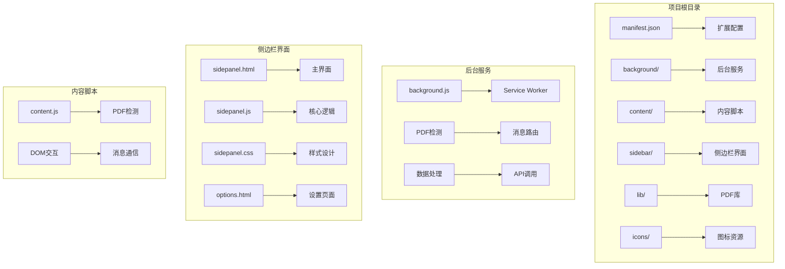

**图表来源**
- [manifest.json:1-48](file://manifest.json#L1-L48)
- [background.js:1-307](file://background/background.js#L1-L307)
- [sidepanel.html:1-646](file://sidebar/sidepanel.html#L1-L646)

**章节来源**
- [manifest.json:1-48](file://manifest.json#L1-L48)
- [README.md:108-126](file://README.md#L108-L126)

## 核心组件

### 扩展配置与权限

项目采用Chrome Extension Manifest V3标准，配置了完整的权限体系：

- **权限声明**：sidePanel、activeTab、scripting、storage、downloads
- **主机权限**：对所有URL的访问权限
- **侧边栏配置**：默认路径指向sidepanel.html
- **图标系统**：支持16x16到128x128像素的多尺寸图标

### 后台服务架构

后台服务采用Service Worker模式，负责核心的PDF处理和消息路由：

- **PDF检测**：监听标签页更新，自动检测PDF文件
- **数据下载**：绕过CORS限制，直接下载PDF二进制数据
- **消息路由**：处理侧边栏与内容脚本之间的通信
- **API代理**：提供HTTP代理服务，支持CORS绕过

**章节来源**
- [manifest.json:6-47](file://manifest.json#L6-L47)
- [background.js:11-117](file://background/background.js#L11-L117)

## 架构概览

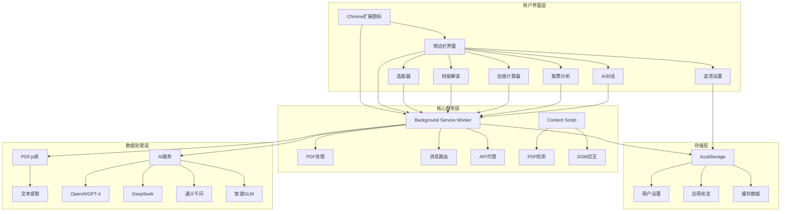

**图表来源**
- [background.js:125-177](file://background/background.js#L125-L177)
- [sidepanel.js:516-584](file://sidebar/sidepanel.js#L516-L584)
- [options.html:73-121](file://sidebar/options.html#L73-L121)

## 详细组件分析

### 后台服务组件

后台服务是整个扩展的核心，负责处理PDF文件检测、数据下载和消息路由：

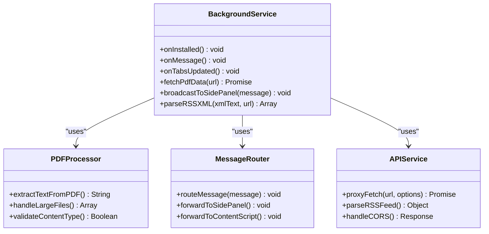

**图表来源**
- [background.js:17-117](file://background/background.js#L17-L117)
- [background.js:125-177](file://background/background.js#L125-L177)

### 侧边栏界面组件

侧边栏界面采用模块化设计，包含多个功能模块：

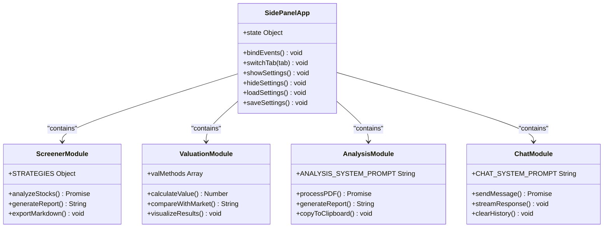

**图表来源**
- [sidepanel.js:516-584](file://sidebar/sidepanel.js#L516-L584)
- [sidepanel.js:14-297](file://sidebar/sidepanel.js#L14-L297)

**章节来源**
- [sidepanel.js:1-800](file://sidebar/sidepanel.js#L1-L800)
- [sidepanel.html:1-646](file://sidebar/sidepanel.html#L1-L646)

### 内容脚本组件

内容脚本负责在网页中检测PDF文件并发送通知：

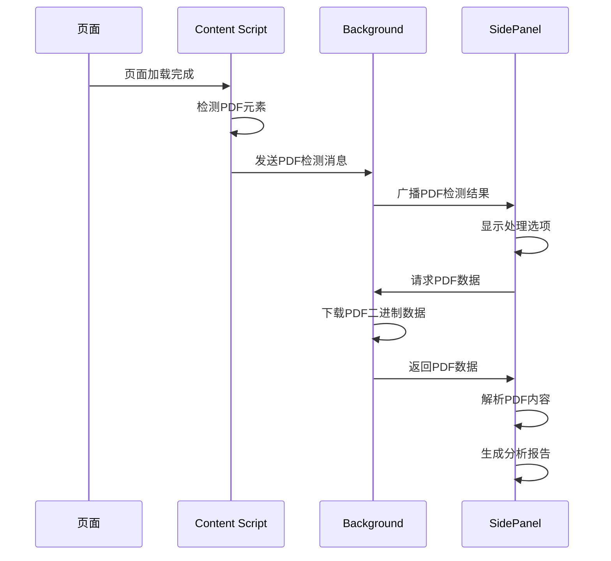

**图表来源**
- [content.js:11-36](file://content/content.js#L11-L36)
- [background.js:21-34](file://background/background.js#L21-L34)

**章节来源**
- [content.js:1-36](file://content/content.js#L1-L36)

## 开发环境部署

### 本地安装步骤

1. **克隆项目**
   ```bash
   git clone https://github.com/yourusername/earnings-report-extension.git
   cd earnings-report-extension
   ```

2. **启动Chrome扩展**
   - 打开Chrome浏览器，访问 `chrome://extensions/`
   - 开启右上角"开发者模式"
   - 点击"加载已解压的扩展程序"
   - 选择项目根目录

3. **首次配置**
   - 点击扩展图标
   - 点击设置按钮
   - 选择LLM服务商并填写API Key
   - 保存设置

### 开发工具配置

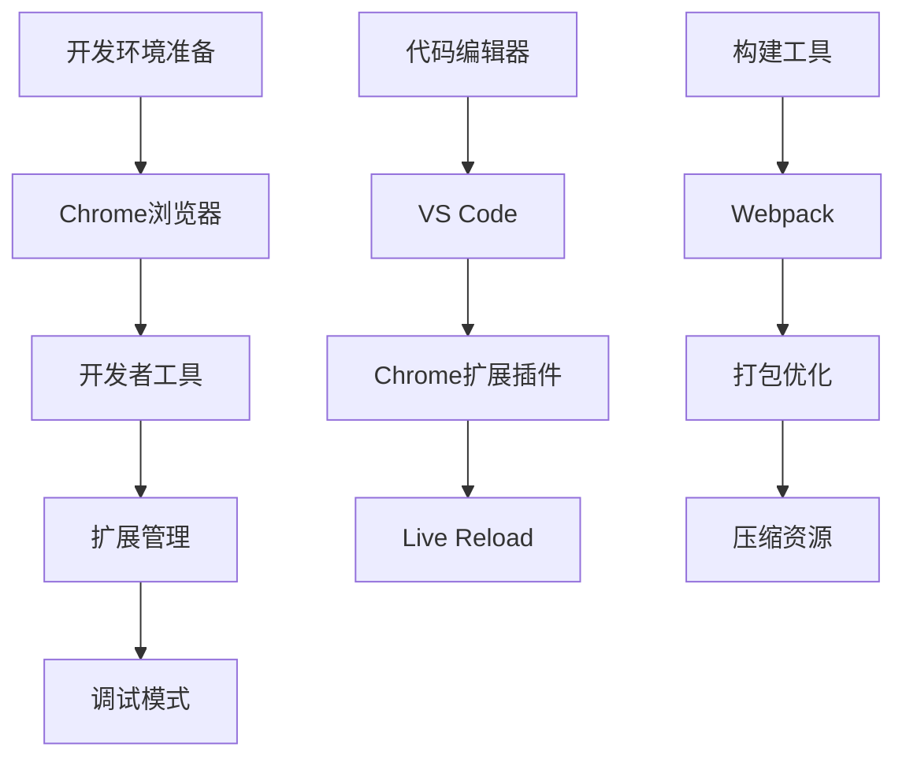

**章节来源**
- [README.md:83-107](file://README.md#L83-L107)

## 生产环境发布

### 版本打包流程

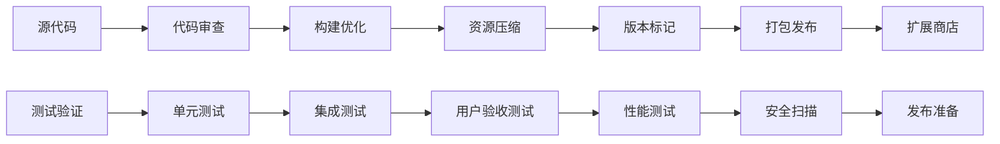

### 发布前检查清单

1. **代码质量检查**
   - [ ] 代码审查完成
   - [ ] 单元测试通过
   - [ ] 性能基准测试
   - [ ] 安全漏洞扫描

2. **功能完整性验证**
   - [ ] 所有功能模块测试
   - [ ] 用户界面响应性
   - [ ] 跨浏览器兼容性
   - [ ] 移动端适配

3. **性能优化**
   - [ ] 资源文件压缩
   - [ ] 缓存策略配置
   - [ ] 加载时间优化
   - [ ] 内存使用监控

**章节来源**
- [manifest.json:4-4](file://manifest.json#L4-L4)

## 版本管理与更新策略

### 版本号规范

项目采用语义化版本控制（SemVer）：

- **主版本号**：重大破坏性变更
- **次版本号**：向后兼容的功能新增
- **修订号**：向后兼容的问题修正

当前版本：`2.11.1`

### 更新策略

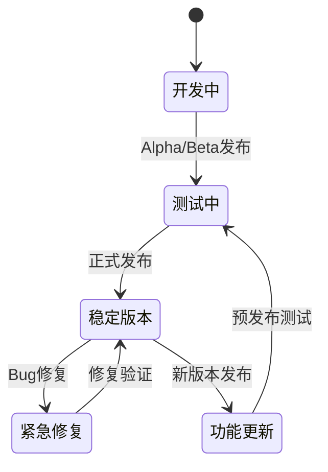

### 自动更新机制

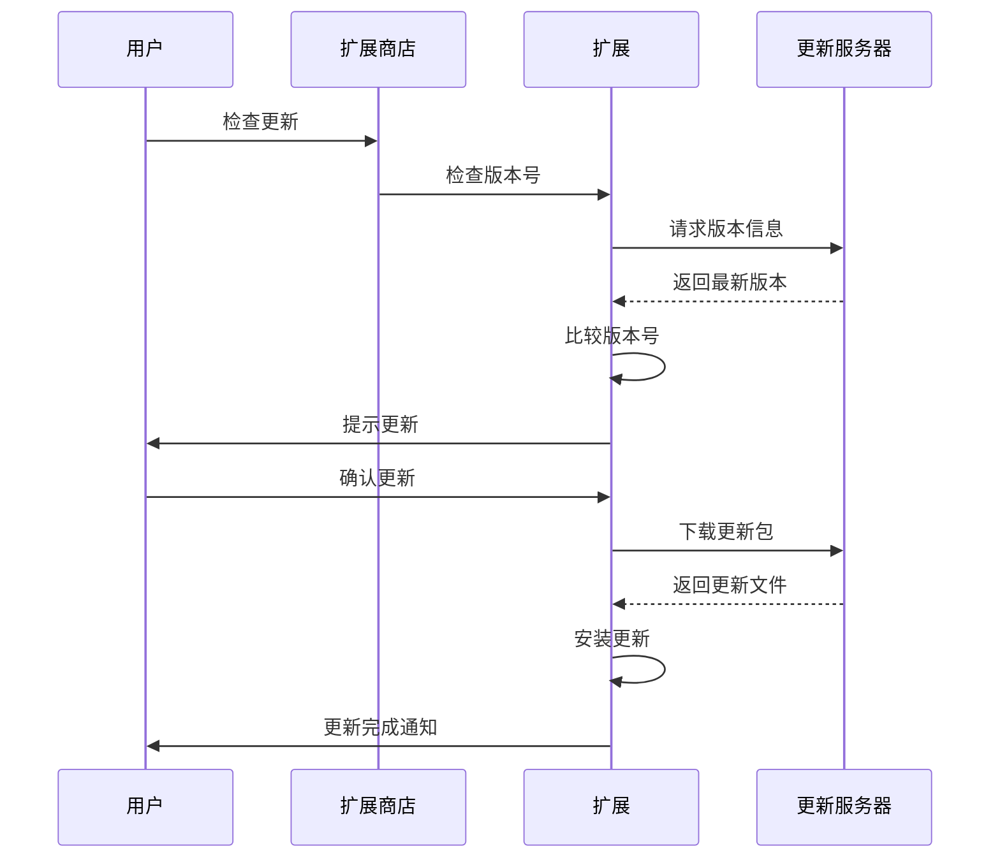

**章节来源**
- [manifest.json:4-4](file://manifest.json#L4-L4)

## 用户反馈与问题跟踪

### 反馈收集渠道

1. **内置反馈系统**
   - 设置页面提供反馈入口
   - 错误报告自动收集
   - 用户满意度调查

2. **外部反馈平台**
   - GitHub Issues
   - 邮件支持
   - 社交媒体渠道

### 问题跟踪流程

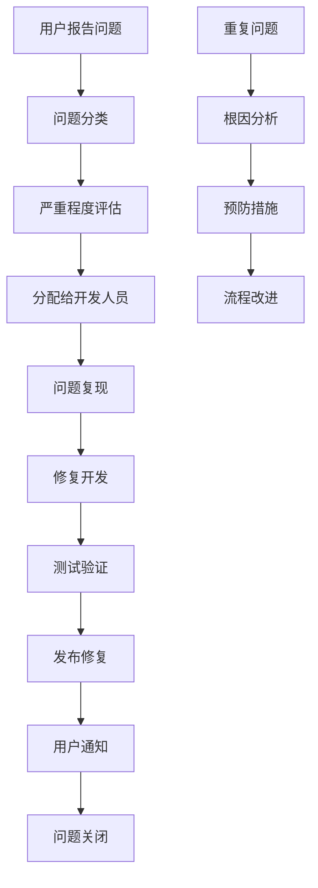

### 用户支持策略

1. **响应时间**
   - 严重问题：24小时内响应
   - 一般问题：72小时内响应
   - 建议和反馈：1周内回复

2. **解决方案跟踪**
   - 问题状态可视化
   - 进度实时更新
   - 用户参与验证

**章节来源**
- [options.html:72-121](file://sidebar/options.html#L72-L121)

## 发布后维护

### 日常维护任务

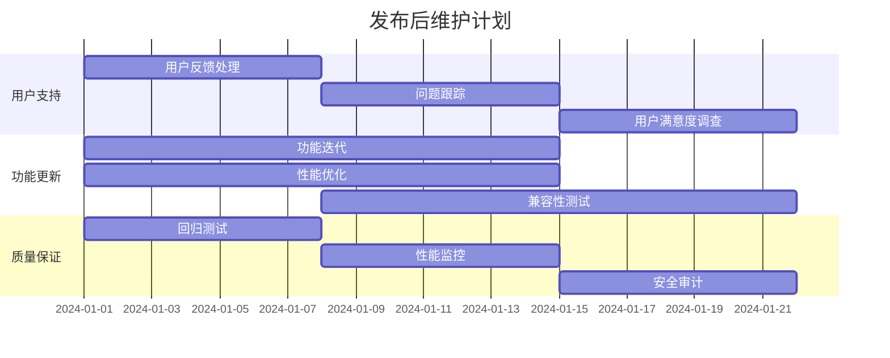

### 维护工作流程

1. **监控系统**
   - 用户行为分析
   - 性能指标监控
   - 错误日志收集
   - 用户反馈分析

2. **定期更新**
   - 每月功能回顾
   - 季度性能评估
   - 年度路线规划

3. **紧急响应**
   - 24小时故障响应
   - 紧急修复流程
   - 用户沟通机制

**章节来源**
- [background.js:182-186](file://background/background.js#L182-L186)

## 质量检查清单

### 开发阶段检查

| 检查类别 | 检查项目 | 通过标准 | 工具/方法 |
|---------|---------|---------|----------|
| 代码质量 | 代码审查 | 无阻塞性问题 | ESLint, SonarQube |
| 功能测试 | 单元测试 | 100%覆盖率 | Jest, Mocha |
| 性能测试 | 加载时间 | <2秒 | Lighthouse, WebPageTest |
| 兼容性测试 | 浏览器支持 | Chrome, Edge, Firefox | BrowserStack |
| 安全测试 | 漏洞扫描 | 无高危漏洞 | OWASP ZAP, Snyk |

### 发布前验证

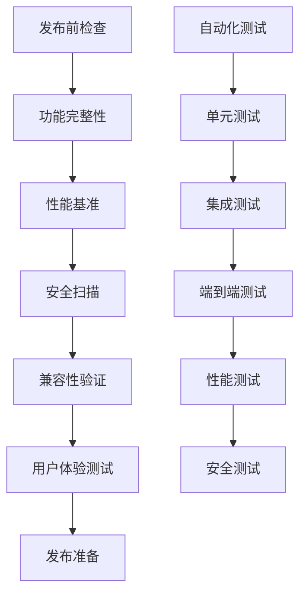

### 回归测试策略

1. **测试金字塔**
   - 单元测试：70%
   - 集成测试：20%
   - 端到端测试：10%

2. **持续集成**
   - 每次提交运行测试
   - 自动化部署到测试环境
   - 性能回归检测

**章节来源**
- [README.md:138-147](file://README.md#L138-L147)

## 扩展商店优化

### SEO优化策略

```mermaid
mindmap
root((扩展商店优化))
标题优化
关键词研究
标题长度控制
热门搜索词
描述优化
功能特性展示
用户价值强调
使用场景说明
截图优化
功能演示
界面截图
使用效果展示
评分提升
用户评价管理
反馈响应及时
问题解决效率
```

### 用户体验优化

1. **安装引导**
   - 清晰的安装说明
   - 首次使用教程
   - 快速开始指南

2. **界面设计**
   - 直观的操作流程
   - 清晰的视觉层次
   - 一致的设计风格

3. **性能优化**
   - 快速加载速度
   - 低内存占用
   - 稳定的运行表现

### 市场推广策略

1. **内容营销**
   - 教程视频制作
   - 使用案例分享
   - 用户故事展示

2. **社区建设**
   - 用户群组建立
   - 论坛讨论引导
   - 反馈收集机制

3. **合作伙伴**
   - 行业媒体合作
   - 影响者推广
   - 交叉推广机会

**章节来源**
- [README.md:1-82](file://README.md#L1-L82)

## 故障排除指南

### 常见问题诊断

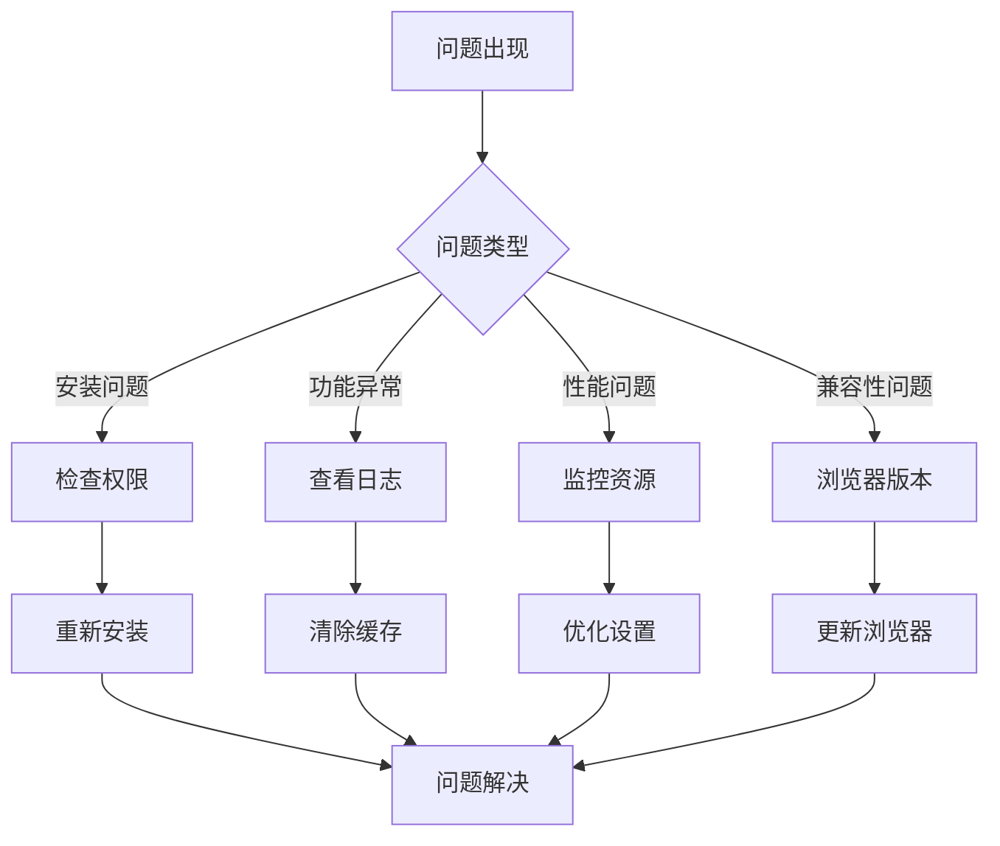

### 调试工具使用

1. **Chrome开发者工具**
   - 扩展页面调试
   - 网络请求监控
   - 控制台错误检查

2. **扩展专用工具**
   - 扩展管理页面
   - 调试模式启用
   - 消息监听器

3. **日志分析**
   - 错误日志收集
   - 性能数据监控
   - 用户行为追踪

### 紧急恢复方案

1. **版本回滚**
   - 自动备份机制
   - 快速恢复流程
   - 数据保护措施

2. **临时修复**
   - 热修复部署
   - 降级策略
   - 服务降级

3. **用户沟通**
   - 问题通知机制
   - 解决进度更新
   - 补偿措施制定

**章节来源**
- [background.js:173-177](file://background/background.js#L173-L177)

## 结论

投资助手扩展的部署与发布涉及多个层面的技术考量和流程管理。通过采用现代化的Chrome Extension架构、完善的测试策略和用户友好的界面设计，该项目为用户提供了一个强大而易用的投资决策辅助工具。

成功的发布不仅需要技术上的完美实现，更需要完善的运维体系、用户反馈机制和持续的产品迭代。建议团队建立标准化的开发流程，完善自动化测试和部署管道，确保产品的稳定性和可靠性。

通过持续的用户反馈收集和数据分析，可以不断优化产品功能和用户体验，保持产品的竞争力和用户满意度。同时，建立完善的故障应急响应机制，确保在出现问题时能够快速有效地解决，维护用户的信任和支持。