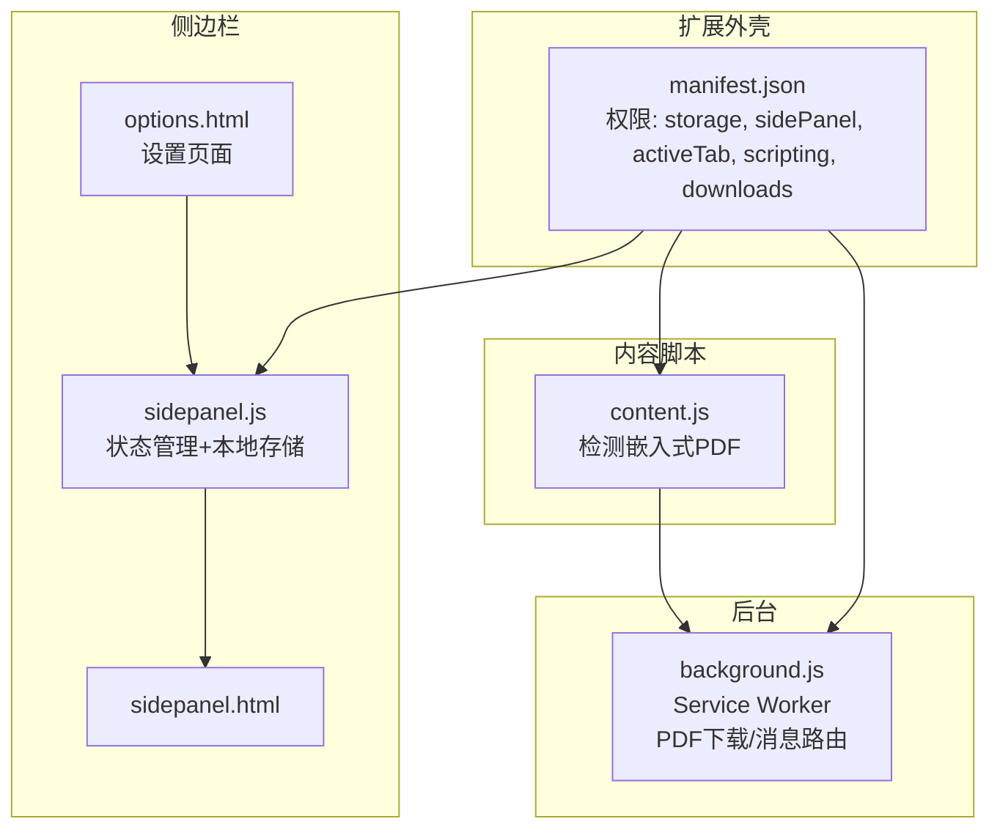
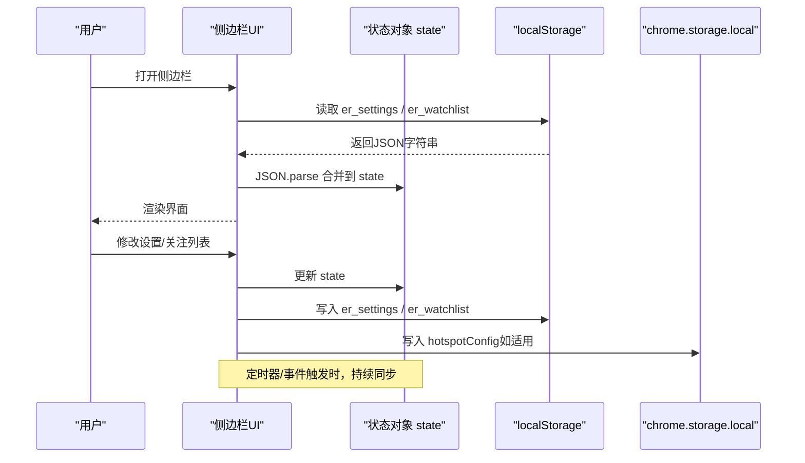
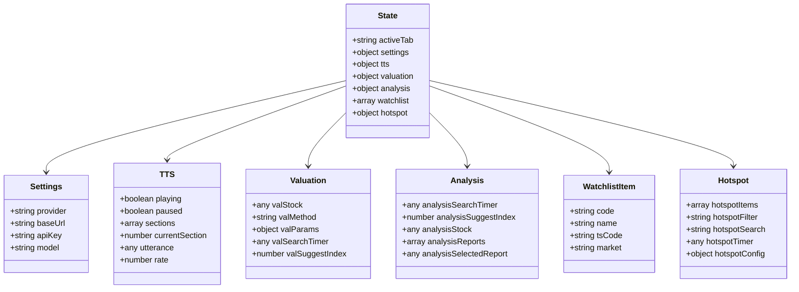
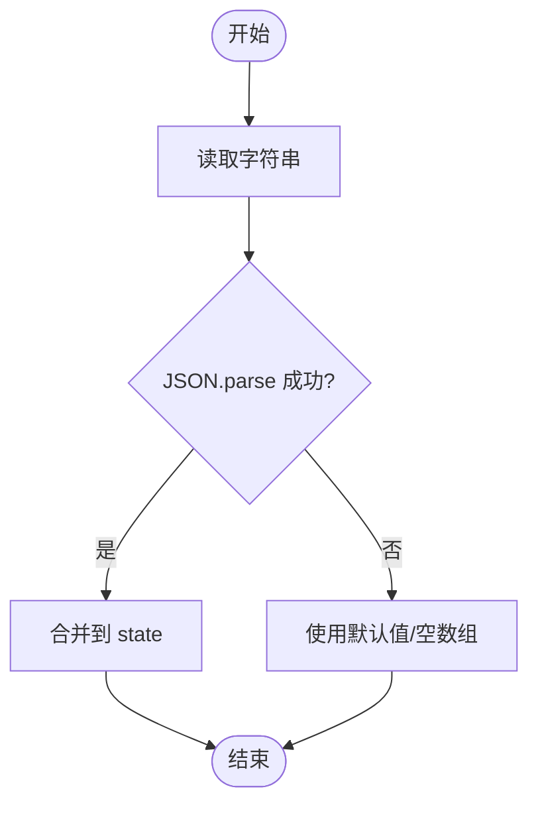
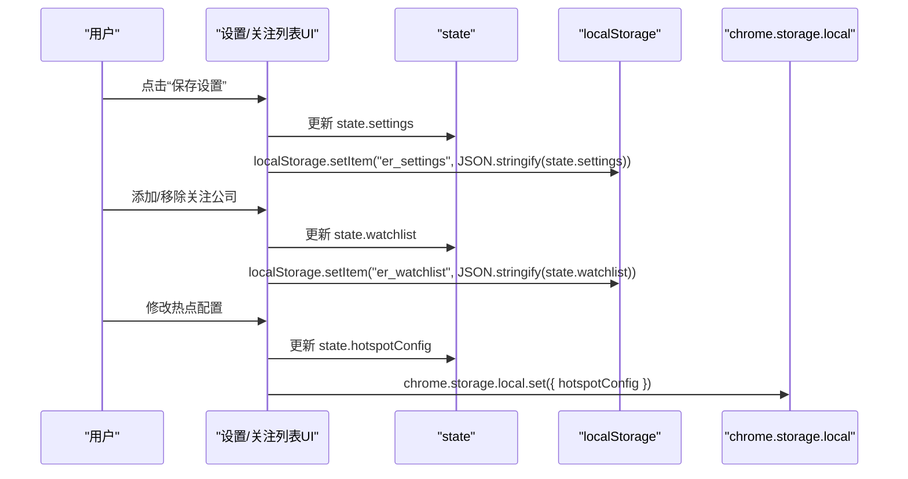
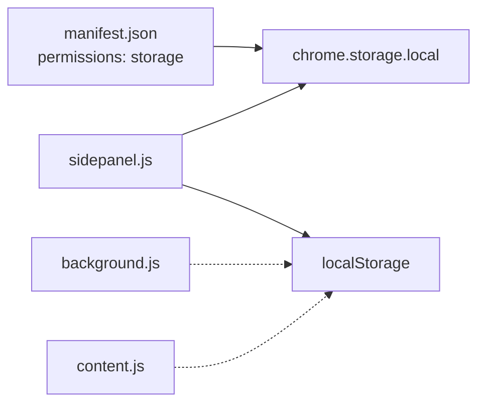

# 本地存储

<cite>
**本文引用的文件**
- [manifest.json](file://manifest.json)
- [background.js](file://background/background.js)
- [content.js](file://content/content.js)
- [sidepanel.js](file://sidebar/sidepanel.js)
- [sidepanel.html](file://sidebar/sidepanel.html)
- [options.html](file://sidebar/options.html)
- [README.md](file://README.md)
</cite>

## 目录
1. [简介](#简介)
2. [项目结构](#项目结构)
3. [核心组件](#核心组件)
4. [架构总览](#架构总览)
5. [详细组件分析](#详细组件分析)
6. [依赖分析](#依赖分析)
7. [性能考虑](#性能考虑)
8. [故障排除指南](#故障排除指南)
9. [结论](#结论)
10. [附录](#附录)

## 简介
本文件系统性梳理该 Chrome 扩展的本地存储机制，涵盖 localStorage 的使用模式、数据持久化策略、应用状态结构（settings、tts、valuation、analysis 等）、序列化与反序列化实现、键值设计规范、版本兼容与迁移方案、容量与性能优化、备份与恢复、跨标签页同步机制以及故障排除与调试技巧。文档面向开发者与非技术读者，既提供代码级细节，也提供概念性说明。

## 项目结构
该项目采用 Manifest V3 架构，核心文件包括：
- manifest.json：声明权限与资源，包含 storage 权限
- background/background.js：服务工作线程，负责 PDF 下载、消息路由
- content/content.js：内容脚本，检测嵌入式 PDF 并上报
- sidebar/sidepanel.js：侧边栏主逻辑，包含状态管理与本地存储
- sidebar/sidepanel.html：侧边栏页面结构
- sidebar/options.html：设置页面，同样使用 localStorage
- README.md：功能与注意事项说明

图表来源
- [manifest.json:1-48](file://manifest.json#L1-L48)
- [background.js:1-307](file://background/background.js#L1-L307)
- [content.js:1-36](file://content/content.js#L1-L36)
- [sidepanel.js:1-800](file://sidebar/sidepanel.js#L1-L800)
- [sidepanel.html:1-646](file://sidebar/sidepanel.html#L1-L646)
- [options.html:1-124](file://sidebar/options.html#L1-L124)

章节来源
- [manifest.json:1-48](file://manifest.json#L1-L48)
- [README.md:108-126](file://README.md#L108-L126)

## 核心组件
- 本地存储载体
  - localStorage：用于保存用户设置、关注列表等轻量数据
  - chrome.storage.local：用于保存热点模块配置（如刷新间隔、RSS 源开关等）
- 状态容器 state：集中管理应用状态，包含 settings、tts、valuation、analysis、hotspot、watchlist 等子状态
- 序列化/反序列化：统一使用 JSON.stringify/JSON.parse
- 键值命名规范：er_settings、er_watchlist 等，带 er_ 前缀，便于识别与隔离

章节来源
- [sidepanel.js:516-584](file://sidebar/sidepanel.js#L516-L584)
- [sidepanel.js:609-637](file://sidebar/sidepanel.js#L609-L637)
- [sidepanel.js:1935-1949](file://sidebar/sidepanel.js#L1935-L1949)
- [options.html:82-120](file://sidebar/options.html#L82-L120)
- [sidepanel.js:1665-1717](file://sidebar/sidepanel.js#L1665-L1717)

## 架构总览
本地存储在前端侧以“状态对象 + 本地存储”双层结构存在：
- 前端状态对象：内存中的 state，承载 UI 交互与业务逻辑
- 本地存储：localStorage/chrome.storage.local，负责持久化
- 同步路径：DOM ready 时从 localStorage 读取并合并到 state；用户操作或定时器触发时写回 localStorage/chrome.storage.local

图表来源
- [sidepanel.js:591-607](file://sidebar/sidepanel.js#L591-L607)
- [sidepanel.js:609-637](file://sidebar/sidepanel.js#L609-L637)
- [sidepanel.js:1935-1949](file://sidebar/sidepanel.js#L1935-L1949)
- [sidepanel.js:1665-1717](file://sidebar/sidepanel.js#L1665-L1717)

## 详细组件分析

### 应用状态结构与持久化策略
- settings（设置）
  - 字段：provider、baseUrl、apiKey、model
  - 读取：DOM ready 时从 localStorage 读取并合并到 state.settings
  - 写入：保存按钮触发，写入 localStorage
  - 失败处理：JSON.parse 异常时静默忽略，保持默认
- watchlist（关注公司）
  - 字段：数组，元素含 code/name/tsCode/market 等
  - 读取/写入：DOM ready 时读取，后续变更立即写入
  - 失败处理：JSON.parse 异常时重置为空数组
- tts（TTS 播报）
  - 字段：playing、paused、sections、currentSection、utterance、rate
  - 作用：承载 TTS 播报状态与节拍切分
  - 特点：仅内存状态，不持久化；播放结束后 UI 自动隐藏
- valuation（估值）
  - 字段：valStock、valMethod、valParams、搜索定时器与索引
  - 作用：估值计算器的输入与中间状态
  - 特点：参数与中间状态不持久化，避免污染
- analysis（财报解读）
  - 字段：analysisSearchTimer、analysisSuggestIndex、analysisStock、analysisReports、analysisSelectedReport
  - 作用：搜索与报告选择的中间状态
  - 特点：不持久化，避免跨会话状态错配
- hotspot（热点信息）
  - 字段：hotspotItems、hotspotFilter、hotspotSearch、hotspotTimer、hotspotConfig
  - 读取/写入：使用 chrome.storage.local 保存配置（刷新间隔、RSS 源开关、自定义源、关键词）
  - 特点：数据主体（热点项）不持久化，仅配置持久化

图表来源
- [sidepanel.js:516-584](file://sidebar/sidepanel.js#L516-L584)

章节来源
- [sidepanel.js:516-584](file://sidebar/sidepanel.js#L516-L584)
- [sidepanel.js:609-637](file://sidebar/sidepanel.js#L609-L637)
- [sidepanel.js:1935-1949](file://sidebar/sidepanel.js#L1935-L1949)
- [sidepanel.js:1665-1717](file://sidebar/sidepanel.js#L1665-L1717)

### 数据序列化与反序列化
- 写入：使用 JSON.stringify 将对象序列化为字符串，再写入 localStorage 或 chrome.storage.local
- 读取：从 localStorage/chrome.storage.local 读取字符串，使用 JSON.parse 反序列化
- 错误处理：try/catch 包裹 JSON.parse，异常时采用默认值或空数组，保证健壮性

图表来源
- [sidepanel.js:611-613](file://sidebar/sidepanel.js#L611-L613)
- [sidepanel.js:1937-1939](file://sidebar/sidepanel.js#L1937-L1939)

章节来源
- [sidepanel.js:611-613](file://sidebar/sidepanel.js#L611-L613)
- [sidepanel.js:1937-1939](file://sidebar/sidepanel.js#L1937-L1939)

### 存储键值设计规范与命名约定
- 前缀：er_，用于标识扩展内部键值，避免与其他扩展冲突
- settings：er_settings
- watchlist：er_watchlist
- 其他：hotspotConfig 使用 chrome.storage.local（不在 localStorage 中）

章节来源
- [sidepanel.js:610](file://sidebar/sidepanel.js#L610)
- [sidepanel.js:1936](file://sidebar/sidepanel.js#L1936)
- [sidepanel.js:1665](file://sidebar/sidepanel.js#L1665)

### 数据迁移与版本兼容
- 现状：未见显式的版本号字段与迁移函数
- 建议实践：
  - 引入版本号字段（如 er_version），在读取时比较当前版本与存储版本
  - 若版本落后，执行迁移函数：重命名键、调整字段结构、补齐默认值
  - 迁移完成后更新版本号
- 本项目当前策略：JSON.parse 失败时回退到默认值，确保向前兼容

章节来源
- [sidepanel.js:611-613](file://sidebar/sidepanel.js#L611-L613)
- [sidepanel.js:1937-1939](file://sidebar/sidepanel.js#L1937-L1939)

### 存储容量限制与性能优化
- localStorage 限制：通常为 5-10 MB，建议控制单键大小
- 优化策略：
  - 合理拆分：将大对象拆分为多个键，或仅持久化必要字段
  - 压缩：对超大文本可考虑压缩（需权衡 CPU 开销）
  - 延迟写入：使用防抖/节流（如搜索定时器）减少频繁写入
  - 清理策略：定期清理过期或冗余数据（如热点项上限）
- 本项目已采用：
  - 热点项上限：最多保留 500 条
  - 配置持久化：仅持久化配置，不持久化数据主体

章节来源
- [sidepanel.js:1285](file://sidebar/sidepanel.js#L1285)
- [sidepanel.js:1665-1667](file://sidebar/sidepanel.js#L1665-L1667)

### 备份与恢复
- 备份
  - settings：从 localStorage 读取 er_settings，复制 JSON 字符串
  - watchlist：从 localStorage 读取 er_watchlist，复制 JSON 字符串
  - hotspot 配置：从 chrome.storage.local 读取 hotspotConfig
- 恢复
  - 将备份的 JSON 字符串写回对应键，重启侧边栏即可生效
- 注意：TTS、valuation、analysis 等为临时状态，无需备份

章节来源
- [sidepanel.js:609-637](file://sidebar/sidepanel.js#L609-L637)
- [sidepanel.js:1935-1949](file://sidebar/sidepanel.js#L1935-L1949)
- [sidepanel.js:1665-1717](file://sidebar/sidepanel.js#L1665-L1717)

### 跨标签页状态同步机制
- 现状：未见使用 StorageEvent 或 chrome.storage.onChanged 监听跨标签页变更
- 可选方案：
  - 使用 chrome.storage.onChanged 监听配置变更（如热点配置）
  - 使用 BroadcastChannel 在标签页间广播状态（需引入额外逻辑）
- 本项目策略：配置通过 chrome.storage.local 持久化，其他状态为页面内内存状态，不跨标签页同步

章节来源
- [sidepanel.js:1665-1717](file://sidebar/sidepanel.js#L1665-L1717)

### API/服务组件：设置与关注列表的保存流程

图表来源
- [sidepanel.js:620-637](file://sidebar/sidepanel.js#L620-L637)
- [sidepanel.js:1946](file://sidebar/sidepanel.js#L1946)
- [sidepanel.js:1665-1717](file://sidebar/sidepanel.js#L1665-L1717)

## 依赖分析
- manifest.json 声明 storage 权限，允许使用 chrome.storage.local
- sidepanel.js 同时使用 localStorage 与 chrome.storage.local，分别用于用户设置/关注列表与热点配置
- background.js 与 content.js 不直接使用本地存储，主要负责 PDF 检测与下载

图表来源
- [manifest.json:6-12](file://manifest.json#L6-L12)
- [sidepanel.js:609-637](file://sidebar/sidepanel.js#L609-L637)
- [sidepanel.js:1935-1949](file://sidebar/sidepanel.js#L1935-L1949)
- [sidepanel.js:1665-1717](file://sidebar/sidepanel.js#L1665-L1717)

章节来源
- [manifest.json:6-12](file://manifest.json#L6-L12)
- [sidepanel.js:609-637](file://sidebar/sidepanel.js#L609-L637)
- [sidepanel.js:1935-1949](file://sidebar/sidepanel.js#L1935-L1949)
- [sidepanel.js:1665-1717](file://sidebar/sidepanel.js#L1665-L1717)

## 性能考虑
- 写入频率控制：使用定时器（如搜索输入）降低写入频次
- 数据体积控制：热点项上限、仅持久化必要配置
- 解析健壮性：JSON.parse 包裹在 try/catch，避免崩溃
- UI 响应：写入成功后即时更新 UI，提升反馈速度

## 故障排除指南
- 设置未生效
  - 检查 localStorage 中 er_settings 是否存在且 JSON 可解析
  - 确认保存按钮是否触发写入
- 关注列表丢失
  - 检查 localStorage 中 er_watchlist 是否存在
  - 若解析失败，state 会重置为空数组
- 热点配置未保存
  - 检查 chrome.storage.local 中 hotspotConfig 是否写入
  - 确认保存按钮与 UI 输入框值正确
- API Key 安全
  - README 明确 API Key 仅存储在 localStorage，不上传至服务器
- 调试技巧
  - 在浏览器开发者工具 Console 中直接读取 localStorage
  - 在 Application 面板查看 localStorage 与 IndexedDB（chrome.storage.local）
  - 通过 Network 面板观察热点数据抓取与 RSS 解析

章节来源
- [README.md:140-142](file://README.md#L140-L142)
- [sidepanel.js:609-637](file://sidebar/sidepanel.js#L609-L637)
- [sidepanel.js:1935-1949](file://sidebar/sidepanel.js#L1935-L1949)
- [sidepanel.js:1665-1717](file://sidebar/sidepanel.js#L1665-L1717)

## 结论
本项目采用“内存状态 + 本地存储”的双层结构，localStorage 用于用户设置与关注列表，chrome.storage.local 用于热点模块配置。通过统一的序列化/反序列化与健壮的错误处理，实现了稳定的持久化体验。建议在未来引入版本号与迁移机制，进一步增强长期维护性与兼容性。

## 附录
- 相关文件清单
  - manifest.json：声明 storage 权限
  - sidepanel.js：状态管理与本地存储实现
  - options.html：设置页面，使用 localStorage
  - sidepanel.html：侧边栏页面结构
  - background.js：PDF 下载与消息路由
  - content.js：嵌入式 PDF 检测
  - README.md：功能与注意事项说明