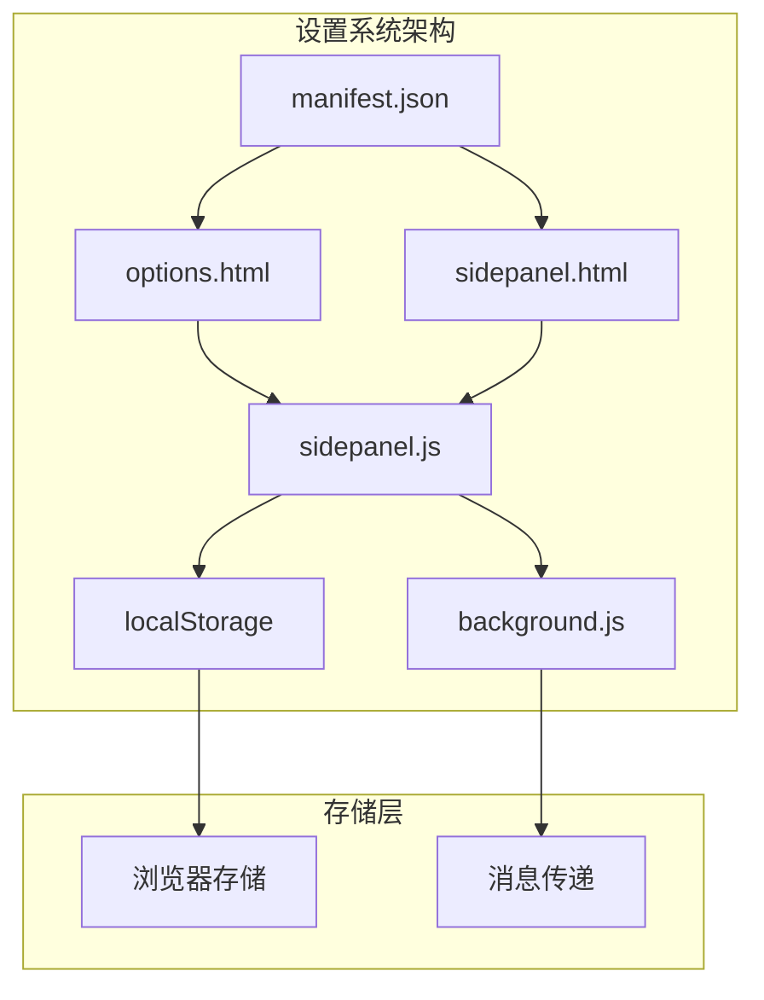
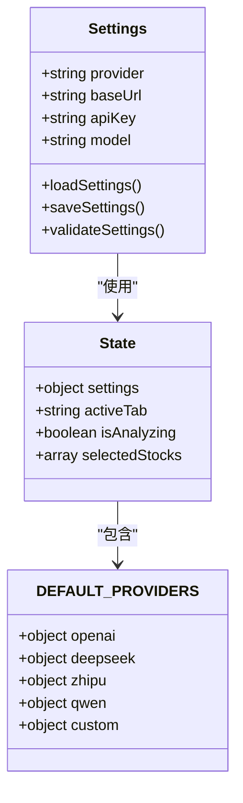
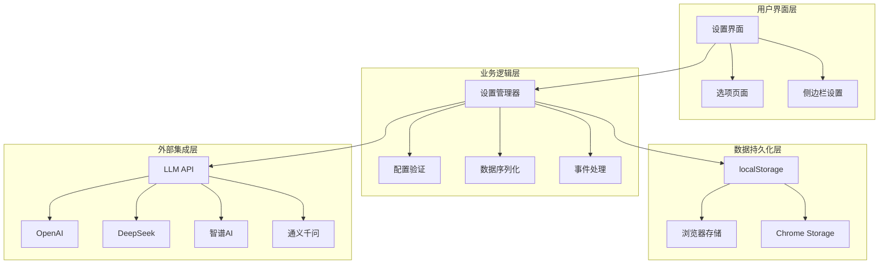
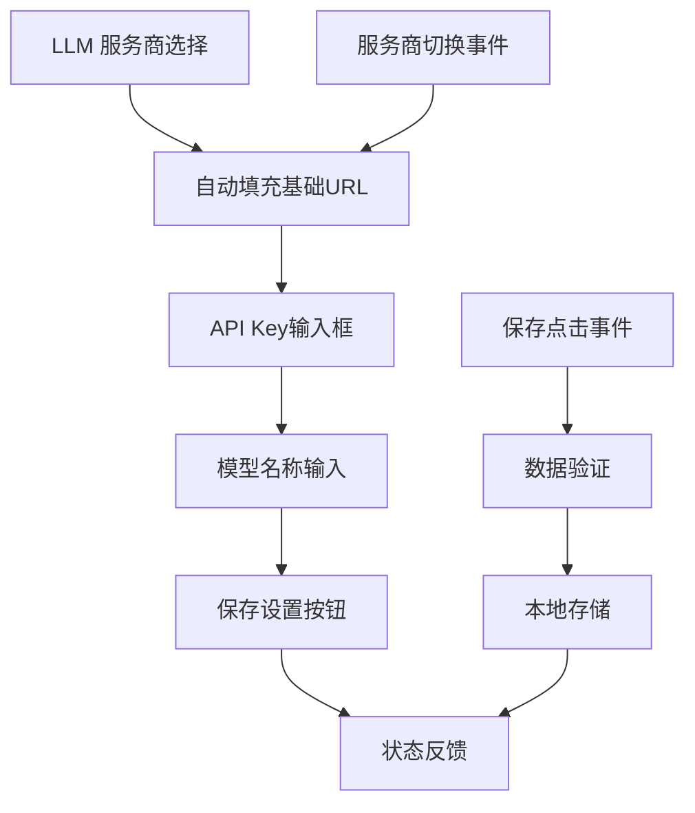
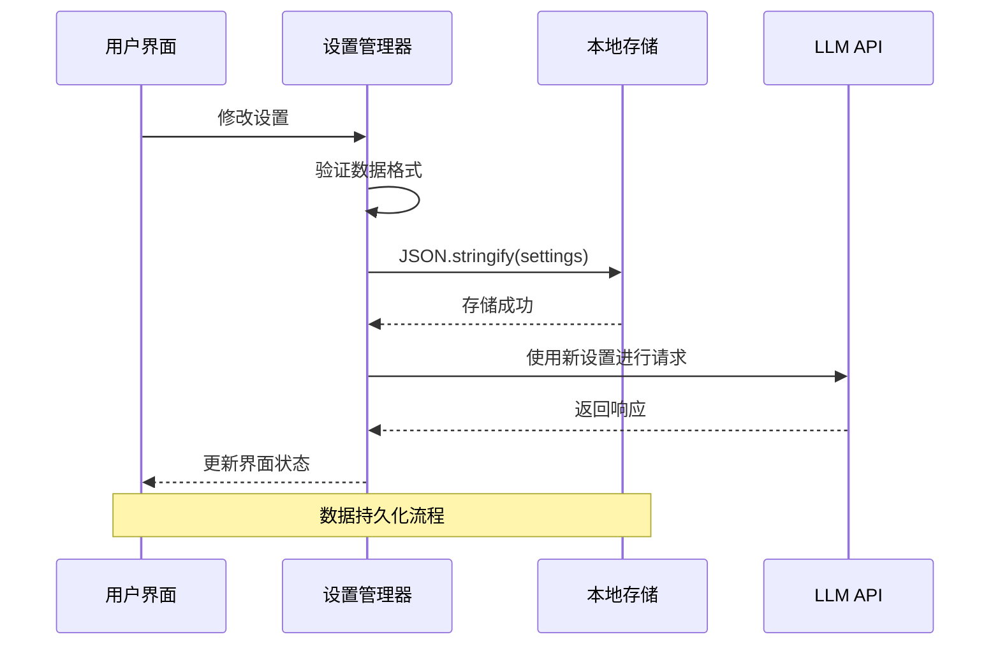
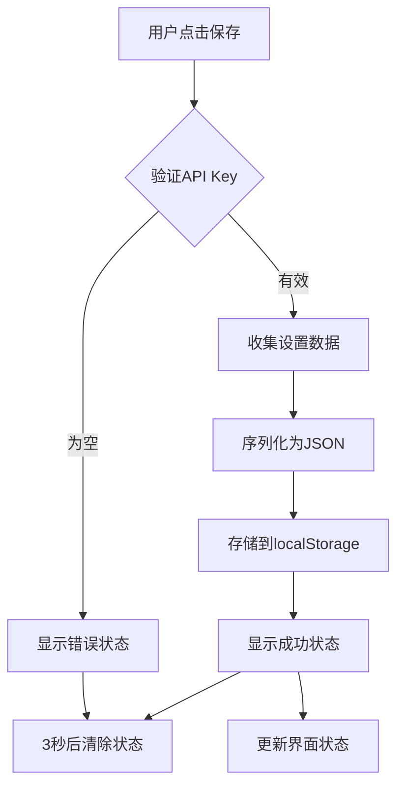
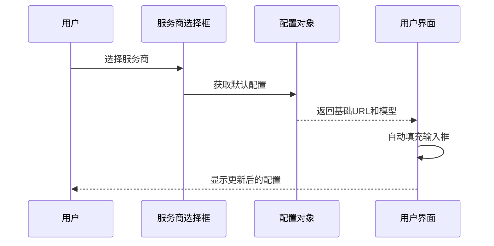
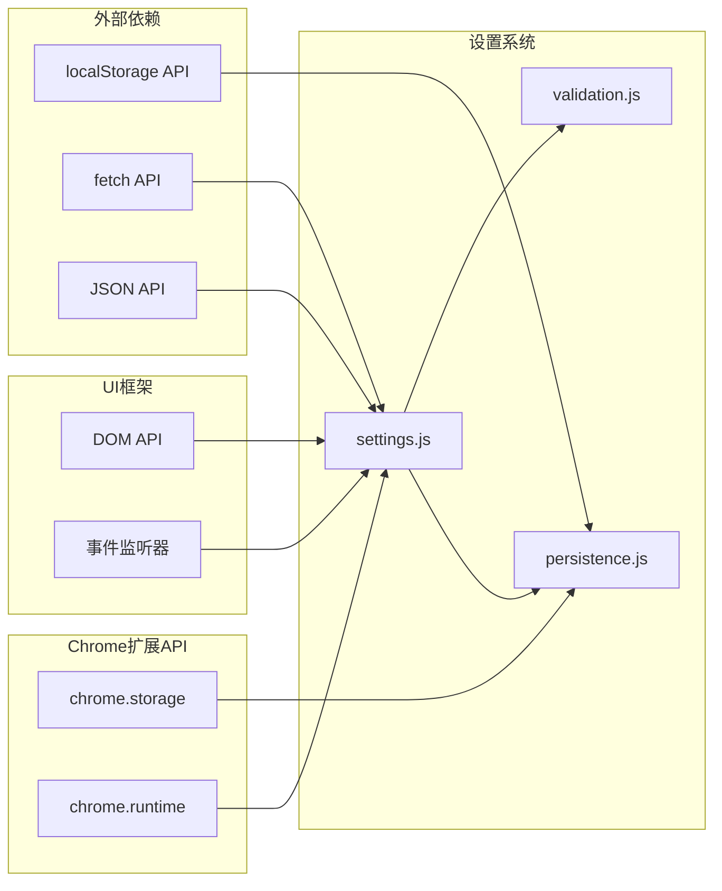

# 设置系统

<cite>
**本文档引用的文件**
- [manifest.json](file://manifest.json)
- [options.html](file://sidebar/options.html)
- [sidepanel.html](file://sidebar/sidepanel.html)
- [sidepanel.js](file://sidebar/sidepanel.js)
- [background.js](file://background/background.js)
</cite>

## 目录
1. [简介](#简介)
2. [项目结构](#项目结构)
3. [核心组件](#核心组件)
4. [架构概览](#架构概览)
5. [详细组件分析](#详细组件分析)
6. [依赖关系分析](#依赖关系分析)
7. [性能考虑](#性能考虑)
8. [故障排除指南](#故障排除指南)
9. [结论](#结论)

## 简介

设置系统是投资助手Chrome扩展的核心配置模块，负责管理LLM提供商配置、API密钥管理、基础URL设置和模型选择功能。该系统提供了直观的用户界面，支持多种AI服务提供商（OpenAI、DeepSeek、智谱、通义千问等），并实现了本地存储的数据持久化机制。

## 项目结构

项目采用模块化架构设计，设置系统主要分布在以下文件中：

**图表来源**
- [manifest.json:1-48](file://manifest.json#L1-L48)
- [options.html:1-124](file://sidebar/options.html#L1-L124)
- [sidepanel.html:564-617](file://sidebar/sidepanel.html#L564-L617)

**章节来源**
- [manifest.json:1-48](file://manifest.json#L1-L48)
- [options.html:1-124](file://sidebar/options.html#L1-L124)
- [sidepanel.html:564-617](file://sidebar/sidepanel.html#L564-L617)

## 核心组件

### LLM提供商配置

设置系统支持以下AI服务提供商：

| 供应商 | 服务端点 | 默认模型 | 特殊说明 |
|--------|----------|----------|----------|
| OpenAI | https://api.openai.com/v1 | gpt-4o | 支持GPT系列模型 |
| DeepSeek | https://api.deepseek.com/v1 | deepseek-chat | 支持中文场景 |
| 智谱 | https://open.bigmodel.cn/api/paas/v4 | glm-4 | 支持中文大模型 |
| 通义千问 | https://dashscope.aliyuncs.com/compatible-mode/v1 | qwen-max | 支持中文对话 |
| 自定义 | 用户配置 | 用户指定 | 支持任意兼容服务 |

### 设置数据结构

设置系统使用标准化的数据结构存储配置信息：

**图表来源**
- [sidepanel.js:529-534](file://sidebar/sidepanel.js#L529-L534)
- [sidepanel.js:417-423](file://sidebar/sidepanel.js#L417-L423)

**章节来源**
- [sidepanel.js:417-423](file://sidebar/sidepanel.js#L417-L423)
- [sidepanel.js:529-534](file://sidebar/sidepanel.js#L529-L534)

## 架构概览

设置系统采用分层架构设计，确保功能模块的清晰分离和良好的可维护性：

**图表来源**
- [sidepanel.js:609-637](file://sidebar/sidepanel.js#L609-L637)
- [options.html:73-79](file://sidebar/options.html#L73-L79)

## 详细组件分析

### 设置界面组件

#### 选项页面设置界面

选项页面提供了简洁的设置界面，包含以下核心元素：

**图表来源**
- [options.html:46-69](file://sidebar/options.html#L46-L69)
- [options.html:93-120](file://sidebar/options.html#L93-L120)

#### 侧边栏设置界面

侧边栏提供了更丰富的设置功能：

| 设置项 | 输入类型 | 默认值 | 验证规则 |
|--------|----------|--------|----------|
| LLM 服务商 | 下拉菜单 | openai | 必填 |
| API 地址 | 文本输入 | 自动填充 | HTTPS协议 |
| API Key | 密码输入 | 空 | 非空验证 |
| 模型名称 | 文本输入 | 自动填充 | 非空验证 |
| 关注公司管理 | 复合组件 | 空列表 | 格式验证 |

**章节来源**
- [sidepanel.html:571-617](file://sidebar/sidepanel.html#L571-L617)
- [sidepanel.js:609-637](file://sidebar/sidepanel.js#L609-L637)

### 数据序列化与反序列化

设置系统实现了完整的数据持久化机制：

**图表来源**
- [sidepanel.js:620-637](file://sidebar/sidepanel.js#L620-L637)
- [options.html:102-120](file://sidebar/options.html#L102-L120)

### 用户交互流程

#### 设置保存流程

**图表来源**
- [sidepanel.js:620-637](file://sidebar/sidepanel.js#L620-L637)
- [options.html:102-120](file://sidebar/options.html#L102-L120)

#### 服务商切换流程

**图表来源**
- [sidepanel.js:651-657](file://sidebar/sidepanel.js#L651-L657)
- [options.html:93-100](file://sidebar/options.html#L93-L100)

**章节来源**
- [sidepanel.js:651-657](file://sidebar/sidepanel.js#L651-L657)
- [options.html:93-100](file://sidebar/options.html#L93-L100)

### 错误处理策略

设置系统实现了多层次的错误处理机制：

| 错误类型 | 处理方式 | 用户反馈 |
|----------|----------|----------|
| API Key为空 | 显示警告状态 | "⚠️ 请填写 API Key" |
| API请求失败 | 显示错误状态 | "❌ API请求失败" |
| JSON解析错误 | 恢复默认设置 | 页面重置 |
| 网络连接失败 | 显示连接错误 | "⚠️ 网络连接失败" |

**章节来源**
- [sidepanel.js:2511-2562](file://sidebar/sidepanel.js#L2511-L2562)
- [sidepanel.js:3323-3357](file://sidebar/sidepanel.js#L3323-L3357)

## 依赖关系分析

设置系统与其他模块的依赖关系如下：

**图表来源**
- [sidepanel.js:609-637](file://sidebar/sidepanel.js#L609-L637)
- [background.js:36-117](file://background/background.js#L36-L117)

**章节来源**
- [sidepanel.js:609-637](file://sidebar/sidepanel.js#L609-L637)
- [background.js:36-117](file://background/background.js#L36-L117)

## 性能考虑

设置系统在性能方面采用了多项优化策略：

### 1. 数据缓存机制
- 使用内存中的状态对象缓存当前设置
- 避免频繁的localStorage访问
- 实现增量更新而非全量替换

### 2. 异步处理
- 所有网络请求采用异步方式
- 非阻塞的UI更新机制
- 流式响应处理

### 3. 内存管理
- 及时清理事件监听器
- 合理的垃圾回收策略
- 避免内存泄漏

## 故障排除指南

### 常见问题及解决方案

#### API Key配置问题
**问题症状**: "API Key 无效" 或 "401 Unauthorized"
**解决步骤**:
1. 检查API Key格式是否正确
2. 确认API Key具有相应权限
3. 验证网络连接状态
4. 重新生成API Key

#### 服务商连接问题
**问题症状**: 服务商切换后配置未更新
**解决步骤**:
1. 刷新页面重新加载配置
2. 检查浏览器控制台错误信息
3. 确认服务商URL可达性
4. 清除浏览器缓存

#### 数据持久化问题
**问题症状**: 设置无法保存或丢失
**解决步骤**:
1. 检查浏览器存储权限
2. 确认localStorage可用性
3. 验证浏览器存储空间
4. 重启浏览器扩展

**章节来源**
- [sidepanel.js:2551-2562](file://sidebar/sidepanel.js#L2551-L2562)
- [sidepanel.js:3343-3357](file://sidebar/sidepanel.js#L3343-L3357)

## 结论

设置系统通过模块化设计和完善的错误处理机制，为用户提供了一个功能完整、易于使用的配置管理界面。系统支持多种主流AI服务提供商，具备良好的扩展性和安全性。通过本地存储机制和响应式设计，确保了用户配置的持久化和良好的用户体验。

未来可以考虑的功能增强包括：
- 设置导入导出功能
- 配置模板管理
- 更详细的错误诊断信息
- 设置版本管理和回滚机制