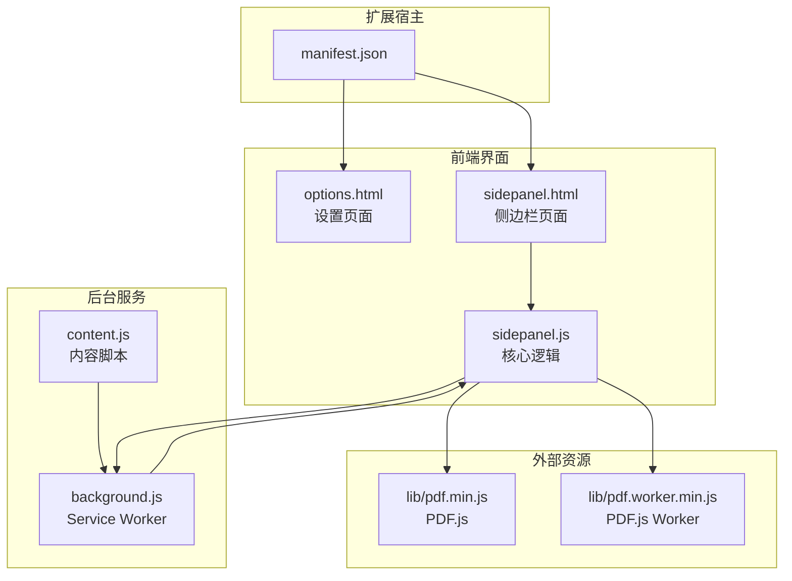
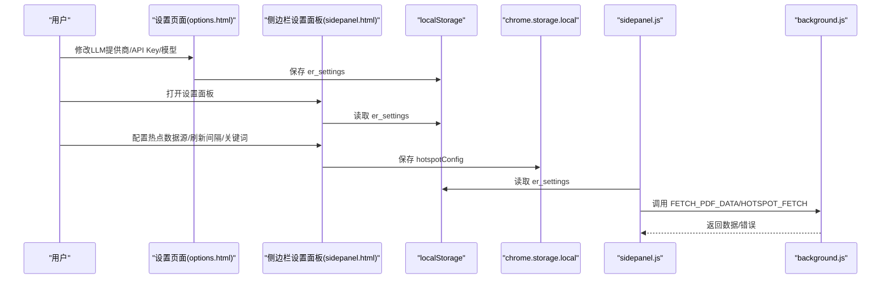
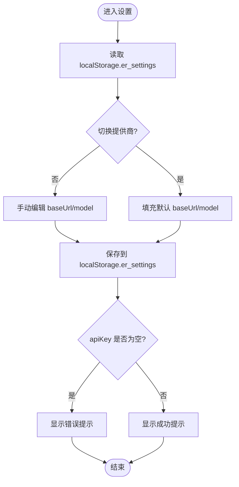
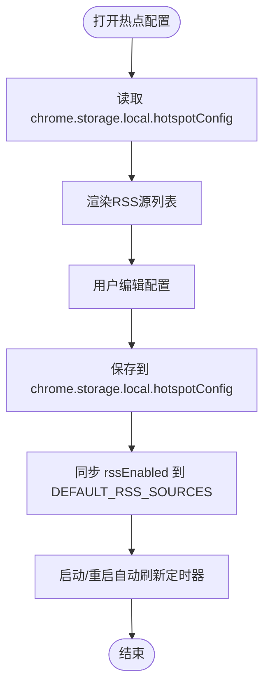
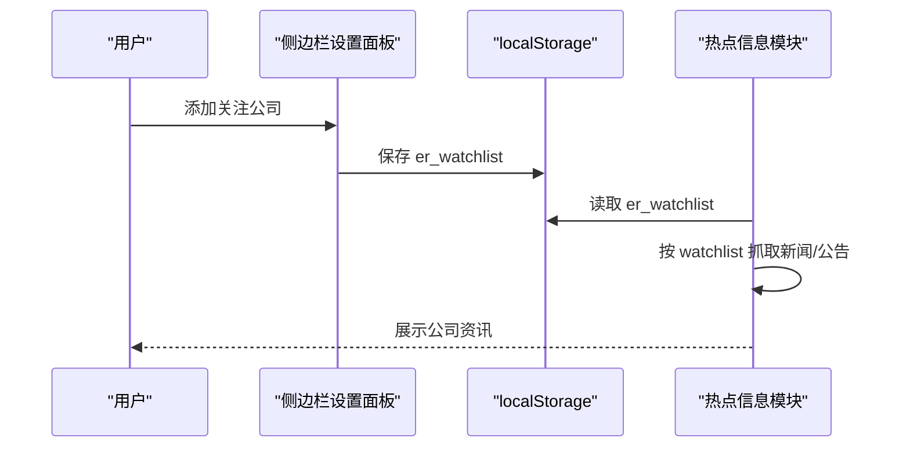
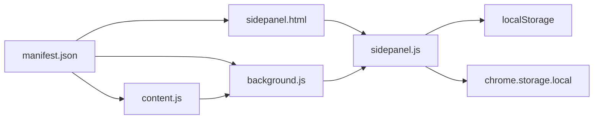

# 配置管理

<cite>
**本文引用的文件**
- [manifest.json](file://manifest.json)
- [options.html](file://sidebar/options.html)
- [sidepanel.html](file://sidebar/sidepanel.html)
- [sidepanel.js](file://sidebar/sidepanel.js)
- [background.js](file://background/background.js)
- [content.js](file://content/content.js)
- [README.md](file://README.md)
</cite>

## 目录
1. [简介](#简介)
2. [项目结构](#项目结构)
3. [核心组件](#核心组件)
4. [架构总览](#架构总览)
5. [详细组件分析](#详细组件分析)
6. [依赖关系分析](#依赖关系分析)
7. [性能考量](#性能考量)
8. [故障排查指南](#故障排查指南)
9. [结论](#结论)
10. [附录](#附录)

## 简介
本文件面向“投资助手”Chrome扩展的配置管理，系统性阐述设置架构、数据源配置、个性化选项、本地存储机制、验证规则与默认值、最佳实践、备份恢复、安全与隐私以及高级用户的自定义指南。文档同时提供可视化图示，帮助非技术读者理解配置如何在前端界面与后台服务之间流转。

## 项目结构
该扩展采用Manifest V3 + Side Panel架构，核心配置涉及：
- 设置页面（options.html）与侧边栏设置面板（sidepanel.html + sidepanel.js）
- LLM提供商配置（OpenAI/DeepSeek/智谱/通义/自定义）
- 数据源配置（热点信息、RSS/JSON API、内置数据源开关）
- 个性化设置（关注公司、自动刷新间隔、关键词过滤）
- 本地存储（localStorage、chrome.storage.local）

图表来源
- [manifest.json:1-48](file://manifest.json#L1-L48)
- [options.html:1-124](file://sidebar/options.html#L1-L124)
- [sidepanel.html:1-646](file://sidebar/sidepanel.html#L1-L646)
- [sidepanel.js:1-120](file://sidebar/sidepanel.js#L1-L120)
- [background.js:1-30](file://background/background.js#L1-L30)
- [content.js:1-36](file://content/content.js#L1-L36)

章节来源
- [manifest.json:1-48](file://manifest.json#L1-L48)
- [README.md:108-126](file://README.md#L108-L126)

## 核心组件
- LLM提供商配置：支持OpenAI、DeepSeek、智谱、通义、自定义API，包含默认提供商映射与模型/基础URL/API Key的保存与读取。
- 数据源配置：热点信息模块支持内置数据源开关、RSS源列表、自定义URL列表、自动刷新间隔、关键词过滤。
- 个性化设置：关注公司列表（本地存储）、侧边栏设置面板、对话上下文与导出行为。
- 本地存储：设置与热点配置分别使用localStorage与chrome.storage.local持久化。

章节来源
- [options.html:73-120](file://sidebar/options.html#L73-L120)
- [sidepanel.html:564-617](file://sidebar/sidepanel.html#L564-L617)
- [sidepanel.js:529-584](file://sidebar/sidepanel.js#L529-L584)
- [sidepanel.js:1641-1717](file://sidebar/sidepanel.js#L1641-L1717)
- [sidepanel.js:1935-1949](file://sidebar/sidepanel.js#L1935-L1949)

## 架构总览
配置在前端界面与后台服务之间的流转如下：
- 设置页面/侧边栏设置面板负责收集用户输入，写入localStorage或chrome.storage.local。
- 侧边栏核心逻辑（sidepanel.js）在运行时读取配置，调用LLM API或热点数据源。
- 后台（background.js）负责PDF下载、CORS代理、RSS解析等，与侧边栏通过消息通道交互。

图表来源
- [options.html:82-120](file://sidebar/options.html#L82-L120)
- [sidepanel.html:564-617](file://sidebar/sidepanel.html#L564-L617)
- [sidepanel.js:609-637](file://sidebar/sidepanel.js#L609-L637)
- [sidepanel.js:1641-1668](file://sidebar/sidepanel.js#L1641-L1668)
- [sidepanel.js:1693-1717](file://sidebar/sidepanel.js#L1693-L1717)
- [background.js:36-117](file://background/background.js#L36-L117)

## 详细组件分析

### LLM提供商配置
- 配置项
  - provider：服务商枚举（openai/deepseek/zhipu/qwen/custom）
  - baseUrl：API基础URL
  - apiKey：API密钥（密码输入框）
  - model：模型名称
- 默认值
  - 默认提供商映射包含各服务商的基础URL与默认模型，自定义时需手动填写。
- 读取与保存
  - 设置页面与侧边栏设置面板均从localStorage读取/写入er_settings。
  - 保存时若未填写API Key，界面提示“请填写 API Key”。

图表来源
- [options.html:73-120](file://sidebar/options.html#L73-L120)
- [sidepanel.html:564-617](file://sidebar/sidepanel.html#L564-L617)
- [sidepanel.js:609-637](file://sidebar/sidepanel.js#L609-L637)

章节来源
- [options.html:46-120](file://sidebar/options.html#L46-L120)
- [sidepanel.html:571-617](file://sidebar/sidepanel.html#L571-L617)
- [sidepanel.js:417-423](file://sidebar/sidepanel.js#L417-L423)
- [sidepanel.js:529-534](file://sidebar/sidepanel.js#L529-L534)

### 数据源配置（热点信息）
- 配置项
  - interval：自动刷新间隔（分钟）
  - clsEnabled/eastmoneyEnabled：内置数据源开关
  - customSources：自定义RSS/JSON API地址列表（每行一个）
  - extraKeywords：关键词过滤列表（每行一个）
  - rssEnabled：RSS源启用状态映射（与DEFAULT_RSS_SOURCES同步）
- 读取与保存
  - 使用chrome.storage.local保存hotspotConfig。
  - 保存时同步rssEnabled到DEFAULT_RSS_SOURCES，确保UI与数据一致。
- 默认RSS源
  - 内置默认RSS源列表，部分默认启用，部分默认关闭，用户可按需勾选。

图表来源
- [sidepanel.js:1641-1668](file://sidebar/sidepanel.js#L1641-L1668)
- [sidepanel.js:1673-1688](file://sidebar/sidepanel.js#L1673-L1688)
- [sidepanel.js:1693-1717](file://sidebar/sidepanel.js#L1693-L1717)
- [sidepanel.js:1043-1068](file://sidebar/sidepanel.js#L1043-L1068)

章节来源
- [sidepanel.js:1641-1717](file://sidebar/sidepanel.js#L1641-L1717)
- [sidepanel.js:1043-1068](file://sidebar/sidepanel.js#L1043-L1068)

### 个性化设置（关注公司）
- 配置项
  - watchlist：关注公司列表（[{code,name,tsCode,market}, ...]）
- 读取与保存
  - 使用localStorage.er_watchlist持久化。
  - 支持添加/删除关注公司，异步补全公司名称。
- 与热点信息联动
  - 公司资讯模块按关注公司列表批量抓取新闻与公告，支持自动刷新。

图表来源
- [sidepanel.js:1935-1949](file://sidebar/sidepanel.js#L1935-L1949)
- [sidepanel.js:2124-2187](file://sidebar/sidepanel.js#L2124-L2187)

章节来源
- [sidepanel.js:1935-2009](file://sidebar/sidepanel.js#L1935-L2009)
- [sidepanel.js:2124-2187](file://sidebar/sidepanel.js#L2124-L2187)

### 本地存储机制
- localStorage
  - er_settings：LLM提供商配置
  - er_watchlist：关注公司列表
- chrome.storage.local
  - hotspotConfig：热点数据源配置
- 存储策略
  - 设置页面与侧边栏设置面板均使用localStorage写入er_settings。
  - 热点配置使用chrome.storage.local写入hotspotConfig。
- 迁移方案
  - 若新增配置字段，读取时使用Object.assign合并默认值，保证向前兼容。
  - 对于热点配置，保存时同步rssEnabled到DEFAULT_RSS_SOURCES，避免配置漂移。

章节来源
- [options.html:82-120](file://sidebar/options.html#L82-L120)
- [sidepanel.html:564-617](file://sidebar/sidepanel.html#L564-L617)
- [sidepanel.js:609-637](file://sidebar/sidepanel.js#L609-L637)
- [sidepanel.js:1641-1668](file://sidebar/sidepanel.js#L1641-L1668)
- [sidepanel.js:1693-1717](file://sidebar/sidepanel.js#L1693-L1717)

### 配置验证规则与默认值
- LLM配置
  - 必填项：apiKey
  - 服务商切换时自动填充默认baseUrl与model
- 数据源配置
  - interval：数值范围1-60分钟（UI限定）
  - rssEnabled：布尔映射，与DEFAULT_RSS_SOURCES保持一致
  - customSources/extraKeywords：空行过滤，数组化存储
- 默认值
  - 默认提供商映射包含各服务商默认模型与基础URL
  - 热点配置默认interval为5分钟，内置数据源按默认策略启用

章节来源
- [options.html:73-120](file://sidebar/options.html#L73-L120)
- [sidepanel.html:564-617](file://sidebar/sidepanel.html#L564-L617)
- [sidepanel.js:417-423](file://sidebar/sidepanel.js#L417-L423)
- [sidepanel.js:1648-1656](file://sidebar/sidepanel.js#L1648-L1656)

### 配置修改最佳实践与注意事项
- LLM提供商
  - 建议先在服务商平台验证API Key有效性，再保存至扩展。
  - 自定义API时，确保baseUrl与模型名称正确，避免401/403错误。
- 数据源
  - 自定义RSS/JSON API需确保可跨域访问或通过background代理。
  - 关键词过滤建议从少量高频词开始，逐步扩展。
  - 自动刷新间隔不宜过短，避免频繁请求导致限流。
- 个人偏好
  - 关注公司列表建议定期清理无效/重复项。
  - 导出报告前确认报告标题与文件名符合预期。

章节来源
- [sidepanel.js:2511-2515](file://sidebar/sidepanel.js#L2511-L2515)
- [sidepanel.js:2888-2894](file://sidebar/sidepanel.js#L2888-L2894)
- [sidepanel.js:1648-1656](file://sidebar/sidepanel.js#L1648-L1656)

### 配置备份与恢复
- 备份
  - 通过浏览器扩展管理页面导出扩展数据（如支持），或手动记录localStorage与chrome.storage.local中的关键键值。
  - 建议导出er_settings、er_watchlist、hotspotConfig三个关键配置。
- 恢复
  - 在新环境中导入配置后，重启扩展并检查设置面板是否恢复。
  - 若出现异常，检查API Key与数据源URL的有效性。

章节来源
- [sidepanel.js:609-637](file://sidebar/sidepanel.js#L609-L637)
- [sidepanel.js:1693-1717](file://sidebar/sidepanel.js#L1693-L1717)

### 安全与隐私
- API Key存储
  - 存储在localStorage，不上传至任何服务器，仅在本地使用。
- 数据传输
  - LLM请求仅发送至用户配置的提供商API。
  - 热点数据抓取通过background代理，避免CORS限制。
- 隐私声明
  - README明确API Key安全与数据隐私注意事项，扩展不收集用户数据。

章节来源
- [README.md:138-142](file://README.md#L138-L142)
- [background.js:65-117](file://background/background.js#L65-L117)

### 高级用户自定义指南
- 自定义LLM提供商
  - 在“自定义API”模式下，手动填写baseUrl与model，确保与服务商兼容。
- 自定义数据源
  - 在热点配置中添加RSS/JSON API地址，支持多行输入。
  - 使用extraKeywords进行二次过滤，提升相关性。
- 扩展开发
  - 可在DEFAULT_RSS_SOURCES中增加默认RSS源，或在hotspotConfig中扩展新的配置字段。
  - 新增配置时，务必提供默认值并在读取时进行合并，保证向后兼容。

章节来源
- [options.html:46-53](file://sidebar/options.html#L46-L53)
- [sidepanel.js:1043-1068](file://sidebar/sidepanel.js#L1043-L1068)
- [sidepanel.js:1648-1656](file://sidebar/sidepanel.js#L1648-L1656)

## 依赖关系分析
- manifest.json声明权限与侧边栏、下载、脚本注入等能力。
- sidepanel.js依赖localStorage与chrome.storage.local进行配置持久化。
- background.js提供PDF下载与热点数据抓取代理，与sidepanel.js通过消息通道交互。
- content.js辅助检测嵌入式PDF，通知background进行处理。

图表来源
- [manifest.json:6-30](file://manifest.json#L6-L30)
- [background.js:1-30](file://background/background.js#L1-L30)
- [content.js:1-36](file://content/content.js#L1-L36)
- [sidepanel.js:1-120](file://sidebar/sidepanel.js#L1-L120)

章节来源
- [manifest.json:6-30](file://manifest.json#L6-L30)
- [sidepanel.js:1-120](file://sidebar/sidepanel.js#L1-L120)

## 性能考量
- 自动刷新频率
  - interval建议设置为5-60分钟，避免过于频繁导致API限流与资源浪费。
- 数据源数量
  - RSS源过多会增加解析与合并成本，建议按需启用。
- LLM调用
  - API Key有效性和网络状况直接影响响应速度，建议在弱网环境下适当降低并发。

## 故障排查指南
- API Key无效
  - 症状：调用LLM时报401/403或提示API Key无效。
  - 处理：在设置面板重新填写并保存，确认服务商与模型匹配。
- PDF无法解析
  - 症状：PDF提取文本过少或报错。
  - 处理：确认PDF为可提取文本版本，或使用手动粘贴功能。
- 热点数据抓取失败
  - 症状：RSS/JSON API返回错误或解析失败。
  - 处理：检查URL可用性与跨域策略，必要时通过background代理。
- 配置丢失
  - 症状：更换设备或重装扩展后配置消失。
  - 处理：通过备份文件恢复localStorage与chrome.storage.local中的配置。

章节来源
- [sidepanel.js:2511-2515](file://sidebar/sidepanel.js#L2511-L2515)
- [sidepanel.js:2888-2894](file://sidebar/sidepanel.js#L2888-L2894)
- [sidepanel.js:1073-1086](file://sidebar/sidepanel.js#L1073-L1086)
- [sidepanel.js:609-637](file://sidebar/sidepanel.js#L609-L637)
- [sidepanel.js:1693-1717](file://sidebar/sidepanel.js#L1693-L1717)

## 结论
本扩展的配置管理以“简单直观 + 可扩展”为核心设计目标：通过设置页面与侧边栏设置面板统一管理LLM提供商与数据源配置，借助localStorage与chrome.storage.local实现可靠持久化，并在后台服务中提供PDF下载与热点数据抓取代理。建议用户在使用中遵循最佳实践，定期备份配置，确保API Key与数据源URL有效，以获得稳定高效的使用体验。

## 附录
- 相关文件清单
  - manifest.json：扩展权限与侧边栏配置
  - options.html：设置页面（LLM提供商配置）
  - sidepanel.html：侧边栏页面（设置面板与热点配置）
  - sidepanel.js：核心逻辑（配置读取、热点抓取、LLM调用）
  - background.js：Service Worker（PDF下载、CORS代理）
  - content.js：内容脚本（PDF检测）
  - README.md：安装与使用说明、技术栈与注意事项

章节来源
- [manifest.json:1-48](file://manifest.json#L1-L48)
- [options.html:1-124](file://sidebar/options.html#L1-L124)
- [sidepanel.html:1-646](file://sidebar/sidepanel.html#L1-L646)
- [sidepanel.js:1-120](file://sidebar/sidepanel.js#L1-L120)
- [background.js:1-30](file://background/background.js#L1-L30)
- [content.js:1-36](file://content/content.js#L1-L36)
- [README.md:108-147](file://README.md#L108-L147)