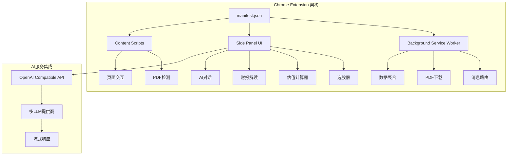
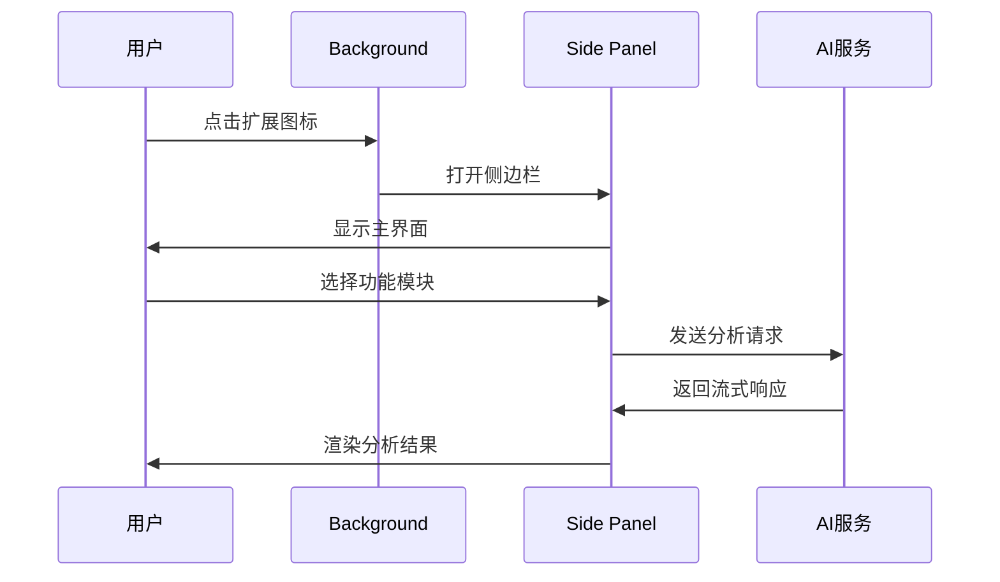
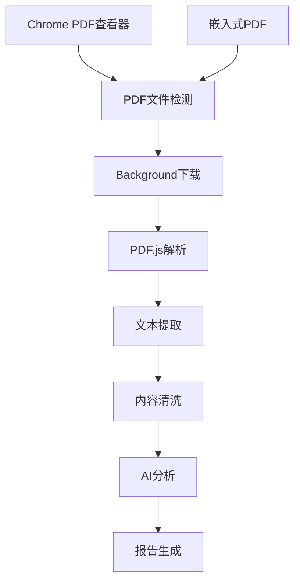
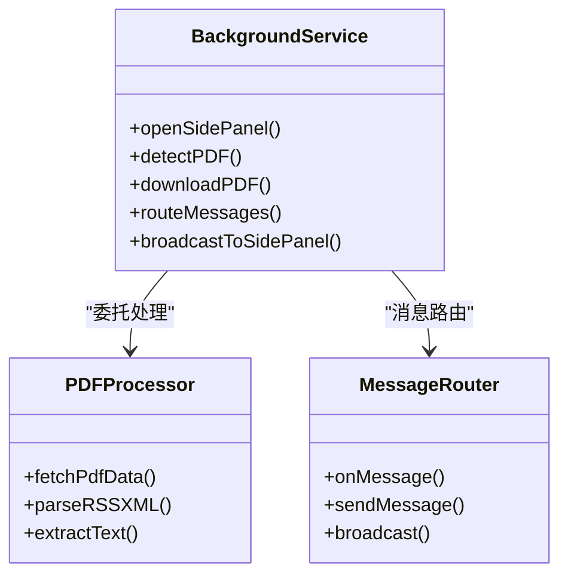
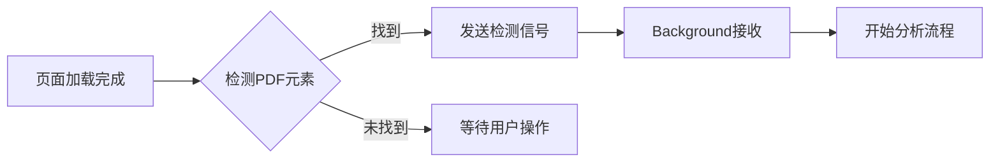
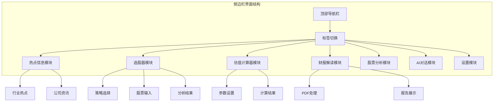
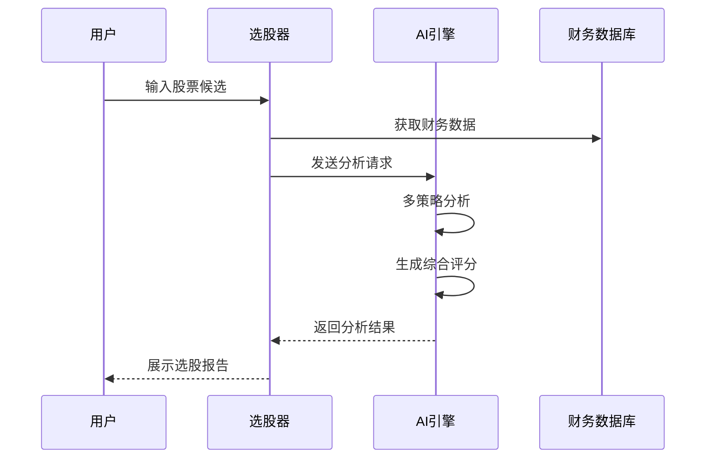

# 项目概述

<cite>
**本文档引用的文件**
- [manifest.json](file://manifest.json)
- [README.md](file://README.md)
- [background.js](file://background/background.js)
- [content.js](file://content/content.js)
- [sidepanel.js](file://sidebar/sidepanel.js)
- [sidepanel.html](file://sidebar/sidepanel.html)
- [sidepanel.css](file://sidebar/sidepanel.css)
- [options.html](file://sidebar/options.html)
- [pdf.min.js](file://lib/pdf.min.js)
</cite>

## 目录
1. [项目简介](#项目简介)
2. [核心价值主张](#核心价值主张)
3. [主要功能特性](#主要功能特性)
4. [目标用户群体](#目标用户群体)
5. [技术架构概览](#技术架构概览)
6. [核心组件详解](#核心组件详解)
7. [设计理念与大师策略融合](#设计理念与大师策略融合)
8. [使用场景示例](#使用场景示例)
9. [安装与配置指南](#安装与配置指南)
10. [总结](#总结)

## 项目简介

投资助手是一个基于Chrome Extension Manifest V3标准开发的专业级投资分析工具扩展程序。该项目将巴菲特、林奇、费雪、芒格和格雷厄姆五位价值投资大师的经典理念有机融合，为用户提供从财报解读到智能选股再到内在价值计算的一站式投资决策支持。

该扩展采用Side Panel UI设计模式，提供直观易用的操作界面，同时深度集成了AI服务，实现智能化的投资分析体验。项目完全开源，采用纯原生JavaScript/CSS开发，无任何第三方依赖，确保了代码的简洁性和安全性。

## 核心价值主张

### 一站式价值投资解决方案
投资助手将传统价值投资理论与现代AI技术相结合，为用户提供从基础财务分析到高级投资决策的完整工具链。用户无需再为寻找不同的分析工具而困扰，所有功能都集成在一个易于使用的扩展程序中。

### 大师智慧的数字化传承
项目将五位价值投资大师的核心理念转化为可执行的分析策略：
- **格雷厄姆**：深度价值与安全边际原则
- **巴菲特**：护城河与优质企业投资
- **林奇**：成长价值与PEG估值
- **费雪**：长期成长与15要点分析
- **芒格**：理性思维与逆向投资

### AI驱动的智能分析
通过集成多种LLM服务提供商，投资助手能够提供智能化的财报解读、投资建议和深度分析，大大提升了投资决策的科学性和准确性。

## 主要功能特性

### 🎯 价值投资大师选股器
基于6种价值投资大师策略，AI逐一筛选候选股票：

| 策略 | 核心思想 | 关键指标 |
|------|----------|----------|
| **🏛 格雷厄姆** | 深度价值 · 安全边际 | PE<15, PB<1.5, 股息≥3%, 流动比率≥2 |
| **🏰 巴菲特** | 护城河 · 优质企业 | ROE≥15%, 所有者盈余, 定价权, 管理层 |
| **🔍 彼得·林奇** | PEG · 成长价值 | PEG<1, 公司分类, 盈利增长15-30% |
| **🌱 费雪** | 长期成长 · 15要点 | 研发投入, 利润率, 管理层深度 |
| **⚖️ 芒格** | 理性 · 逆向思维 | ROIC>WACC, 逆向排除, 压力测试 |
| **🌟 综合大师** | 多策略融合 · 严选 | 5大师加权评分，综合排名 |

### 🧮 企业内在价值计算器
支持5种经典估值方法的智能计算：

| 方法 | 核心公式 | 适用场景 |
|------|----------|----------|
| **💵 DCF折现** | 两阶段FCF折现 + 永续终值 | 成长期/成熟期企业 |
| **🏛 格雷厄姆** | V = EPS × (8.5+2g) × 4.4/Y | 价值型/深度低估 |
| **💳 DDM股息** | V = D1 / (r - g) | 稳定分红的成熟企业 |
| **📐 相对PE/PB** | PE估值 + PB估值 均值 | 有可比同行的企业 |
| **📊 EVA经济附加值** | 价值 = IC + ∑(ROIC-WACC)×IC/(1+WACC)^t | 资本效率型分析 |

### 📊 结构化财报解读报告
融合四大投资大师分析框架，自动生成10大模块深度解读：

1. **核心业绩概览** - 关键指标同比/环比对比
2. **业务亮点** - 3-5个数据支撑的正面信号
3. **增长驱动力** - 量/价/结构/效率四维分析
4. **不及预期原因** - 深挖根因与持续性判断
5. **投资风险** - 短期+中长期+行业红旗信号
6. **管理层观点** - 分类提炼+诚信检验
7. **投资大师视角** - 护城河/PEG/成长因子/逆向思维
8. **同行业趋势对比** - 横向对比表+趋势分析
9. **行业深度分析** - 周期量化评分+竞争格局
10. **综合评述** - 定调+评级+前瞻信号

### 🔊 智能播报（TTS）
- 标题悬停显示 ▶ 按钮，从指定章节开始播报
- 底部控制条：播放/暂停、上一段/下一段、停止、语速调节
- 自动连播，播报章节标题高亮 + 滚动跟随

### 💬 AI 对话深入分析
- 基于财报解读或选股结果继续追问
- 预设常用问题
- 支持流式输出

### 💾 导出 Markdown
- 一键导出 .md 文件，自动提取文件名 + 日期

## 目标用户群体

### 投资新手
- 需要系统学习价值投资理念的入门者
- 希望获得专业级分析工具但缺乏复杂操作经验的用户
- 通过AI辅助理解复杂的财务报表和投资概念

### 价值投资者
- 深度认同巴菲特、格雷厄姆等大师理念的长期投资者
- 寻求多维度分析工具来验证投资决策的专业人士
- 希望将传统价值投资理论与现代技术相结合的实践者

### 研究分析师
- 需要快速获取和分析大量财务信息的研究人员
- 希望获得标准化分析框架和报告模板的专业人士
- 通过AI增强分析能力和效率的金融从业者

### 自动化投资者
- 通过技术分析和基本面分析相结合的量化投资者
- 需要批量筛选和分析股票池的机构投资者
- 希望建立标准化投资流程和决策体系的资产管理者

## 技术架构概览

### Chrome Extension Manifest V3 标准
项目严格遵循最新的Chrome Extension标准，采用现代化的架构设计：



**图表来源**
- [manifest.json:1-48](file://manifest.json#L1-L48)
- [background.js:1-307](file://background/background.js#L1-L307)
- [sidepanel.js:1-800](file://sidebar/sidepanel.js#L1-L800)

### Side Panel UI 设计模式
采用Google推荐的Side Panel设计模式，提供沉浸式的用户体验：



**图表来源**
- [sidepanel.html:1-646](file://sidebar/sidepanel.html#L1-L646)
- [sidepanel.js:3381-3824](file://sidebar/sidepanel.js#L3381-L3824)

### PDF处理架构
集成PDF.js库实现专业的PDF文本提取和分析：



**图表来源**
- [background.js:125-177](file://background/background.js#L125-L177)
- [sidepanel.js:2621-2697](file://sidebar/sidepanel.js#L2621-L2697)

## 核心组件详解

### 1. 背景服务（Background Service Worker）

背景服务是整个扩展的核心协调者，负责管理侧边栏状态、PDF文件检测和消息路由：



**图表来源**
- [background.js:11-186](file://background/background.js#L11-L186)

### 2. 内容脚本（Content Script）

轻量级内容脚本专门用于检测网页中的嵌入式PDF：



**图表来源**
- [content.js:11-35](file://content/content.js#L11-L35)

### 3. 侧边栏主界面

侧边栏采用模块化设计，包含六大核心功能模块：



**图表来源**
- [sidepanel.html:32-646](file://sidebar/sidepanel.html#L32-L646)

### 4. AI服务集成

支持多家LLM服务提供商，实现灵活的AI服务选择：

| 服务提供商 | API端点 | 模型支持 | 特殊功能 |
|------------|---------|----------|----------|
| OpenAI | api.openai.com/v1 | gpt-4o, gpt-4 | 标准兼容 |
| DeepSeek | api.deepseek.com/v1 | deepseek-chat | 高性价比 |
| 智谱 | open.bigmodel.cn/api/paas/v4 | glm-4 | 国内访问 |
| 通义千问 | dashscope.aliyuncs.com/compatible-mode/v1 | qwen-max | 云端部署 |
| 自定义 | 用户配置 | 任意模型 | 灵活扩展 |

**图表来源**
- [sidepanel.js:417-423](file://sidebar/sidepanel.js#L417-L423)

## 设计理念与大师策略融合

### 价值投资理论的数字化实现

项目将五位价值投资大师的核心理念转化为具体的分析指标和计算方法：

```mermaid
mindmap
root((价值投资大师策略))
格雷厄姆
安全边际
深度价值
财务稳健性
巴菲特
护城河理论
优质企业
管理层质量
林奇
成长价值
PEG估值
公司分类
费雪
长期成长
15要点
管理层深度
芒格
理性思维
逆向投资
多学科模型
```

### 多策略融合机制

通过加权评分系统实现多策略的有机融合：

| 策略权重 | 格雷厄姆 | 巴菲特 | 林奇 | 费雪 | 芒格 |
|----------|----------|--------|------|------|------|
| 权重分配 | 20% | 25% | 20% | 20% | 15% |
| 综合评分 | Σ(权重×单项评分) |  |  |  |  |

### AI增强的价值投资

通过AI技术提升传统价值投资的效率和准确性：



**图表来源**
- [sidepanel.js:14-297](file://sidebar/sidepanel.js#L14-L297)

## 使用场景示例

### 场景一：新手学习路径
1. **首次使用**：安装扩展 → 配置LLM API → 了解基本功能
2. **学习价值投资**：通过选股器了解不同大师策略的特点
3. **实践应用**：使用内在价值计算器验证投资想法
4. **深入分析**：利用AI对话功能探讨复杂投资问题

### 场景二：专业投资者日常工作
1. **市场监控**：使用热点信息模块跟踪行业动态
2. **股票筛选**：通过多策略选股器快速筛选候选标的
3. **深度分析**：使用财报解读功能分析目标公司
4. **决策支持**：结合内在价值计算制定投资计划

### 场景三：研究分析师工作流程
1. **数据收集**：自动化获取财务数据和市场信息
2. **初步筛选**：使用选股器进行快速过滤
3. **深度研究**：利用AI对话功能进行专题分析
4. **报告生成**：导出Markdown格式的研究报告

## 安装与配置指南

### 安装步骤
1. 打开 Chrome 浏览器，访问 `chrome://extensions/`
2. 开启右上角「开发者模式」
3. 点击「加载已解压的扩展程序」
4. 选择 `earnings-report-extension` 文件夹

### 首次配置
1. 点击扩展图标 → 点击 ⚙️ 设置按钮
2. 选择 LLM 服务商并填写 API Key
3. 保存设置

### 基本使用流程
1. **选股器**：切换到「🎯 选股器」标签 → 选择投资策略 → 输入候选股票 → 点击「🚀 开始选股分析」
2. **财报解读**：在浏览器中打开财报 PDF 文件 → 点击扩展图标 → 系统自动检测并分析
3. **估值计算**：在「🧮 估值」标签中输入股票信息 → 选择估值方法 → 点击「🧮 计算内在价值」

## 总结

投资助手Chrome扩展项目代表了传统价值投资理论与现代AI技术的完美结合。通过将巴菲特、林奇、费雪、芒格和格雷厄姆五位大师的投资智慧数字化，项目为用户提供了前所未有的投资分析体验。

### 核心优势
- **理论完整性**：涵盖五位大师的核心理念
- **技术先进性**：基于Chrome Extension V3和AI服务集成
- **用户体验**：直观的Side Panel设计和流畅的交互体验
- **实用性**：从基础学习到专业分析的全栈功能

### 技术特色
- 现代化的Chrome Extension架构
- 深度集成的AI服务支持
- 专业的PDF处理能力
- 模块化的功能设计

### 发展前景
项目为价值投资的数字化转型提供了完整的解决方案，不仅适合个人投资者学习和实践，也为专业投资者和研究机构提供了强大的技术支持。随着AI技术的不断发展，投资助手将继续演进，为用户提供更加智能化的投资决策支持。

通过这个项目，我们希望能够帮助更多人理解和实践价值投资理念，让传统的智慧在数字时代焕发新的活力。